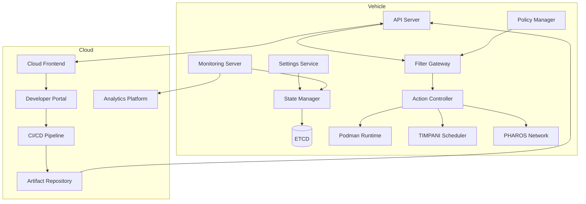
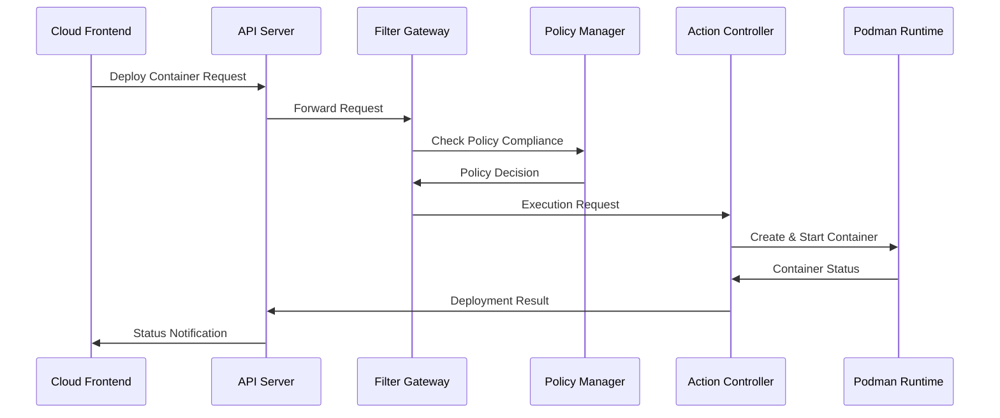
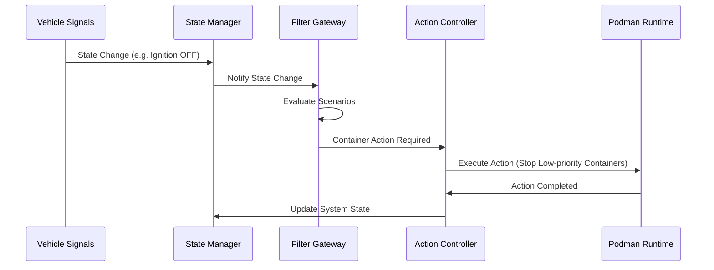

# PICCOLO System Architecture and Functionality Overview

**Document Information:**
- Document ID: PICCOLO-ARCH-OVERVIEW-2025
- Version: 1.0
- Date: 2025-07-28
- Classification: System Architecture Overview

## Table of Contents

1. [Introduction](#1-introduction)
2. [System Architecture](#2-system-architecture)
3. [Component Description](#3-component-description)
4. [Functional Boundaries](#4-functional-boundaries)
5. [Data Flow](#5-data-flow)
6. [Integration Scenarios](#6-integration-scenarios)

## 1. Introduction

PICCOLO is an OS-independent container framework optimized for vehicle environments, serving as a vehicle system orchestrator suitable for the SDV (Software-Defined Vehicle) era. This document explains the overall system architecture of PICCOLO and the integration structure between vehicle and cloud.

### 1.1 Key Features

- **Declarative Resource Management**: YAML-based resource definition and management
- **Vehicle State-Based Scenarios**: Dynamic service management based on vehicle state
- **Container Lifecycle Management**: Podman-based container management
- **Real-time Control and Networking**: TIMPANI scheduling and PHAROS networking
- **Cloud-integrated CI/CD**: Integrated development and deployment platform
- **Policy-based Resource Management**: Safety and performance optimization

## 2. System Architecture

The PICCOLO system consists of in-vehicle components and cloud components, providing secure and efficient data exchange and service management.

## 3. Component Description

### 3.1 In-Vehicle Components

#### Core Components
- **API Server**: Provides external APIs and manages artifact registration
- **Filter Gateway**: Processes scenarios and policy-based filtering
- **Action Controller**: Manages container lifecycle and execution
- **State Manager**: Manages and synchronizes system state
- **Monitoring Server**: Collects and analyzes monitoring data
- **Policy Manager**: Determines service priorities based on policies
- **Settings Service**: Manages settings and state synchronization

#### Storage
- **ETCD**: Distributed key-value store for system state and settings

#### Runtime & Integration
- **Podman**: Container runtime environment
- **TIMPANI**: Real-time task scheduler
- **PHAROS**: Vehicle network orchestration system

### 3.2 Cloud Components

- **Cloud Frontend**: Main interface for vehicle-cloud communication
- **Developer Portal**: Interface for developers to manage applications
- **CI/CD Pipeline**: Automated building, testing, and deployment
- **Artifact Repository**: Storage for container images and binaries
- **Analytics Platform**: Data analysis and visualization platform

## 4. Functional Boundaries

### 4.1 PICCOLO Core Functions

| Function | Description | Responsible Component |
|----------|-------------|----------------------|
| Container Lifecycle | Create, run, stop, remove containers | Action Controller |
| State Management | Track and manage vehicle and service states | State Manager |
| Resource Management | Allocate and monitor system resources | Policy Manager |
| Networking | Container network configuration and management | PHAROS |
| Scheduling | Real-time and priority-based scheduling | TIMPANI |
| API Management | External API handling and authentication | API Server |

### 4.2 Integration Points

- **Vehicle Integration**: CAN, Automotive Ethernet, SOME/IP
- **Cloud Integration**: gRPC, REST, MQTT
- **Developer Integration**: CLI, REST API, WebSocket

## 5. Data Flow

### 5.1 Container Deployment Flow

### 5.2 Vehicle State Change Flow

## 6. Integration Scenarios

### 6.1 OTA Update Scenario

1. Cloud pushes new container image to vehicle
2. API Server validates and registers new image
3. Filter Gateway evaluates update policy
4. Action Controller stops old container
5. Action Controller starts new container
6. State Manager updates system state
7. Monitoring Server verifies successful update

### 6.2 Resource Constraint Scenario

1. Monitoring Server detects resource shortage
2. State Manager updates system state
3. Policy Manager evaluates priorities
4. Filter Gateway selects containers for action
5. Action Controller pauses or stops low-priority containers
6. Resources are reallocated to high-priority containers
7. System stabilizes with optimized resource utilization

### 6.3 Vehicle Mode Change Scenario

1. Vehicle mode changes (e.g., Driving → Parked)
2. State Manager detects mode change
3. Filter Gateway evaluates applicable scenarios
4. Policy Manager updates allowed operations
5. Action Controller adjusts running containers
6. New services are started or stopped based on mode
7. Network policies are updated through PHAROS

## 7. Conclusion

The PICCOLO system provides a comprehensive container orchestration solution tailored for vehicle environments. By combining declarative management, state-based scenarios, and policy-driven execution, it enables efficient and safe operation of software-defined vehicle features. The tight integration between vehicle and cloud components ensures seamless updates and monitoring throughout the vehicle lifecycle.
