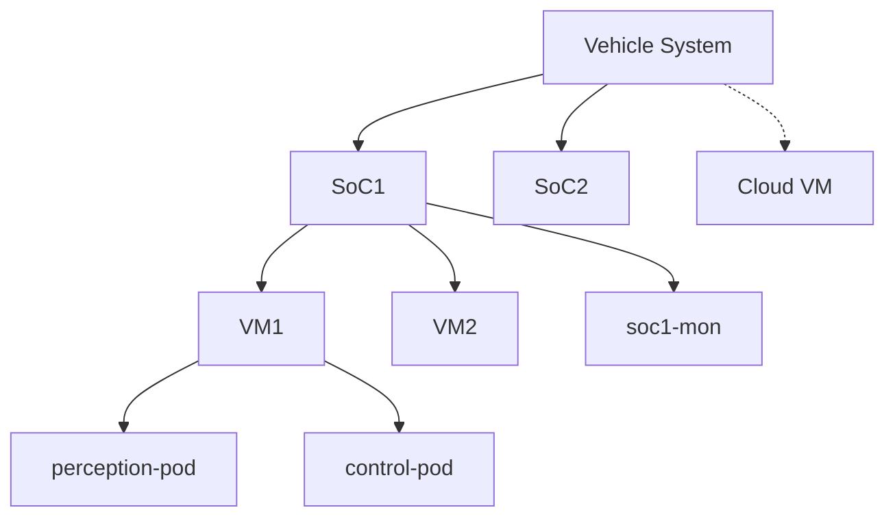
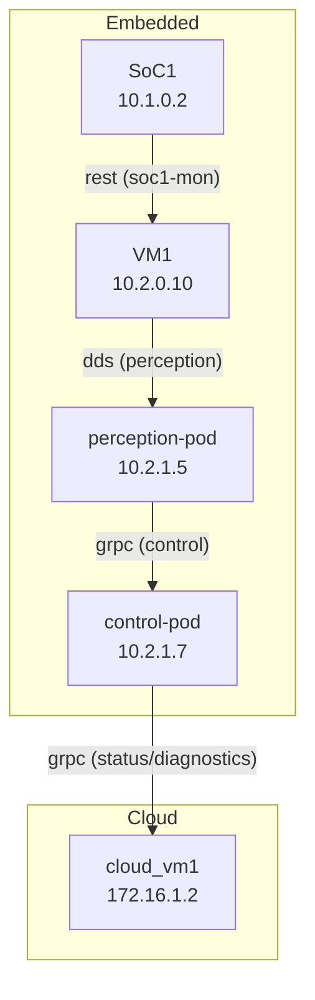
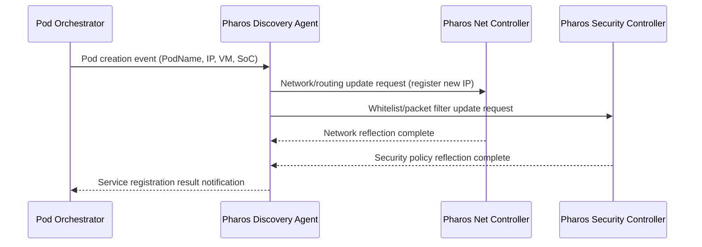
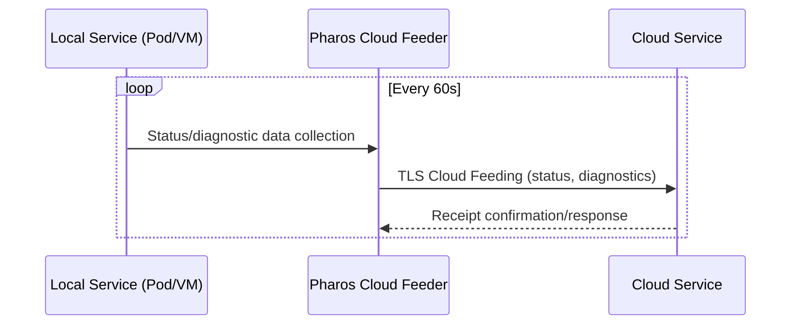

# Pharos Vehicle Network System Comprehensive Specification

| Document Information | Details |
|--------|------|
| Document Title | Pharos Vehicle Network System Comprehensive Specification |
| Version | 1.0.0 |
| Date | 2025-07-24 03:13:13 |
| Author | joshua-jung_LGESDV |
| Status | Pending Approval |

---

## Table of Contents

1. [Introduction](#1-introduction)
2. [System Architecture](#2-system-architecture)
3. [Core Features](#3-core-features)
4. [Network Configuration and Management](#4-network-configuration-and-management)
5. [Service Deployment and Operation](#5-service-deployment-and-operation)
6. [Dynamic Service Management](#6-dynamic-service-management)
7. [Security and Access Control](#7-security-and-access-control)
8. [Cloud Integration](#8-cloud-integration)
9. [Monitoring and Logging](#9-monitoring-and-logging)
10. [Configuration Examples](#10-configuration-examples)
11. [API Specifications](#11-api-specifications)
12. [Usage Scenarios](#12-usage-scenarios)
13. [Implementation Considerations](#13-implementation-considerations)
14. [Appendix: Diagrams and Sequences](#14-appendix-diagrams-and-sequences)
15. [Appendix: Complete Proto Files](#15-appendix-complete-proto-files)

---

## 1. Introduction

Pharos is a vehicle network orchestration system that provides complete network integration between in-vehicle and cloud systems. This system manages computing resources at the SoC, VM, and Pod levels, along with the communication between them, and supports various communication protocols.

### 1.1 Purpose

- Efficient automation of network configuration for in-vehicle computing resources
- Secure and efficient communication support between vehicle and cloud
- Providing bridges and transformations between various protocols
- Dynamic service deployment and automatic application of network policies
- Integrated management of security and access control

### 1.2 Scope

- In-vehicle network configuration (SoC, VM, Pod)
- Vehicle-cloud connection management
- Service discovery and dynamic network updates
- Traffic control and QoS management
- Security policy implementation and monitoring

---

## 2. System Architecture

### 2.1 Hierarchical Structure

Pharos manages the system with the following hierarchical structure:

1. **Vehicle System**
   - Consists of multiple SoCs (System on Chip)

2. **SoC (System on Chip)**
   - Physical computing hardware within the vehicle
   - Can host 0 or more VMs
   - Can directly run native services

3. **VM (Virtual Machine)**
   - Virtual machines running on SoC
   - Can host 0 or more Pods
   - Uses fixed IP address scheme

4. **Pod**
   - Container groups running on VMs
   - Can be dynamically created/terminated/moved
   - Requires dynamic IP allocation at each execution

### 2.2 Key Components

- **Pharos Controller**: Responsible for overall network orchestration
- **Discovery Agent**: Discovery and registration of dynamic services/Pods
- **Network Manager**: Network configuration, routing, NAT management
- **Security Controller**: Packet filtering, access control, encryption management
- **Cloud Connector**: Vehicle-cloud communication management
- **Configuration Handler**: Processing and application of YAML configuration files

---

## 3. Core Features

### 3.1 Supported Protocols

- **DDS (Data Distribution Service)**
  - Optimized for real-time data sharing within vehicles
  - Support for QoS policies

- **gRPC**
  - Efficient communication between microservices
  - Support for bidirectional streaming

- **REST**
  - For cloud services and management interfaces
  - HTTP/HTTPS based communication

- **SOME/IP**
  - Automotive industry standard communication protocol
  - Support for service discovery and event management

### 3.2 Performance Optimization Features

- **Fasttrack**
  - XDP (eXpress Data Path) based high-performance packet processing
  - SHM (Shared Memory) based inter-process communication optimization
  - Priority processing for latency-sensitive applications

- **TSN (Time Sensitive Networking)**
  - Support for IEEE 802.1 TSN standard
  - Guaranteed deterministic latency
  - Time slots and traffic shaping

---

## 4. Network Configuration and Management

### 4.1 Network Topology

- **Multiple Subnet Management**
  - Independent subnet configuration for SoC, VM, and Pod
  - Automated routing between subnets

- **Bridge Configuration**
  - VM-Bridge: Connection between VM and host SoC
  - Pod-Bridge: Support for Pod-to-Pod communication
  - Cloud-Bridge: Connection to cloud services

### 4.2 IP Management

- **Static IP Allocation**
  - Static IP allocation for SoC and VM
  - Configuration file-based settings

- **Dynamic IP Allocation**
  - Dynamic IP allocation via IPAM when creating Pods
  - Support for host-local or DHCP methods

### 4.3 Routing and NAT

- **Routing Table Management**
  - Automatic generation of routing rules between subnets
  - Support for policy-based routing

- **NAT (Network Address Translation)**
  - Support for communication between different subnets
  - IP Masquerading and port forwarding
  - Configurable SNAT, DNAT

### 4.4 QoS (Quality of Service)

- **Traffic Classification**
  - Classification based on protocol, port, service
  - Priority tagging

- **Bandwidth Management**
  - Bandwidth allocation by service
  - Congestion control and shaping

---

## 5. Service Deployment and Operation

### 5.1 Service Definition

- YAML-based service specification
- Specifying service execution location (SoC/VM/Pod)
- Defining required resources and network requirements

### 5.2 Service Placement

- Declarative deployment model
- Management of dependencies between services
- Reflection of resource constraints

### 5.3 Service Connectivity

- Automatic configuration of communication paths between services
- Automatic setup of protocol bridges
- Management of connection policies (allow/deny)

---

## 6. Dynamic Service Management

### 6.1 Service Discovery

- **Discovery Process**
  - Automatic discovery when Pod/service is created
  - Registration of IP, protocol, port information
  - Management of service metadata

- **Service Registry**
  - Central storage of all active services
  - Real-time updates with health status
  - Support for query and filtering

### 6.2 Service Lifecycle Management

- **Service State Tracking**
  - Tracking service creation, modification, termination
  - Health check and status monitoring
  - Automatic recovery for failed services

- **Dynamic Reconfiguration**
  - Network topology update on service changes
  - Automatic route recalculation
  - Zero-downtime reconfiguration

---

## 7. Security and Access Control

### 7.1 Network Security

- **Network Isolation**
  - Subnet-level isolation
  - VLAN and network namespace separation
  - Micro-segmentation capabilities

- **Traffic Filtering**
  - Rule-based packet filtering
  - Deep packet inspection for critical services
  - Intrusion detection and prevention

### 7.2 Access Control

- **Policy-based Access Control**
  - Granular service-to-service access rules
  - Role-based access for management APIs
  - Dynamic policy updates

- **Authentication and Authorization**
  - PKI-based service authentication
  - TLS mutual authentication
  - Token-based API authorization

### 7.3 Secure Communication

- **Encryption**
  - TLS for all external communications
  - Optional encryption for internal high-value data
  - Hardware-accelerated cryptography support

- **Key Management**
  - Automated certificate rotation
  - Secure storage of cryptographic material
  - Integration with vehicle-wide trust system

---

## 8. Cloud Integration

### 8.1 Cloud Connection Management

- **Connectivity Options**
  - Cellular (4G/5G)
  - Wi-Fi (when available)
  - Satellite (for remote areas)

- **Connection Resilience**
  - Automatic failover between connection types
  - Bandwidth-aware operation modes
  - Store-and-forward for intermittent connectivity

### 8.2 Data Synchronization

- **Selective Data Feeding**
  - Configurable data selection for cloud transmission
  - Bandwidth optimization through compression
  - Priority-based transmission scheduling

- **Bidirectional Updates**
  - Cloud-to-vehicle configuration updates
  - Service deployment from cloud
  - Remote diagnostics capability

---

## 9. Monitoring and Logging

### 9.1 Network Monitoring

- **Real-time Metrics**
  - Bandwidth usage by service/component
  - Latency and packet loss tracking
  - Resource utilization monitoring

- **Alerting System**
  - Threshold-based alerts
  - Anomaly detection
  - Hierarchical alert management

### 9.2 Logging Framework

- **Centralized Logging**
  - Aggregation of logs from all components
  - Structured logging format
  - Configurable retention policies

- **Log Analysis**
  - Search and filtering capabilities
  - Correlation between events
  - Visual dashboards for key metrics

---

## 10. Configuration Examples

### 10.1 Vehicle Network Configuration Example

```yaml
vehicle:
  name: "premium_sedan"
  socs:
    - name: soc1
      ip: "10.1.0.2"
      subnet: "10.1.0.0/24"
      vms:
        - name: vm1
          ip: "10.2.0.10"
          subnet: "10.2.0.0/24"
          pods:
            - name: perception-pod
              namespace: perception
              networking:
                type: cni
                subnet: "10.2.1.0/24"
            - name: control-pod
              namespace: control
              networking:
                type: cni
                subnet: "10.2.1.0/24"
    - name: soc2
      ip: "10.1.0.3"
      subnet: "10.1.0.0/24"
  routes:
    - from: "10.2.0.0/24"
      to: "10.2.1.0/24"
      gateway: "10.2.0.1"
    - from: "10.2.1.0/24"
      to: "0.0.0.0/0"
      gateway: "10.2.1.1"
```

### 10.2 Security Policy Example

```yaml
security_policy:
  default_action: deny
  rules:
    - name: allow_perception_to_control
      from:
        namespace: perception
      to:
        namespace: control
      ports:
        - 8080
        - 8081
      protocol: tcp
      action: allow
    
    - name: allow_cloud_updates
      from:
        external: true
        tls_verified: true
      to:
        service: update-service
      ports:
        - 443
      protocol: tcp
      action: allow
```

---

## 11. API Specifications

### 11.1 API Overview

Pharos provides gRPC-based APIs for communication with external systems (Piccolo). APIs are clearly separated according to **call direction**:

1. **Pharos Service (PharosService)**
   - Piccolo → Pharos direction calls
   - Processing requests related to vehicle network configuration, monitoring, diagnostics, security

2. **Piccolo Callback Service (PiccoloCallbackService)**
   - Pharos → Piccolo direction calls
   - Notifications for asynchronous task completion, status change events, security events, etc.

APIs for each direction are organized into the following functional groups:

#### Piccolo → Pharos Direction APIs:
- Network configuration and management
- Service registration and management
- Configuration validation and application
- Network status and diagnostics
- Security policy management

#### Pharos → Piccolo Direction APIs:
- Task completion notifications
- Status change notifications
- Security event notifications

### 11.2 Piccolo → Pharos Direction APIs (PharosService)

#### 11.2.1 Network Configuration and Management

##### RequestNetworkPod

**Function**: Requests network configuration for a Pod. Used when Piccolo requests Pod network settings.

**Request Message (RequestNetworkPodRequest)**:
```
message RequestNetworkPodRequest {
  string node_yaml = 1;    // Node configuration information (YAML format)
  string pod_name = 2;     // Name of Pod to configure
  string network_yaml = 3; // Network configuration information (YAML format)
}
```

**Response Message (RequestNetworkPodResponse)**:
```
message RequestNetworkPodResponse {
  string request_id = 1;   // Unique ID for request tracking
  bool accepted = 2;       // Whether request is accepted (true/false)
  string message = 3;      // Additional information or error message
}
```

**Usage Example**:
```java
// Client code (Piccolo side)
PharosServiceClient client = new PharosServiceClient(channel);
RequestNetworkPodRequest request = RequestNetworkPodRequest.newBuilder()
    .setNodeYaml(nodeYaml)
    .setPodName("perception-pod")
    .setNetworkYaml(networkYaml)
    .build();
    
RequestNetworkPodResponse response = client.requestNetworkPod(request);
String requestId = response.getRequestId();
```

##### ConfigureVehicleNetwork

**Function**: Initializes or updates the entire vehicle network configuration. Used at vehicle boot or when changing the entire network configuration.

**Request Message (ConfigureVehicleNetworkRequest)**:
```
message ConfigureVehicleNetworkRequest {
  string vehicle_yaml = 1;   // Complete vehicle network configuration (YAML format)
  bool dry_run = 2;          // Validate only without applying
}
```

**Response Message (ConfigureVehicleNetworkResponse)**:
```
message ConfigureVehicleNetworkResponse {
  bool success = 1;                         // Operation success
  string message = 2;                       // Additional information or error message
  repeated ValidationIssue validation_issues = 3; // List of configuration issues found
}
```

**Usage Example**:
```java
// Client code (Piccolo side)
PharosServiceClient client = new PharosServiceClient(channel);
ConfigureVehicleNetworkRequest request = ConfigureVehicleNetworkRequest.newBuilder()
    .setVehicleYaml(vehicleConfigYaml)
    .setDryRun(false)  // Actually apply
    .build();
    
ConfigureVehicleNetworkResponse response = client.configureVehicleNetwork(request);
if (response.getSuccess()) {
    logger.info("Vehicle network configuration successful");
} else {
    logger.error("Vehicle network configuration failed: " + response.getMessage());
    // Handle validation issues
    for (ValidationIssue issue : response.getValidationIssues()) {
        logger.error("Validation error: " + issue.getDescription());
    }
}
```

##### UpdateNetworkConfiguration

**Function**: Updates part of an existing network configuration. Used when modifying specific parts without changing the entire configuration.

**Request Message (UpdateNetworkConfigurationRequest)**:
```
message UpdateNetworkConfigurationRequest {
  string update_yaml = 1;    // Configuration information to update (YAML format)
  bool incremental = 2;      // Partial update (true: merge with existing, false: complete replacement)
}
```

**Response Message (UpdateNetworkConfigurationResponse)**:
```
message UpdateNetworkConfigurationResponse {
  bool success = 1;                         // Operation success
  string message = 2;                       // Additional information or error message
  repeated string affected_components = 3;  // List of components affected by changes
}
```

**Usage Example**:
```java
// Client code (Piccolo side)
PharosServiceClient client = new PharosServiceClient(channel);
UpdateNetworkConfigurationRequest request = UpdateNetworkConfigurationRequest.newBuilder()
    .setUpdateYaml(updateConfigYaml)
    .setIncremental(true)  // Merge with existing configuration
    .build();
    
UpdateNetworkConfigurationResponse response = client.updateNetworkConfiguration(request);
if (response.getSuccess()) {
    logger.info("Network configuration update successful");
    logger.info("Affected components: " + String.join(", ", response.getAffectedComponents()));
}
```

#### 11.2.2 Service Registration and Management

##### RegisterService

**Function**: Registers a new service in the Pharos network. Necessary for service discovery and routing.

**Request Message (RegisterServiceRequest)**:
```
message RegisterServiceRequest {
  string service_name = 1;            // Service name
  string host = 2;                    // Host (IP or hostname)
  int32 port = 3;                     // Port number
  string protocol = 4;                // Protocol (dds, grpc, rest, someip)
  map<string, string> metadata = 5;   // Additional metadata
}
```

**Response Message (RegisterServiceResponse)**:
```
message RegisterServiceResponse {
  bool success = 1;      // Success status
  string service_id = 2; // Unique ID of registered service
}
```

**Usage Example**:
```java
// Client code (Piccolo side)
PharosServiceClient client = new PharosServiceClient(channel);
Map<String, String> metadata = new HashMap<>();
metadata.put("version", "1.2.0");
metadata.put("category", "perception");

RegisterServiceRequest request = RegisterServiceRequest.newBuilder()
    .setServiceName("object-detection")
    .setHost("10.2.1.5")
    .setPort(8080)
    .setProtocol("grpc")
    .putAllMetadata(metadata)
    .build();
    
RegisterServiceResponse response = client.registerService(request);
String serviceId = response.getServiceId();
```

##### DeregisterService

**Function**: Removes a registered service from the Pharos network. Used when a service terminates or is removed.

**Request Message (DeregisterServiceRequest)**:
```
message DeregisterServiceRequest {
  string service_id = 1;  // ID of service to remove
}
```

**Response Message (DeregisterServiceResponse)**:
```
message DeregisterServiceResponse {
  bool success = 1;  // Success status
}
```

##### UpdateServiceEndpoint

**Function**: Updates the endpoint (host, port) information of an already registered service.

**Request Message (UpdateServiceEndpointRequest)**:
```
message UpdateServiceEndpointRequest {
  string service_id = 1;  // ID of service to update
  string host = 2;        // New host information
  int32 port = 3;         // New port number
}
```

**Response Message (UpdateServiceEndpointResponse)**:
```
message UpdateServiceEndpointResponse {
  bool success = 1;  // Success status
}
```

#### 11.2.3 Configuration Validation and Application

##### ValidateConfiguration

**Function**: Validates the network configuration. Used to identify potential issues before actual application.

**Request Message (ValidateConfigurationRequest)**:
```
message ValidateConfigurationRequest {
  string config_yaml = 1;  // Configuration YAML to validate
}
```

**Response Message (ValidateConfigurationResponse)**:
```
message ValidateConfigurationResponse {
  bool valid = 1;                  // Validity status
  repeated ValidationIssue issues = 2;  // List of issues found
}

message ValidationIssue {
  string path = 1;            // Location of issue (YAML path)
  string description = 2;     // Issue description
  string severity = 3;        // Severity (ERROR, WARNING, INFO)
  string recommendation = 4;  // Suggested solution (optional)
}
```

**Usage Example**:
```java
// Client code (Piccolo side)
PharosServiceClient client = new PharosServiceClient(channel);
ValidateConfigurationRequest request = ValidateConfigurationRequest.newBuilder()
    .setConfigYaml(configYaml)
    .build();
    
ValidateConfigurationResponse response = client.validateConfiguration(request);
if (response.getValid()) {
    logger.info("Configuration validation successful");
} else {
    logger.warn("Configuration has issues:");
    for (ValidationIssue issue : response.getIssues()) {
        logger.warn(issue.getSeverity() + " - " + issue.getPath() + ": " + issue.getDescription());
    }
}
```

##### ApplyConfiguration

**Function**: Applies validated configuration. Used to apply configuration to the network after validation.

**Request Message (ApplyConfigurationRequest)**:
```
message ApplyConfigurationRequest {
  string config_yaml = 1;  // Configuration YAML to apply
  bool validate_only = 2;  // Validate only (when true, doesn't actually apply)
}
```

**Response Message (ApplyConfigurationResponse)**:
```
message ApplyConfigurationResponse {
  bool success = 1;          // Success status
  string message = 2;        // Additional information or error message
  string config_version = 3; // Applied configuration version/ID
}
```

##### RollbackConfiguration

**Function**: Rolls back to a previously applied configuration. Used when issues arise after applying a new configuration.

**Request Message (RollbackConfigurationRequest)**:
```
message RollbackConfigurationRequest {
  string target_version = 1;  // Version to rollback to (if none, rolls back to previous version)
}
```

**Response Message (RollbackConfigurationResponse)**:
```
message RollbackConfigurationResponse {
  bool success = 1;           // Success status
  string message = 2;         // Additional information or error message
  string current_version = 3; // Currently applied configuration version
}
```

#### 11.2.4 Network Status and Diagnostics

##### GetNetworkStatus

**Function**: Queries the current status of network components. Used to check status of SoC, VM, Pod, bridges, etc.

**Request Message (GetNetworkStatusRequest)**:
```
message GetNetworkStatusRequest {
  string component_filter = 1;  // Filter specific components (optional)
}
```

**Response Message (GetNetworkStatusResponse)**:
```
message GetNetworkStatusResponse {
  message ComponentStatus {
    string name = 1;             // Component name
    string type = 2;             // Type (soc, vm, pod, bridge, etc.)
    string status = 3;           // Status (up, down, degraded, etc.)
    string ip_address = 4;       // IP address
    repeated string connected_to = 5;  // Connected components
  }
  repeated ComponentStatus components = 1;  // Component status list
}
```

**Usage Example**:
```java
// Client code (Piccolo side)
PharosServiceClient client = new PharosServiceClient(channel);
GetNetworkStatusRequest request = GetNetworkStatusRequest.newBuilder()
    .setComponentFilter("pod")  // Filter Pod types only
    .build();
    
GetNetworkStatusResponse response = client.getNetworkStatus(request);
for (ComponentStatus component : response.getComponents()) {
    logger.info(component.getType() + " " + component.getName() + ": " + 
                component.getStatus() + " (" + component.getIpAddress() + ")");
}
```

##### GetServiceConnectivity

**Function**: Checks connectivity between services. Used to check network connection status between two services.

**Request Message (GetServiceConnectivityRequest)**:
```
message GetServiceConnectivityRequest {
  string source_service = 1;  // Source service
  string target_service = 2;  // Target service
}
```

**Response Message (GetServiceConnectivityResponse)**:
```
message GetServiceConnectivityResponse {
  bool connected = 1;               // Connectivity status
  string route_description = 2;     // Route description
  repeated string hops = 3;         // Intermediate node path
  int32 latency_ms = 4;            // Measured latency (ms)
}
```

##### GetNetworkMetrics

**Function**: Collects network performance metrics. Used to check network performance of specific components.

**Request Message (GetNetworkMetricsRequest)**:
```
message GetNetworkMetricsRequest {
  string component_id = 1;       // Target component
  int32 duration_seconds = 2;    // Measurement period (seconds)
}
```

**Response Message (GetNetworkMetricsResponse)**:
```
message GetNetworkMetricsResponse {
  message ComponentMetrics {
    string component_id = 1;
    int64 bytes_in = 2;
    int64 bytes_out = 3;
    int32 packets_in = 4;
    int32 packets_out = 5;
    int32 errors_in = 6;
    int32 errors_out = 7;
    float bandwidth_usage_mbps = 8;
  }
  repeated ComponentMetrics metrics = 1;
}
```

##### TestConnectivity

**Function**: Performs connectivity tests. Used for testing connections between specific services or IPs.

**Request Message (TestConnectivityRequest)**:
```
message TestConnectivityRequest {
  string source = 1;        // Source (IP or service name)
  string destination = 2;   // Destination (IP or service name)
  string protocol = 3;      // Protocol (icmp, tcp, udp, etc.)
  int32 port = 4;           // Port (for tcp/udp)
  int32 timeout_ms = 5;     // Timeout (ms)
}
```

**Response Message (TestConnectivityResponse)**:
```
message TestConnectivityResponse {
  bool success = 1;             // Success status
  int32 latency_ms = 2;         // Latency (ms)
  string detailed_result = 3;   // Detailed results
}
```

##### GetRouteInfo

**Function**: Queries routing information. Used to check network path and applied policies between source and destination.

**Request Message (GetRouteInfoRequest)**:
```
message GetRouteInfoRequest {
  string source = 1;       // Source (IP or service name)
  string destination = 2;  // Destination (IP or service name)
}
```

**Response Message (GetRouteInfoResponse)**:
```
message GetRouteInfoResponse {
  bool routable = 1;                  // Routing possibility
  repeated string route_hops = 2;     // Routing path
  repeated string policy_rules = 3;   // Applied policy rules
}
```

#### 11.2.5 Security Policy Management

##### ConfigureSecurityPolicy

**Function**: Configures security policies. Used for setting network access control, packet filtering, etc.

**Request Message (ConfigureSecurityPolicyRequest)**:
```
message ConfigureSecurityPolicyRequest {
  string security_policy_yaml = 1;  // Security policy YAML
}
```

**Response Message (ConfigureSecurityPolicyResponse)**:
```
message ConfigureSecurityPolicyResponse {
  bool success = 1;      // Success status
  string message = 2;    // Additional information or error message
}
```

##### ConfigureCloudFeeding

**Function**: Configures cloud feeding settings. Used for data transmission settings to cloud services.

**Request Message (ConfigureCloudFeedingRequest)**:
```
message ConfigureCloudFeedingRequest {
  bool enabled = 1;                   // Enable status
  int32 interval_seconds = 2;         // Transmission interval (seconds)
  repeated string data_fields = 3;    // Data fields to transmit
  string target_endpoint = 4;         // Cloud endpoint
}
```

**Response Message (ConfigureCloudFeedingResponse)**:
```
message ConfigureCloudFeedingResponse {
  bool success = 1;  // Success status
}
```

##### GetCloudFeedingStatus

**Function**: Queries cloud feeding status. Used to check current cloud feeding settings and status.

**Request Message (GetCloudFeedingStatusRequest)**:
```
message GetCloudFeedingStatusRequest {}  // No parameters
```

**Response Message (GetCloudFeedingStatusResponse)**:
```
message GetCloudFeedingStatusResponse {
  bool enabled = 1;                 // Enable status
  int32 interval_seconds = 2;       // Transmission interval (seconds)
  string last_feeding_time = 3;     // Last transmission time (ISO 8601)
  bool last_feeding_success = 4;    // Last transmission success status
  string last_error_message = 5;    // Last error message
}
```

##### EmergencyNetworkMode

**Function**: Changes emergency network mode. Used for activating emergency or diagnostic mode.

**Request Message (EmergencyNetworkModeRequest)**:
```
message EmergencyNetworkModeRequest {
  bool activate = 1;    // Activation status
  string mode = 2;      // Mode ("minimal", "failsafe", "diagnostic", etc.)
}
```

**Response Message (EmergencyNetworkModeResponse)**:
```
message EmergencyNetworkModeResponse {
  bool success = 1;       // Success status
  string message = 2;     // Additional information or error message
  string active_mode = 3; // Currently activated mode
}
```

### 11.3 Pharos → Piccolo Direction APIs (PiccoloCallbackService)

#### 11.3.1 Task Completion Notifications

##### CompleteNetworkSetting

**Function**: Notifies of network setting completion status. Used when Pharos notifies the result after completing Pod network setup.

**Request Message (CompleteNetworkSettingRequest)**:
```
message CompleteNetworkSettingRequest {
  string request_id = 1;   // Request ID
  enum Status {
    OK = 0;
    ERROR = 1;
    TIMEOUT = 2;
  }
  Status status = 2;       // Completion status
  string details = 3;      // Additional detailed information
}
```

**Response Message (CompleteNetworkSettingResponse)**:
```
message CompleteNetworkSettingResponse {
  bool acknowledged = 1;   // Response receipt confirmation
}
```

**Usage Example**:
```java
// Server implementation (Piccolo side)
@Override
public void completeNetworkSetting(CompleteNetworkSettingRequest request,
                                  StreamObserver<CompleteNetworkSettingResponse> responseObserver) {
    String requestId = request.getRequestId();
    Status status = request.getStatus();
    
    // Find related task by request ID
    PendingNetworkTask task = pendingTasks.get(requestId);
    if (task != null) {
        if (status == Status.OK) {
            logger.info("Network setting completed: " + requestId);
            task.complete(true);
        } else {
            logger.error("Network setting failed: " + requestId + ", Details: " + request.getDetails());
            task.complete(false, request.getDetails());
        }
    } else {
        logger.warn("Unknown request ID: " + requestId);
    }
    
    // Return response
    CompleteNetworkSettingResponse response = CompleteNetworkSettingResponse.newBuilder()
        .setAcknowledged(true)
        .build();
    responseObserver.onNext(response);
    responseObserver.onCompleted();
}
```

#### 11.3.2 Status Change Notifications

##### NotifyNetworkStatusChange

**Function**: Notifies of network component status changes. Used when status of bridges, interfaces, routing, etc. changes.

**Request Message (NetworkStatusChangeNotification)**:
```
message NetworkStatusChangeNotification {
  string component_id = 1;      // Component ID
  string previous_status = 2;   // Previous status
  string current_status = 3;    // Current status
  string timestamp = 4;         // Change time (ISO 8601 format)
  string details = 5;           // Detailed information
}
```

**Response Message (NetworkStatusChangeAcknowledgement)**:
```
message NetworkStatusChangeAcknowledgement {
  bool acknowledged = 1;        // Response receipt confirmation
}
```

**Usage Example**:
```java
// Client code (Pharos side)
PiccoloCallbackServiceClient client = new PiccoloCallbackServiceClient(channel);
NetworkStatusChangeNotification notification = NetworkStatusChangeNotification.newBuilder()
    .setComponentId("vm1-bridge")
    .setPreviousStatus("UP")
    .setCurrentStatus("DOWN")
    .setTimestamp(ZonedDateTime.now(ZoneOffset.UTC).format(DateTimeFormatter.ISO_INSTANT))
    .setDetails("Link failure detected")
    .build();
    
NetworkStatusChangeAcknowledgement response = client.notifyNetworkStatusChange(notification);
```

##### NotifyServiceStatusChange

**Function**: Notifies of service status changes. Used when services start, stop, fail, etc.

**Request Message (ServiceStatusChangeNotification)**:
```
message ServiceStatusChangeNotification {
  string service_id = 1;        // Service ID
  string previous_status = 2;   // Previous status
  string current_status = 3;    // Current status
  string timestamp = 4;         // Change time (ISO 8601 format)
  string details = 5;           // Detailed information
}
```

**Response Message (ServiceStatusChangeAcknowledgement)**:
```
message ServiceStatusChangeAcknowledgement {
  bool acknowledged = 1;        // Response receipt confirmation
}
```

#### 11.3.3 Security Event Notifications

##### NotifySecurityEvent

**Function**: Notifies of security-related events. Used when suspicious connection attempts, packet filtering, policy violations, etc. occur.

**Request Message (SecurityEventNotification)**:
```
message SecurityEventNotification {
  enum Severity {
    INFO = 0;
    WARNING = 1;
    CRITICAL = 2;
  }
  Severity severity = 1;       // Severity
  string event_type = 2;       // Event type
  string source = 3;           // Source information
  string destination = 4;      // Destination information
  string timestamp = 5;        // Event occurrence time (ISO 8601 format)
  string details = 6;          // Detailed information
}
```

**Response Message (SecurityEventAcknowledgement)**:
```
message SecurityEventAcknowledgement {
  bool acknowledged = 1;       // Response receipt confirmation
  string action_taken = 2;     // Action taken (optional)
}
```

**Usage Example**:
```java
// Client code (Pharos side)
PiccoloCallbackServiceClient client = new PiccoloCallbackServiceClient(channel);
SecurityEventNotification notification = SecurityEventNotification.newBuilder()
    .setSeverity(Severity.CRITICAL)
    .setEventType("unauthorized_access")
    .setSource("10.5.2.15")
    .setDestination("10.2.0.10:22")
    .setTimestamp(ZonedDateTime.now(ZoneOffset.UTC).format(DateTimeFormatter.ISO_INSTANT))
    .setDetails("SSH unauthorized access attempt detected, 5 failures")
    .build();
    
SecurityEventAcknowledgement response = client.notifySecurityEvent(notification);
```

### 11.4 Implementation Considerations

#### 11.4.1 Bidirectional Communication Setup

For bidirectional communication, both Piccolo and Pharos must serve as gRPC servers and clients:

1. **Server Setup**:
   - Piccolo runs gRPC server for PiccoloCallbackService implementation
   - Pharos runs gRPC server for PharosService implementation

2. **Endpoint Exchange**:
   - Exchange gRPC endpoint information (IP:port) during initial connection setup
   - Predefine in configuration file or exchange through registration process at startup

3. **Connection Maintenance**:
   - Periodic connection status check (keepalive)
   - Implement reconnection mechanism when connection is lost

4. **Implementation Example**:
```java
// Piccolo side PiccoloCallbackService server initialization
Server piccoloCallbackServer = ServerBuilder.forPort(9090)
    .addService(new PiccoloCallbackServiceImpl())
    .build()
    .start();

// Pharos side PharosService server initialization
Server pharosServer = ServerBuilder.forPort(9091)
    .addService(new PharosServiceImpl())
    .build()
    .start();
```

#### 11.4.2 Error Handling and Recovery Strategy

1. **gRPC Error Handling**:
   - Use standard gRPC status codes (NOT_FOUND, PERMISSION_DENIED, INTERNAL, etc.)
   - Return detailed error information with messages

2. **Retry Mechanism**:
   - Exponential backoff retry for temporary network issues
   - Set maximum retry count and timeout

3. **Asynchronous Task Management**:
   - Use unique request IDs to track task status
   - Provide API for checking status of long-running tasks
   - Use callback methods for asynchronous notifications

4. **Implementation Example**:
```java
// Channel setup with retry policy
ManagedChannel channel = ManagedChannelBuilder.forAddress(host, port)
    .usePlaintext()
    .enableRetry()
    .maxRetryAttempts(3)
    .initialRetryDelay(Duration.ofSeconds(1))
    .maxRetryDelay(Duration.ofSeconds(10))
    .retryBufferSize(16 * 1024 * 1024)
    .build();
```

---

## 12. Usage Scenarios

### 12.1 Vehicle Boot Network Initialization

1. Piccolo calls `ConfigureVehicleNetwork` to transmit the entire vehicle network configuration to Pharos
2. Pharos validates and applies the configuration, then responds with results
3. If needed, Piccolo calls `GetNetworkStatus` to check initial network status

```
Piccolo -> Pharos: ConfigureVehicleNetwork(vehicle_yaml)
Pharos -> Piccolo: ConfigureVehicleNetworkResponse(success=true)
Piccolo -> Pharos: GetNetworkStatus()
Pharos -> Piccolo: GetNetworkStatusResponse(components=[...])
```

### 12.2 New Pod Creation and Network Configuration

1. Piccolo calls `RequestNetworkPod` to request network configuration for a new Pod
2. Pharos processes the request and returns a task ID
3. After network configuration, Pharos notifies the result via `CompleteNetworkSetting`

```
Piccolo -> Pharos: RequestNetworkPod(node_yaml, pod_name, network_yaml)
Pharos -> Piccolo: RequestNetworkPodResponse(request_id="abc123", accepted=true)
... Network configuration task execution ...
Pharos -> Piccolo: CompleteNetworkSetting(request_id="abc123", status=OK)
Piccolo -> Pharos: CompleteNetworkSettingResponse(acknowledged=true)
```

### 12.3 Security Policy Update

1. Piccolo calls `ConfigureSecurityPolicy` to request application of a new security policy
2. Pharos applies the policy and returns the result

```
Piccolo -> Pharos: ConfigureSecurityPolicy(security_policy_yaml)
Pharos -> Piccolo: ConfigureSecurityPolicyResponse(success=true)
```

### 12.4 Cloud Feeding Configuration and Status Check

1. Piccolo calls `ConfigureCloudFeeding` to configure cloud feeding
2. Periodically calls `GetCloudFeedingStatus` to check feeding status

```
Piccolo -> Pharos: ConfigureCloudFeeding(enabled=true, interval_seconds=60)
Pharos -> Piccolo: ConfigureCloudFeedingResponse(success=true)
... Time passes ...
Piccolo -> Pharos: GetCloudFeedingStatus()
Pharos -> Piccolo: GetCloudFeedingStatusResponse(enabled=true, last_feeding_time="2025-07-24T03:13:13Z")
```

### 12.5 Network Problem Diagnosis

1. Piccolo calls `TestConnectivity` to test connection between specific services
2. If problems occur, calls `GetRouteInfo` to check routing information

```
Piccolo -> Pharos: TestConnectivity(source="service-a", destination="service-b", protocol="tcp", port=8080)
Pharos -> Piccolo: TestConnectivityResponse(success=false, detailed_result="Connection timeout")
Piccolo -> Pharos: GetRouteInfo(source="service-a", destination="service-b")
Pharos -> Piccolo: GetRouteInfoResponse(routable=true, policy_rules=["DENY in firewall"])
```

---

## 13. Implementation Considerations

### 13.1 Error Handling

- All APIs should return standardized error codes and detailed messages
- Handle various failure scenarios including network errors, timeouts, configuration errors
- Log critical errors and generate alerts when necessary

### 13.2 Performance Optimization

- Consider streaming for processing large YAML files
- Process long-running tasks asynchronously and provide status check APIs
- Consider caching for frequent API calls

### 13.3 Security

- Implement authentication and authorization mechanisms for API calls
- Consider encryption for sensitive configuration information
- Implement API access audit logging

### 13.4 Scalability

- Prepare expansion plans for supporting new network features and protocols
- Consider scaling for future multi-vehicle management
- Maintain API compatibility through version management

---

## 14. Appendix: Diagrams and Sequences

### 14.1 System Hierarchical Structure Diagram



### 14.2 Network Communication Diagram



### 14.3 Pod Dynamic Creation and Discovery Sequence



### 14.4 Cloud Feeding Sequence



---

## 15. Appendix: Complete Proto Files

### 15.1 pharos_service.proto (Piccolo → Pharos)

```protobuf
syntax = "proto3";

package pharos.api.v1;

import "pharos_common.proto";
import "pharos_management_messages.proto";
import "pharos_configuration_messages.proto";
import "pharos_monitoring_messages.proto";
import "pharos_security_messages.proto";

// Piccolo → Pharos direction API (Pharos provides service)
service PharosService {
  // Pod network configuration request
  rpc RequestNetworkPod(RequestNetworkPodRequest) returns (RequestNetworkPodResponse);
  
  // Vehicle-wide network configuration
  rpc ConfigureVehicleNetwork(ConfigureVehicleNetworkRequest) returns (ConfigureVehicleNetworkResponse);
  
  // Network configuration partial update
  rpc UpdateNetworkConfiguration(UpdateNetworkConfigurationRequest) returns (UpdateNetworkConfigurationResponse);
  
  // Service registration
  rpc RegisterService(RegisterServiceRequest) returns (RegisterServiceResponse);
  
  // Service deregistration
  rpc DeregisterService(DeregisterServiceRequest) returns (DeregisterServiceResponse);
  
  // Service endpoint update
  rpc UpdateServiceEndpoint(UpdateServiceEndpointRequest) returns (UpdateServiceEndpointResponse);
  
  // Configuration validation
  rpc ValidateConfiguration(ValidateConfigurationRequest) returns (ValidateConfigurationResponse);
  
  // Configuration application
  rpc ApplyConfiguration(ApplyConfigurationRequest) returns (ApplyConfigurationResponse);
  
  // Rollback to previous configuration
  rpc RollbackConfiguration(RollbackConfigurationRequest) returns (RollbackConfigurationResponse);
  
  // Network status query
  rpc GetNetworkStatus(GetNetworkStatusRequest) returns (GetNetworkStatusResponse);
  
  // Service connectivity check
  rpc GetServiceConnectivity(GetServiceConnectivityRequest) returns (GetServiceConnectivityResponse);
  
  // Network metrics collection
  rpc GetNetworkMetrics(GetNetworkMetricsRequest) returns (GetNetworkMetricsResponse);
  
  // Connectivity test
  rpc TestConnectivity(TestConnectivityRequest) returns (TestConnectivityResponse);
  
  // Routing information query
  rpc GetRouteInfo(GetRouteInfoRequest) returns (GetRouteInfoResponse);
  
  // Security policy configuration
  rpc ConfigureSecurityPolicy(ConfigureSecurityPolicyRequest) returns (ConfigureSecurityPolicyResponse);
  
  // Cloud feeding configuration
  rpc ConfigureCloudFeeding(ConfigureCloudFeedingRequest) returns (ConfigureCloudFeedingResponse);
  
  // Cloud feeding status query
  rpc GetCloudFeedingStatus(GetCloudFeedingStatusRequest) returns (GetCloudFeedingStatusResponse);
  
  // Emergency network mode change
  rpc EmergencyNetworkMode(EmergencyNetworkModeRequest) returns (EmergencyNetworkModeResponse);
}

// Pod network messages
message RequestNetworkPodRequest {
  string node_yaml = 1;  // Node configuration YAML
  string pod_name = 2;   // Pod name
  string network_yaml = 3; // Network configuration YAML
}

message RequestNetworkPodResponse {
  string request_id = 1;   // Request tracking ID
  bool accepted = 2;       // Request acceptance status
  string message = 3;      // Additional info/error message
}
```

### 15.2 piccolo_callback_service.proto (Pharos → Piccolo)

```protobuf
syntax = "proto3";

package pharos.api.v1;

// Pharos → Piccolo direction API (Piccolo provides service)
service PiccoloCallbackService {
  // Network setting completion notification
  rpc CompleteNetworkSetting(CompleteNetworkSettingRequest) returns (CompleteNetworkSettingResponse);
  
  // Network status change notification
  rpc NotifyNetworkStatusChange(NetworkStatusChangeNotification) returns (NetworkStatusChangeAcknowledgement);
  
  // Service status change notification
  rpc NotifyServiceStatusChange(ServiceStatusChangeNotification) returns (ServiceStatusChangeAcknowledgement);
  
  // Security event notification
  rpc NotifySecurityEvent(SecurityEventNotification) returns (SecurityEventAcknowledgement);
}

message CompleteNetworkSettingRequest {
  string request_id = 1;   // Request ID
  enum Status {
    OK = 0;
    ERROR = 1;
    TIMEOUT = 2;
  }
  Status status = 2;       // Completion status
  string details = 3;      // Additional detailed information
}

message CompleteNetworkSettingResponse {
  bool acknowledged = 1;   // Response receipt confirmation
}

message NetworkStatusChangeNotification {
  string component_id = 1;
  string previous_status = 2;
  string current_status = 3;
  string timestamp = 4;    // ISO 8601 format (UTC)
  string details = 5;
}

message NetworkStatusChangeAcknowledgement {
  bool acknowledged = 1;
}

message ServiceStatusChangeNotification {
  string service_id = 1;
  string previous_status = 2;
  string current_status = 3;
  string timestamp = 4;    // ISO 8601 format (UTC)
  string details = 5;
}

message ServiceStatusChangeAcknowledgement {
  bool acknowledged = 1;
}

message SecurityEventNotification {
  enum Severity {
    INFO = 0;
    WARNING = 1;
    CRITICAL = 2;
  }
  Severity severity = 1;
  string event_type = 2;   // "connection_attempt", "packet_filtered", etc.
  string source = 3;
  string destination = 4;
  string timestamp = 5;    // ISO 8601 format (UTC)
  string details = 6;
}

message SecurityEventAcknowledgement {
  bool acknowledged = 1;
  string action_taken = 2; // Optional field, if action was taken
}
```


### 15.3 pharos_management_messages.proto

```protobuf
syntax = "proto3";

package pharos.api.v1;

import "pharos_common.proto";

// Vehicle network configuration messages
message ConfigureVehicleNetworkRequest {
  string vehicle_yaml = 1;   // Complete vehicle configuration YAML
  bool dry_run = 2;          // Validate only without applying
}

message ConfigureVehicleNetworkResponse {
  bool success = 1;
  string message = 2;
  repeated ValidationIssue validation_issues = 3;
}

// Network update messages
message UpdateNetworkConfigurationRequest {
  string update_yaml = 1;    // Configuration YAML to update
  bool incremental = 2;      // Partial update status
}

message UpdateNetworkConfigurationResponse {
  bool success = 1;
  string message = 2;
  repeated string affected_components = 3;  // Components affected
}

// Service management messages
message RegisterServiceRequest {
  string service_name = 1;
  string host = 2;
  int32 port = 3;
  string protocol = 4;  // dds, grpc, rest, someip
  map<string, string> metadata = 5;  // Additional metadata
}

message RegisterServiceResponse {
  bool success = 1;
  string service_id = 2;
}

message DeregisterServiceRequest {
  string service_id = 1;
}

message DeregisterServiceResponse {
  bool success = 1;
}

message UpdateServiceEndpointRequest {
  string service_id = 1;
  string host = 2;
  int32 port = 3;
}

message UpdateServiceEndpointResponse {
  bool success = 1;
}
```

### 15.4 pharos_configuration_messages.proto

```protobuf
syntax = "proto3";

package pharos.api.v1;

import "pharos_common.proto";

// Configuration validation messages
message ValidateConfigurationRequest {
  string config_yaml = 1;  // Configuration YAML to validate
}

message ValidateConfigurationResponse {
  bool valid = 1;
  repeated ValidationIssue issues = 2;
}

// Configuration application messages
message ApplyConfigurationRequest {
  string config_yaml = 1;  // Configuration YAML to apply
  bool validate_only = 2;  // Perform validation only
}

message ApplyConfigurationResponse {
  bool success = 1;
  string message = 2;
  string config_version = 3;  // Applied configuration version/ID
}

// Configuration rollback messages
message RollbackConfigurationRequest {
  string target_version = 1;  // Version to roll back to
}

message RollbackConfigurationResponse {
  bool success = 1;
  string message = 2;
  string current_version = 3;
}
```

### 15.5 pharos_monitoring_messages.proto

```protobuf
syntax = "proto3";

package pharos.api.v1;

// Network status messages
message GetNetworkStatusRequest {
  string component_filter = 1;  // Filter specific components
}

message GetNetworkStatusResponse {
  message ComponentStatus {
    string name = 1;
    string type = 2;  // soc, vm, pod, bridge, etc.
    string status = 3;  // up, down, degraded, etc.
    string ip_address = 4;
    repeated string connected_to = 5;
  }
  repeated ComponentStatus components = 1;
}

// Service connectivity messages
message GetServiceConnectivityRequest {
  string source_service = 1;
  string target_service = 2;
}

message GetServiceConnectivityResponse {
  bool connected = 1;
  string route_description = 2;
  repeated string hops = 3;  // Intermediate nodes in path
  int32 latency_ms = 4;      // Measured latency (milliseconds)
}

// Network metrics messages
message GetNetworkMetricsRequest {
  string component_id = 1;  // Target component
  int32 duration_seconds = 2;  // Measurement period
}

message GetNetworkMetricsResponse {
  message ComponentMetrics {
    string component_id = 1;
    int64 bytes_in = 2;
    int64 bytes_out = 3;
    int32 packets_in = 4;
    int32 packets_out = 5;
    int32 errors_in = 6;
    int32 errors_out = 7;
    float bandwidth_usage_mbps = 8;
  }
  repeated ComponentMetrics metrics = 1;
}

// Connectivity test messages
message TestConnectivityRequest {
  string source = 1;
  string destination = 2;
  string protocol = 3;  // icmp, tcp, udp, etc.
  int32 port = 4;  // For tcp/udp protocols
  int32 timeout_ms = 5;
}

message TestConnectivityResponse {
  bool success = 1;
  int32 latency_ms = 2;
  string detailed_result = 3;
}

// Routing information messages
message GetRouteInfoRequest {
  string source = 1;  // Source IP or service name
  string destination = 2;  // Target IP or service name
}

message GetRouteInfoResponse {
  bool routable = 1;
  repeated string route_hops = 2;  // Routing path
  repeated string policy_rules = 3;  // Applied policy rules
}
```

### 15.6 pharos_security_messages.proto

```protobuf
syntax = "proto3";

package pharos.api.v1;

// Security policy messages
message ConfigureSecurityPolicyRequest {
  string security_policy_yaml = 1;  // Security policy YAML
}

message ConfigureSecurityPolicyResponse {
  bool success = 1;
  string message = 2;
}

// Cloud feeding messages
message ConfigureCloudFeedingRequest {
  bool enabled = 1;
  int32 interval_seconds = 2;
  repeated string data_fields = 3;  // Data fields to transmit
  string target_endpoint = 4;       // Cloud endpoint
}

message ConfigureCloudFeedingResponse {
  bool success = 1;
}

message GetCloudFeedingStatusRequest {}

message GetCloudFeedingStatusResponse {
  bool enabled = 1;
  int32 interval_seconds = 2;
  string last_feeding_time = 3;    // ISO 8601 format time
  bool last_feeding_success = 4;
  string last_error_message = 5;
}

// Emergency mode messages
message EmergencyNetworkModeRequest {
  bool activate = 1;  // true: activate, false: deactivate
  string mode = 2;    // "minimal", "failsafe", "diagnostic", etc.
}

message EmergencyNetworkModeResponse {
  bool success = 1;
  string message = 2;
  string active_mode = 3;
}
```

---

## 16. Conclusion

The Pharos Vehicle Network System provides an integrated network environment between complex in-vehicle computing resources and cloud services. Through efficient management of hierarchical structures, dynamic service discovery and network application, and robust security and access control features, it provides the foundation for modern connected car services.

The functions and components defined in this specification will continue to evolve, with future releases planned to include multi-vehicle management, advanced diagnostic features, enhanced security features, and more.

---
