# PICCOLO Resource State Management Specification

**Document Number**: PICCOLO-STATE-RESOURCES-2025-002  
**Version**: 1.0  
**Date**: 2025-08-04  
**Author**: joshua-jung_LGESDV  
**Category**: State Management Specification  

## 1. Overview

This document provides the technical details for resource state management in the PICCOLO framework. It describes the state machine definitions, transition rules, monitoring methods, reconciliation processes, and recovery strategies for managing the state of Scenario, Package, Model, Volume, Network, and Node resources via the StateManager.

## 2. Resource State Machine Definitions

Each resource type has its own state machine, which is used to manage the lifecycle of the resource.

### 2.1 Scenario State Machine

#### 2.1.1 State Definitions

| State | Description |
|-------|-------------|
| idle | Scenario ready state (not yet activated) |
| waiting | Waiting for condition to be met |
| playing | Scenario action in progress |
| error | Error occurred during scenario execution |
| allowed | Action allowed by policy |
| denied | Action denied by policy |

#### 2.1.2 State Transition Diagram


#### 2.1.3 State Transition Rules

| Current State | Event | Next State | Condition | Action |
|--------------|-------|------------|-----------|--------|
| idle | Scenario activation | waiting | - | Start condition evaluation |
| waiting | Condition met | allowed | - | Start policy verification |
| allowed | Policy verification success | playing | - | Execute action on target package |
| allowed | Policy verification failure | denied | - | Log denial, generate alert |
```markdown
| waiting | Timeout | error | Timeout setting exists | Log error, generate alert |
| playing | Action complete | idle | One-time action | Log completion |
| playing | Condition change | waiting | Continuous evaluation | Restart evaluation |
| playing | Execution error | error | - | Log error, generate alert |
| error | Recovery attempt | waiting | Auto recovery enabled | Re-initialize state, retry |
| error | Manual reset | idle | - | Re-initialize state |
| denied | Policy change | waiting | - | Restart evaluation |

### 10.2 State Transition Verification Process

#### 10.2.1 General Verification Process

1. **Pre-verification Stage**
   - Verify state transition request
   - Check resource availability
   - Check dependency state
   - Verify security and permissions

2. **Verification During Transition**
   - Ensure atomicity
   - Monitor timeouts
   - Check intermediate state consistency

3. **Post-verification Stage**
   - Confirm transition completion
   - Validate new state
   - Check affected resource states
   - Log and audit record

#### 10.2.2 ASIL D Service Verification Process

ASIL D services apply the strictest state transition verification process:


#### 10.2.3 Time Constraint Verification

Verification of time constraints for time-critical resources:

1. **Record transition start time**
   - Record timestamp with nanosecond precision
   - Record transition ID and context

2. **Measure intermediate step times**
   - Measure time for each key step
   - Take action or warn if thresholds are exceeded

3. **Record and analyze transition completion time**
   - Calculate and record total time
   - Verify completion within acceptable range
   - Accumulate and analyze statistical data

4. **Respond to time constraint violations**
   - Execute response strategy by ASIL grade
   - Log and notify
   - Start recovery procedures if necessary

### 10.3 State Transition Verification Metrics and Monitoring

#### 10.3.1 Key Verification Metrics

| Metric | Description | Measurement Method |
|--------|-------------|-------------------|
| State transition success rate | Percentage of successfully completed state transitions | (Successful count / Total attempts) × 100% |
| State transition time | Time taken to complete state transition | Difference between start time and completion time |
| Verification success rate | Percentage of state transitions that passed verification | (Verification passes / Total verification attempts) × 100% |
| Verification time | Time taken to complete verification | Time from verification start to completion |
| State consistency error rate | Percentage of consistency errors | (Consistency error count / Total transition count) × 100% |

#### 10.3.2 Monitoring Dashboard

Dashboard components for state transition verification monitoring:

1. **Real-time State Transition Monitor**
   - Display current state transitions
   - Color coding by ASIL grade
   - Show elapsed time and time limits

2. **Verification Success Rate Graph**
   - Verification success rate trends by resource type
   - Comparison charts by ASIL grade
   - Anomaly detection and alerts

3. **Performance Statistics Panel**
   - Average, maximum, minimum transition times
   - 95th percentile performance metrics
   - Time constraint compliance rate

4. **Error and Warning Log**
   - List of recent verification failures
   - Analysis of frequent error patterns
   - Classification and filtering by severity

#### 10.3.3 ASIL Grade-specific Monitoring Requirements

| ASIL Grade | Monitoring Cycle | Metric Storage Period | Alert Threshold | Response Automation Level |
|------------|------------------|----------------------|-----------------|---------------------------|
| ASIL D | Real-time (5ms) | 30 days + black box | Immediate (first occurrence) | Full automation |
| ASIL C | Near real-time (50ms) | 15 days | Immediate (pattern occurrence) | High automation |
| ASIL B | Periodic (100ms) | 7 days | When threshold exceeded | Partial automation |
| ASIL A | Periodic (500ms) | 3 days | On repeated occurrence | Alert-centric |
| QM | Regular (1s) | 1 day | On severe pattern | Manual response |

### 10.4 State Transition Verification Error Response Strategies

#### 10.4.1 Response Strategies by Error Type

| Error Type | Response Strategy | Application Priority |
|------------|-------------------|----------------------|
| Precondition not met | Reject request and record cause | Highest |
| Resource availability shortage | Search for alternative resources or delay execution | High |
| Time constraint violation | Handle timeout by ASIL grade | High |
| Dependency state mismatch | Attempt dependency adjustment or reject request | Medium |
| Consistency error | Start consistency recovery procedure | Medium |
| Verification module failure | Alternative verification procedure or conservative response | Low |

#### 10.4.2 ASIL D Service Error Response Example

Response flow when verification error occurs in emergency braking system:


## 7. StateManager Implementation

### 7.1 StateManager Architecture

StateManager is a core component of the PICCOLO framework, managing and coordinating the state of all resources. The main components of StateManager are:

1. **State Store**: ETCD-based distributed state store that stores the current and desired states of all resources
2. **State Observer**: Detects resource state changes and generates events
3. **Reconciliation Controller**: Implements state reconciliation logic for each resource type
4. **State Transition Manager**: Manages state transitions according to state machines
5. **Recovery Manager**: Executes recovery strategies in error situations
6. **Event Processing Engine**: Processes and routes state-related events

### 7.2 StateManager Operation

1. **Initialization and Registration**:
   - Load all resource states at system startup
   - Register state machines for each resource type
   - Initialize reconciliation controllers and watch mechanisms

2. **State Monitoring and Event Processing**:
   - Receive periodic state updates from NodeAgent
   - Generate events when resource state changes are detected
   - Trigger reconciliation or recovery processes based on events

3. **State Reconciliation Process**:
   - Compare desired state with current state
   - Develop reconciliation plan when differences are found
   - Execute reconciliation actions and verify results
   - Update state and manage history

4. **Error Handling and Recovery**:
   - Select recovery strategy based on resource type and ASIL grade when error situations are detected
   - Execute and monitor recovery procedures
   - Apply escalation or alternative strategies if recovery fails
   - Record and analyze recovery history

5. **State Reporting and Notification**:
   - Generate notifications for important state changes
   - Analyze state history and trends
   - Provide state information to dashboards and monitoring systems

### 7.3 StateManager API

StateManager provides the following main APIs:

1. **State Query API**:
   - `GetResourceState(resourceType, resourceName)`: Query the current state of a specific resource
   - `GetResourceStateHistory(resourceType, resourceName, timeRange)`: Query state history
   - `ListResourcesByState(resourceType, state)`: List resources in a specific state

2. **State Management API**:
   - `UpdateDesiredState(resourceType, resourceName, desiredState)`: Update desired state
   - `TriggerStateTransition(resourceType, resourceName, targetState)`: Trigger state transition
   - `ForceSynchronization(resourceType, resourceName)`: Force state synchronization

3. **Recovery Management API**:
   - `TriggerRecovery(resourceType, resourceName, recoveryStrategy)`: Start recovery process
   - `AbortRecovery(resourceType, resourceName)`: Abort ongoing recovery
   - `GetRecoveryStatus(resourceType, resourceName)`: Query recovery status

4. **Event and Notification API**:
   - `SubscribeToStateChanges(resourceType, filter)`: Subscribe to state change events
   - `AcknowledgeAlert(alertId)`: Acknowledge alert
   - `GetPendingAlerts(severity, resourceType)`: Query pending alerts

## 8. Conclusion

The resource state management system of the PICCOLO framework is a core function for stable and predictable service operation specialized for vehicle environments. The state machines and transition rules defined for each resource type clearly manage the lifecycle of resources, and thorough monitoring and reconciliation processes ensure consistency between actual and desired states.

In particular, specialized state management features for ASIL services provide high reliability and availability for safety-critical services in vehicles. State transition verification, rapid error detection and recovery, and detailed logging fulfill safety requirements.

The integrated state management architecture centered on StateManager consistently manages the state of all resources and enables rapid response and adjustment to state changes. Through this, the PICCOLO framework ensures the stability, availability, and safety of the vehicle software platform.

| State | Description |
|-------|-------------|
| initializing | Package being initialized |
| running | Package operating normally |
| degraded | Package operating with reduced functionality |
| error | Package in error state |
| paused | Package temporarily paused |
| updating | Package being updated |

#### 2.2.2 State Transition Diagram


#### 2.2.3 State Transition Rules

| Current State | Event | Next State | Condition | Action |
|--------------|-------|------------|-----------|--------|
| - | Launch request | initializing | - | Start model creation, allocate resources |
| initializing | Initialization complete | running | All models normal | Update state, announce availability |
| initializing | Partial initialization failure | degraded | Critical models normal | Log warning, activate partial functionality |
| initializing | Critical initialization failure | error | Critical models failed | Log error, attempt recovery |
| running | Model issue detected | degraded | Non-critical model issues | Log warning, maintain partial functionality |
| running | Critical issue detected | error | Critical model issues | Log error, attempt recovery |
| running | Pause request | paused | - | Pause models, preserve state |
| degraded | Model recovery | running | All models recovered | Update state, restore full functionality |
| degraded | Additional model issues | error | Critical models affected | Log error, attempt recovery |
| degraded | Pause request | paused | - | Pause models, preserve state |
| error | Recovery successful | running/degraded | Depends on recovery level | Update state, announce functionality restoration |
| paused | Resume request | running/degraded | Depends on previous state | Resume models, restore state |
| - | Update request | updating | - | Start update process |
| updating | Update successful | running | - | Activate new version, update state |
| updating | Update failed | error/previous state | Depends on rollback settings | Rollback or error handling |

### 2.3 Model State Machine

#### 2.3.1 State Definitions

| State | Description |
|-------|-------------|
| Pending | Model waiting to be assigned to a node |
| Running | Model running normally |
| Succeeded | All model containers terminated successfully |
| Failed | One or more containers failed |
| Unknown | Model state cannot be determined |
| ContainerCreating | Containers being created |
| CrashLoopBackOff | Applying backoff due to repeated crashes |

#### 2.3.2 State Transition Diagram


#### 2.3.3 State Transition Rules

| Current State | Event | Next State | Condition | Action |
|--------------|-------|------------|-----------|--------|
| - | Creation request | Pending | - | Start node selection and allocation |
| Pending | Node allocation complete | ContainerCreating | Sufficient resources | Pull container images, mount volumes |
| Pending | Node allocation failed | Failed | Timeout or error | Log error, retry or reschedule |
| ContainerCreating | Container creation complete | Running | All containers started | Update state, start readiness checks |
| ContainerCreating | Container creation failed | Failed | - | Log error, retry or reschedule |
| Running | Temporary task complete | Succeeded | One-time task | Log completion, clean up resources |
| Running | Container termination | Failed | Unexpected termination | Log error, evaluate automatic restart |
| Running | Repeated crash detection | CrashLoopBackOff | Consecutive restart failures | Set backoff timer, collect logs |
| Running | Monitoring failure | Unknown | Node communication issues | Attempt diagnostics, restore communication |
| CrashLoopBackOff | Backoff time elapsed | Running | Restart successful | Resume monitoring, reset counter |
| CrashLoopBackOff | Maximum retries exceeded | Failed | Retry limit reached | Log error, notify for manual intervention |
| Unknown | State check recovered | Running/Failed | Depends on actual state | Synchronize state, recover if needed |
| Failed | Manual/automatic recovery | Pending | According to restart policy | Start model recreation |

### 2.4 Volume State Machine

#### 2.4.1 State Definitions

| State | Description |
|-------|-------------|
| Pending | Volume being created |
| Bound | Volume bound to a model |
| Released | Volume released from a model |
| Failed | Error occurred during volume creation or use |
| Terminating | Volume being deleted |

#### 2.4.2 State Transition Diagram

```mermaid
stateDiagram-v2
    [*] --> Pending: creation request
    Pending --> Bound: creation complete
    Pending --> Failed: creation failed
    Bound --> Released: model release
    Released --> Bound: model reconnection
    Released --> Terminating: deletion request
    Bound --> Failed: volume error
    Failed --> Bound: recovery successful
    Failed --> Released: recovery successful
    Terminating --> [*]: deletion complete
    Terminating --> Failed: deletion failed
```



#### 2.4.3 State Transition Rules

| Current State | Event | Next State | Condition | Action |
|--------------|-------|------------|-----------|--------|
| - | Creation request | Pending | - | Start storage provisioning |
| Pending | Creation complete | Bound | Bound to model | Set mount information, mark as available |
| Pending | Creation failed | Failed | - | Log error, retry or use alternative storage |
| Bound | Model release | Released | According to reclaimPolicy | Unmount, preserve data |
| Released | Model reconnection | Bound | Model claim match | Remount, set access permissions |
| Released | Deletion request | Terminating | reclaimPolicy=Delete | Start data deletion process |
| Bound | Volume error | Failed | I/O errors, mount issues, etc. | Log error, attempt automatic recovery |
| Failed | Recovery successful | Bound/Released | Depends on recovery method | Reactivate volume, update state |
| Terminating | Deletion complete | (deleted) | - | Clean up resources, remove from state store |
| Terminating | Deletion failed | Failed | - | Log error, notify for manual intervention |

### 2.5 Network State Machine

#### 2.5.1 State Definitions

| State | Description |
|-------|-------------|
| Pending | Network being created |
| Active | Network activated and available for use |
| Degraded | Network operating with reduced functionality |
| Error | Network in error state |
| Terminating | Network being deleted |

#### 2.5.2 State Transition Diagram


#### 2.5.3 State Transition Rules

| Current State | Event | Next State | Condition | Action |
|--------------|-------|------------|-----------|--------|
| - | Creation request | Pending | - | Start network resource provisioning |
| Pending | Creation complete | Active | - | Activate network, set connection information |
| Pending | Creation failed | Error | - | Log error, retry or use alternative configuration |
| Active | Performance degradation detected | Degraded | Packet loss, increased latency, etc. | Log warning, adjust QoS |
| Active | Critical error | Error | Connection loss, configuration error, etc. | Log error, attempt automatic recovery |
| Degraded | Issue resolved | Active | Performance metrics normalized | Update state, resume normal operation |
| Degraded | Additional performance degradation | Error | Threshold exceeded | Log error, notify critical issue |
| Error | Recovery successful | Active/Degraded | Depends on recovery level | Reconfigure network, update state |
| Active/Degraded/Error | Deletion request | Terminating | - | Disconnect, start resource release |
| Terminating | Deletion complete | (deleted) | - | Clean up resources, remove from state store |
| Terminating | Deletion failed | Error | - | Log error, notify for manual intervention |

### 2.6 Node State Machine

#### 2.6.1 State Definitions

| State | Description |
|-------|-------------|
| NotReady | Node not ready |
| Ready | Node operating normally |
| CordonedReady | Node normal but blocked from new workload allocation |
| CordonedNotReady | Node has issues and is blocked from new workload allocation |
| Maintenance | Node under maintenance |
| Decommissioned | Node excluded from service |

#### 2.6.2 State Transition Diagram


#### 2.6.3 State Transition Rules

| Current State | Event | Next State | Condition | Action |
|--------------|-------|------------|-----------|--------|
| - | Node registration | NotReady | - | Initialize node, start status checks |
| NotReady | Ready complete | Ready | All services normal | Mark as available for workload allocation |
| Ready | Issue detected | NotReady | Critical issue | Start workload relocation, diagnose issues |
| Ready | Block new workloads | CordonedReady | Administrator request | Block new allocations, maintain existing workloads |
| CordonedReady | Start maintenance | Maintenance | Administrator request | Drain workloads, suspend services |
| CordonedReady | Issue detected | CordonedNotReady | - | Relocate workloads, diagnose issues |
| NotReady | Block new workloads | CordonedNotReady | Administrator request | Relocate workloads, block new allocations |
| Maintenance | Maintenance complete | CordonedReady | All services normal | Prepare to resume service, maintain block |
| Maintenance | Maintenance failed | CordonedNotReady | - | Log error, require additional diagnosis |
| CordonedNotReady | Issue resolved | CordonedReady | All services normal | Enable workload relocation, maintain block |
| CordonedReady | Unblock | Ready | Administrator request | Allow new workload allocation |
| CordonedNotReady | Unblock | NotReady | Administrator request | Continue issue diagnostics |
| Any state | Exclude from service | Decommissioned | Administrator request | Remove all workloads, release resources |

## 3. Resource Monitoring Methods

The following are monitoring approaches for each resource type:

### 3.1 Scenario Monitoring

| Monitoring Item | Method | Frequency | Importance |
|----------------|--------|-----------|------------|
| Condition fulfillment | Vehicle data stream subscription and condition evaluation | 100ms | High |
| Action execution status | Track action execution results | Event-based | High |
| Policy compliance | Policy engine verification | Before action execution | Required |
| Timeout monitoring | Time-based checks | Action-specific setting | Medium |

### 3.2 Package Monitoring

| Monitoring Item | Method | Frequency | Importance |
|----------------|--------|-----------|------------|
| Overall status | Aggregate status of all contained Models | 1s | Required |
| Resource usage | CPU, memory, disk usage aggregation | 1s | High |
| Package type-specific metrics | Specialized metrics by package type | Varies by package type | High |
| Dependency status | Status of dependent packages | 3s | Medium |

### 3.3 Model Monitoring

| Monitoring Item | Method | Frequency | Importance |
|----------------|--------|-----------|------------|
| Container status | Podman/containerd API calls | 1s | Required |
| Process status | cgroup filesystem monitoring | 1s | Required |
| Resource usage | cgroup metrics collection | 1s | High |
| Logs and events | Log stream monitoring | Real-time | Medium |
| Execution time | Track start time | Event-based | Medium |
| Restart count | Count restart events | Event-based | High |

### 3.4 Volume Monitoring

| Monitoring Item | Method | Frequency | Importance |
|----------------|--------|-----------|------------|
| Available space | Filesystem status check | 10s | High |
| I/O performance | Read/write latency measurement | 30s | Medium |
| Mount status | Mount point verification | 5s | Required |
| Integrity check | Checksum verification (if applicable) | 1h | Medium |
| Backup status | Backup process monitoring | Based on backup cycle | Medium |

### 3.5 Network Monitoring

| Monitoring Item | Method | Frequency | Importance |
|----------------|--------|-----------|------------|
| Connection status | Network interface status check | 1s | Required |
| Bandwidth usage | Traffic measurement | 1s | High |
| Packet loss rate | Packet statistics collection | 1s | High |
| Latency | Round-trip time measurement | 1s | High |
| QoS compliance | Traffic priority verification | 1s | High |
| Security policy compliance | Traffic filtering log analysis | 5s | High |

### 3.6 Node Monitoring

| Monitoring Item | Method | Frequency | Importance |
|----------------|--------|-----------|------------|
| System resources | OS-level metrics collection | 1s | Required |
| Hardware status | Hardware diagnostic interface | 10s | High |
| Temperature | Temperature sensor data collection | 5s | High |
| Process load | System load average measurement | 1s | High |
| Network connectivity | Connection status check | 5s | High |
| Storage status | Disk health check | 1m | Medium |

## 4. Reconciliation Process

Reconciliation is the process of detecting and resolving differences between the "desired state" and "current state" of resources. PICCOLO's StateManager performs the following reconciliation steps:

### 4.1 Reconciliation Steps

1. **State Collection**: Collect current resource state from NodeAgent
2. **Difference Analysis**: Compare desired state (spec) with current state (status)
3. **Reconciliation Plan**: Develop action plan to resolve differences
4. **Reconciliation Action**: Execute necessary actions according to priority
5. **Verification**: Recheck state after reconciliation actions
6. **Result Update**: Update reconciliation results in state store

### 4.2 Resource Type-specific Reconciliation Strategies

| Resource Type | Reconciliation Strategy | Priority Rules | Reconciliation Cycle |
|--------------|------------------------|----------------|----------------------|
| Scenario | Execute action when conditions are met, verify policy | Safety-related > Time-critical > General | Event-based |
| Package | Prioritize dependencies, manage model lifecycle | ASIL grade > User experience > Background | On state change |
| Model | Container creation/start/stop, resource allocation adjustment | Safety-critical > Functionally-critical > Convenience | On state change |
| Volume | Volume creation, mount state adjustment, space management | Data preservation > Performance optimization | Before use and periodically |
| Network | Network configuration, QoS settings, connection management | Safety communication > User experience > Background | On connection change |
| Node | Workload relocation, resource allocation adjustment | Node health > Workload distribution | On state change |

### 4.3 Reconciliation Conflict Resolution

Methods for resolving conflicts between multiple scenarios or requests:

1. **Safety First Principle**: Requests with higher ASIL grades take precedence
2. **Preemption Policy**: Higher priority requests preempt lower priority requests
3. **Resource Allocation Policy**: Apply resource allocation policies based on vehicle state
4. **Time-based Arbitration**: Adjust priorities based on timeouts and deadlines
5. **Policy-based Rejection**: Immediately reject requests that violate safety policies

## 5. Error Recovery Methods

The following are error detection and recovery methods for each resource type:

### 5.1 Scenario Recovery Methods

| Error Type | Detection Method | Recovery Strategy | Recovery Time Target |
|------------|-----------------|-------------------|----------------------|
| Condition evaluation error | Evaluation result log analysis | Retry evaluation logic, use alternative conditions | 500ms |
| Action execution failure | Execution result monitoring | Retry (max 3 times), perform alternative action | 1s |
| Policy verification failure | Policy engine response | Notify administrator, log record | Immediate |
| Scenario conflict | Conflict detection logic | Apply priority rules, resolve conflict | 2s |

### 5.2 Package Recovery Methods

| Error Type | Detection Method | Recovery Strategy | Recovery Time Target |
|------------|-----------------|-------------------|----------------------|
| Initialization failure | State transition timeout | Retry, dependency check, separate initialization steps | 5s |
| Model failure | Model state monitoring | Restart individual models, prioritize critical models | 2s |
| Resource shortage | Resource usage monitoring | Resource reallocation, terminate non-essential models | 3s |
| Dependency issues | Dependency check failure | Attempt to recover dependent packages, explore alternative paths | 5s |

### 5.3 Model Recovery Methods

| Error Type | Detection Method | Recovery Strategy | Recovery Time Target |
|------------|-----------------|-------------------|----------------------|
| Crash | Process termination detection | Automatic restart (with backoff), log analysis | 1s |
| OOM kill | OOM event detection | Adjust memory limits and restart | 2s |
| Deadlock | Responsiveness monitoring | Force termination and restart | 3s |
| Resource exceeded | Resource usage monitoring | Adjust resource limits, activate optimization mode | 2s |
| Startup failure | Startup timeout | Check dependencies, verify configuration and retry | 5s |

### 5.4 Volume Recovery Methods

| Error Type | Detection Method | Recovery Strategy | Recovery Time Target |
|------------|-----------------|-------------------|----------------------|
| Mount failure | Mount status check | Retry mount, filesystem check | 3s |
| Space shortage | Usage monitoring | Automatic cleanup, remove unnecessary data | 10s |
| Filesystem error | I/O error detection | Run fsck, switch to read-only mode | 30s |
| Corrupted data | Integrity check | Restore from backup, recover data | Depends on situation |
| Volume detachment | Device status check | Attempt automatic reconnection, use alternative path | 5s |

### 5.5 Network Recovery Methods

| Error Type | Detection Method | Recovery Strategy | Recovery Time Target |
|------------|-----------------|-------------------|----------------------|
| Connection loss | Connection status monitoring | Automatic reconnection, alternative path exploration | 1s |
| Excessive packet loss | Packet statistics analysis | QoS adjustment, bandwidth optimization | 2s |
| High latency | Latency measurement | Traffic priority adjustment, route optimization | 2s |
| Security policy violation | Security log analysis | Block connection, strengthen policy, generate alert | Immediate |
| Network interface error | Hardware diagnostics | Reset interface, use alternative interface | 3s |

### 5.6 Node Recovery Methods

| Error Type | Detection Method | Recovery Strategy | Recovery Time Target |
|------------|-----------------|-------------------|----------------------|
| Resource depletion | System metrics monitoring | Terminate non-essential workloads, reallocate resources | 5s |
| Overheating | Temperature monitoring | Activate cooling mode, reduce workload | 10s |
| Node unresponsive | Heartbeat check | Relocate workloads, reboot node | 30s |
| Partial hardware failure | Hardware diagnostics | Isolate affected functions, use alternative resources | 15s |
| Software error | System log analysis | Restart services, apply updates | 10s |

## 6. ASIL Service State Management Specialized Features

For effective management of safety-critical (ASIL) services, the PICCOLO framework provides specialized configurations and features according to ISO 26262 standards for each ASIL grade. Through appropriate Scenario and Package configuration methods for each ASIL grade, the reliability and availability of vehicle safety services are guaranteed.

> **Note**: For detailed information on ASIL service state management, refer to the [PICCOLO ASIL Service State Management Specialized Guide](/home/edo/2025/projects/docs/workspace/specs/EN/PICCOLO_ASIL_Service_StateManagement.md) document. This document contains detailed state machines, configuration examples, design patterns, state transition rules, and performance evaluation methods for each ASIL grade.

### 6.1 Critical Safety Scenario State Transition Example

The following is an example of a key state transition scenario for a safety-critical system:

#### 6.1.1 ASIL D: Brake System Redundant Controller Switching

State transition sequence when the primary controller of the brake control system fails and switches to the backup controller:


Total state transition time: 45ms (within ASIL D requirement of 50ms)

#### 6.1.2 ASIL C: Lane Keeping Assist Degradation Management

State transition sequence when lane recognition quality degrades and transitions to performance degradation mode:


Total state transition time: 95ms (within ASIL C requirement of 100ms)

#### 6.1.3 ASIL B: Rear Collision Warning Sensor Error Recovery

State transition sequence for radar sensor error and recovery process in the rear collision warning system:


Total state transition time: 400ms (within ASIL B requirement of 500ms)

### 6.2 ASIL Grade-specific Resource Configuration Principles

The basic principles for Scenario and Package configuration according to each ASIL grade are as follows:

| ASIL Grade | Basic Design Principles | Package Configuration | Scenario Configuration | State Management Requirements |
|------------|------------------------|----------------------|------------------------|-------------------------------|
| ASIL D | Multiple redundancy design, deterministic execution, resource isolation | time-critical + redundant + secure | Multiple safeguards, automatic recovery scenarios required | Complete verification and monitoring, recovery within 50ms |
| ASIL C | Redundant design, high reliability, resource guarantee | time-critical + redundant or one of the two | Selective recovery scenarios, performance degradation allowed | Strict monitoring, recovery within 100ms |
| ASIL B | Single fault tolerance, resource reservation | time-critical or resource-bounded | Notification and simple recovery scenarios | State monitoring, recovery within 500ms |
| ASIL A | Basic safety, appropriate resource allocation | resource-bounded or secure | Notification-focused scenarios | Basic monitoring, recovery within 1s |
| QM | Standard quality management | plain or update | General scenarios | Standard state management, recovery within 5s |

### 6.2 ASIL D Service Configuration Example: Brake Control System

The brake control system with ASIL D grade must meet the strictest safety requirements.

#### 6.2.1 Package Configuration

```yaml
apiVersion: piccolo.io/v1
kind: Package
metadata:
  name: brake-control-system
  annotations:
    version: "2.1"
    description: "ASIL-D Brake Control System"
    safetyIntegrityLevel: "ASIL-D"
  labels:
    types: ["time-critical", "redundant", "secure"]
    function: "braking"
    criticality: "safety-critical"
spec:
  pattern:
    type: distributed
    nodeSelectorPolicy: "safety-dedicated"
  models:
    - name: primary-brake-controller
      image: vehicle/brake-controller:2.1
      node: BrakeECU-1
      resources:
        requests:
          cpu: 2
          memory: 1Gi
        limits:
          cpu: 2
          memory: 1Gi
      scheduling:
        timeCritical: true
        priority: 99
        period: "5ms"
        deadline: "4ms"
        executionTime: "1ms"
        cpuAffinity: [0, 1]
        isolationLevel: "exclusive"
      volumes:
        - name: brake-data
          mountPath: /data
          volume: brake-data-volume
      networks:
        - name: control-network
          qos:
            priority: "critical"
            latency: "ultra-low"
    
    - name: secondary-brake-controller
      image: vehicle/brake-controller:2.1
      node: BrakeECU-2
      resources:
        requests:
          cpu: 2
          memory: 1Gi
        limits:
          cpu: 2
          memory: 1Gi
      scheduling:
        timeCritical: true
        priority: 99
        period: "5ms"
        deadline: "4ms"
        executionTime: "1ms"
        cpuAffinity: [0, 1]
        isolationLevel: "exclusive"
      volumes:
        - name: brake-data-backup
          mountPath: /data
          volume: brake-data-backup-volume
      networks:
        - name: control-network
          qos:
            priority: "critical"
            latency: "ultra-low"
    
    - name: brake-monitoring
      image: vehicle/brake-monitor:1.8
      node: BrakeECU-1
      resources:
        requests:
          cpu: 1
          memory: 512Mi
        limits:
          cpu: 1
          memory: 512Mi
      scheduling:
        timeCritical: true
        priority: 95
        period: "10ms"
        deadline: "8ms"
      networks:
        - name: monitoring-network
          qos:
            priority: "high"

    - name: safety-watchdog
      image: vehicle/safety-watchdog:1.5
      node: BrakeECU-3
      resources:
        requests:
          cpu: 0.5
          memory: 256Mi
        limits:
          cpu: 0.5
          memory: 256Mi
      scheduling:
        priority: 98
        period: "10ms"
      networks:
        - name: control-network
          qos:
            priority: "critical"
        - name: monitoring-network
          qos:
            priority: "high"

  failoverConfig:
    mode: "active-active"
    heartbeatInterval: "5ms"
    maxFailureDetectionTime: "15ms"
    automaticFailover: true
    validationCheck: true
    
```yaml
  securityConfig:
    encryptedCommunication: true
    signedExecutables: true
    resourceIsolation: true
    secureBootRequired: true
```

#### 6.2.2 Scenario Configuration

ASIL D services respond to various situations through multiple scenarios:

```yaml
apiVersion: piccolo.io/v1
kind: Scenario
metadata:
  name: brake-system-startup
  annotations:
    description: "Brake System Startup Scenario"
    priority: "critical"
    safetyLevel: "ASIL-D"
  labels:
    function: "safety-critical"
    category: "braking"
spec:
  condition:
    ignitionState: "ON"
  action: launch
  target:
    packages:
      - brake-control-system
  executionConstraints:
    maxStartupTime: "100ms"
    resourceGuarantee: true
    preemptLowerPriority: true
    startupValidation: true
  orderConstraints:
    - first: "safety-watchdog"
      then: ["primary-brake-controller", "secondary-brake-controller"]
```

```yaml
apiVersion: piccolo.io/v1
kind: Scenario
metadata:
  name: brake-system-failover
  annotations:
    description: "Brake System Failover Scenario"
    priority: "critical"
    safetyLevel: "ASIL-D"
  labels:
    function: "safety-critical"
    category: "braking"
spec:
  condition:
    primaryControllerState: "FAILED OR DEGRADED"
    vehicleMoving: "true"
  action: modify
  target:
    packages:
      - brake-control-system
    specificModels:
      - secondary-brake-controller
  modifications:
    secondaryControllerRole: "PRIMARY"
    resourcePriority: "MAXIMUM"
  executionConstraints:
    maxTransitionTime: "20ms"
    notificationLevel: "CRITICAL"
```

```yaml
apiVersion: piccolo.io/v1
kind: Scenario
metadata:
  name: brake-system-monitoring
  annotations:
    description: "Brake System Continuous Monitoring"
    priority: "high"
    safetyLevel: "ASIL-D"
  labels:
    function: "safety-critical"
    category: "monitoring"
spec:
  condition:
    ignitionState: "ON"
  action: launch
  target:
    packages:
      - brake-control-system
    specificModels:
      - brake-monitoring
      - safety-watchdog
  continuousValidation:
    enabled: true
    interval: "10ms"
    metricThresholds:
      responseTime: "5ms"
      cpuUsage: "80%"
      memoryUsage: "80%"
    actions:
      - threshold: "responseTime > 5ms"
        action: "notify"
        level: "warning"
      - threshold: "responseTime > 10ms"
        action: "triggerScenario"
        scenarioName: "brake-system-failover"
```

#### 6.2.3 RecoveryPolicy Configuration

```yaml
apiVersion: piccolo.io/v1
kind: RecoveryPolicy
metadata:
  name: brake-controller-recovery
  annotations:
    description: "Emergency brake system recovery policy"
    asilLevel: "D"
spec:
  target:
    package: brake-control-system
  recoveryStrategies:
    - type: failover
      timeout: 20ms
      maxRetries: 0  # Immediately switch to backup instance
      backupInstance: true
      validationRequired: true
    - type: restart
      timeout: 50ms
      maxRetries: 1
      gracePeriod: 10ms
      coldRestart: false  # Restart maintaining state
    - type: degradedMode
      activationCondition: "failover-failed AND restart-failed"
      notificationLevel: "critical"
      functionalityReduction:
        maintain: ["emergency-braking", "abs"]
        reduce: ["comfort-features"]
  isolationStrategy:
    enabled: true
    scope: "container"
    faultContainment: true
  resourceGuarantee:
    preemptive: true
    reservedResources:
      cpu: "2"
      memory: "1Gi"
  monitoringConfig:
    interval: 5ms
    healthCheck:
      type: "custom"
      endpoint: "/health"
      timeout: 2ms
    heartbeat:
      enabled: true
      interval: 5ms
      missedThreshold: 2
  loggingConfig:
    detailedStateTransitions: true
    persistenceLevel: "blackbox"
    storeDuration: "30d"
  safetyMeasures:
    fallbackMode: "limp-home"
    emergencyStop:
      enabled: true
      conditions: "all-recovery-failed AND vehicle-moving"
```

### 6.3 ASIL C Service Configuration Example: Lane Keeping Assist

The Lane Keeping Assist system with ASIL C grade can have a more flexible configuration than ASIL D while still meeting high safety requirements.

#### 6.3.1 Package Configuration

```yaml
apiVersion: piccolo.io/v1
kind: Package
metadata:
  name: lane-keeping-assist
  annotations:
    version: "3.2"
    description: "ASIL-C Lane Keeping Assist System"
    safetyIntegrityLevel: "ASIL-C"
  labels:
    types: ["time-critical", "resource-bounded"]
    function: "driver-assistance"
    criticality: "safety-related"
spec:
  pattern:
    type: selector
    nodeSelector:
      function: "vision-processing"
  models:
    - name: lane-detection
      image: vehicle/lane-detection:3.2
      resources:
        requests:
          cpu: 2
          memory: 2Gi
          gpu: 0.5
        limits:
          cpu: 4
          memory: 3Gi
          gpu: 1
      scheduling:
        timeCritical: true
        priority: 85
        period: "50ms"
        deadline: "40ms"
      volumes:
        - name: camera-data
          mountPath: /data/camera
          volume: camera-data-volume
      networks:
        - name: sensor-network
          qos:
            priority: "high"
    
    - name: lane-control
      image: vehicle/lane-control:2.8
      resources:
        requests:
          cpu: 1
          memory: 1Gi
        limits:
          cpu: 2
          memory: 2Gi
      scheduling:
        timeCritical: true
        priority: 80
        period: "50ms"
        deadline: "45ms"
      networks:
        - name: control-network
          qos:
            priority: "high"
    
    - name: lane-monitor
      image: vehicle/lane-monitor:1.4
      resources:
        requests:
          cpu: 0.5
          memory: 512Mi
        limits:
          cpu: 1
          memory: 1Gi
      scheduling:
        priority: 75
      networks:
        - name: monitoring-network
          qos:
            priority: "medium"

  degradedModeConfig:
    enabled: true
    levels:
      - name: "full-functionality"
        conditions: "all-resources-available"
      - name: "reduced-precision"
        conditions: "gpu-limited OR cpu-limited"
        features:
          disabled: []
          reduced: ["detection-precision"]
      - name: "warning-only"
        conditions: "severe-resource-limitation"
        features:
          disabled: ["automatic-steering"]
          reduced: ["detection-frequency"]
  
  securityConfig:
    encryptedCommunication: true
    resourceIsolation: true
```

#### 6.3.2 Scenario Configuration

```yaml
apiVersion: piccolo.io/v1
kind: Scenario
metadata:
  name: lane-assist-activation
  annotations:
    description: "Lane Keeping Assist System Activation"
    priority: "high"
    safetyLevel: "ASIL-C"
  labels:
    function: "driver-assistance"
    category: "lane-keeping"
spec:
  condition:
    vehicleSpeed: ">30"
    driverAssistEnabled: "true"
    cameraStatus: "OPERATIONAL"
  action: launch
  target:
    packages:
      - lane-keeping-assist
  executionConstraints:
    maxStartupTime: "200ms"
    resourceGuarantee: true
```

```yaml
apiVersion: piccolo.io/v1
kind: Scenario
metadata:
  name: lane-assist-degraded
  annotations:
    description: "Lane Keeping Assist Degraded Mode"
    priority: "high"
    safetyLevel: "ASIL-C"
  labels:
    function: "driver-assistance"
    category: "lane-keeping"
spec:
  condition:
    vehicleSpeed: ">30"
    driverAssistEnabled: "true"
    cameraStatus: "DEGRADED OR resourceLimitation: true"
  action: modify
  target:
    packages:
      - lane-keeping-assist
  modifications:
    operationMode: "REDUCED_PRECISION"
    notifyDriver: true
  executionConstraints:
    maxTransitionTime: "100ms"
```

### 6.4 ASIL B Service Configuration Example: Rear Collision Warning

The Rear Collision Warning system with ASIL B grade meets moderate safety requirements.

#### 6.4.1 Package Configuration

```yaml
apiVersion: piccolo.io/v1
kind: Package
metadata:
  name: rear-collision-warning
  annotations:
    version: "2.5"
    description: "ASIL-B Rear Collision Warning System"
    safetyIntegrityLevel: "ASIL-B"
  labels:
    types: ["time-critical"]
    function: "warning-system"
    criticality: "safety-related"
spec:
  pattern:
    type: plain
  models:
    - name: radar-processing
      image: vehicle/radar-processing:2.5
      resources:
        requests:
          cpu: 1
          memory: 1Gi
        limits:
          cpu: 2
          memory: 2Gi
      scheduling:
        timeCritical: true
        priority: 70
        period: "100ms"
      volumes:
        - name: radar-data
          mountPath: /data/radar
          volume: radar-data-volume
      networks:
        - name: sensor-network
          qos:
            priority: "medium"
    
    - name: warning-controller
      image: vehicle/warning-controller:1.9
      resources:
        requests:
          cpu: 0.5
          memory: 512Mi
        limits:
          cpu: 1
          memory: 1Gi
      scheduling:
        priority: 65
      networks:
        - name: control-network
          qos:
            priority: "medium"
  
  restartPolicy:
    maxRestarts: 3
    backoffSeconds: 5
    notifyOnFailure: true
```

#### 6.4.2 Scenario Configuration

```yaml
apiVersion: piccolo.io/v1
kind: Scenario
metadata:

