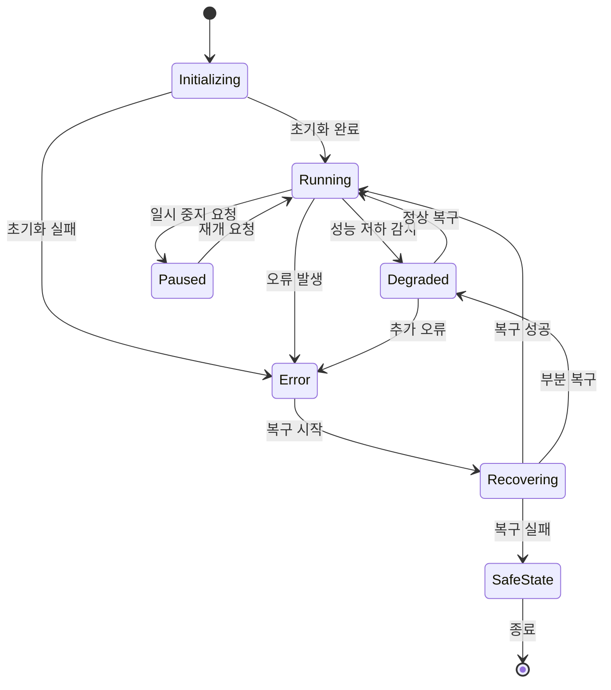
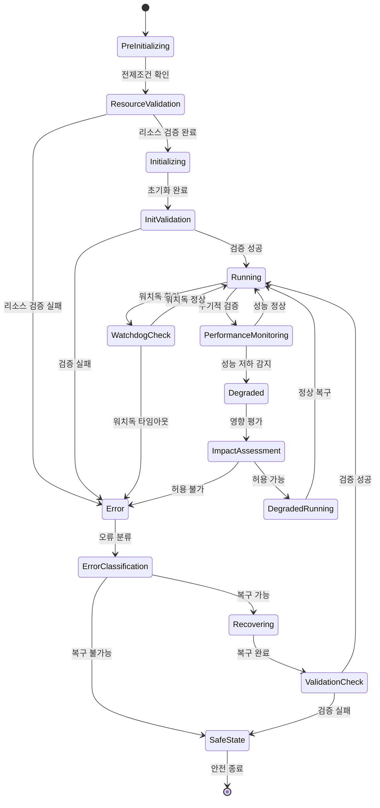
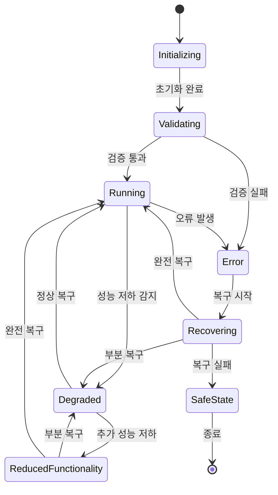
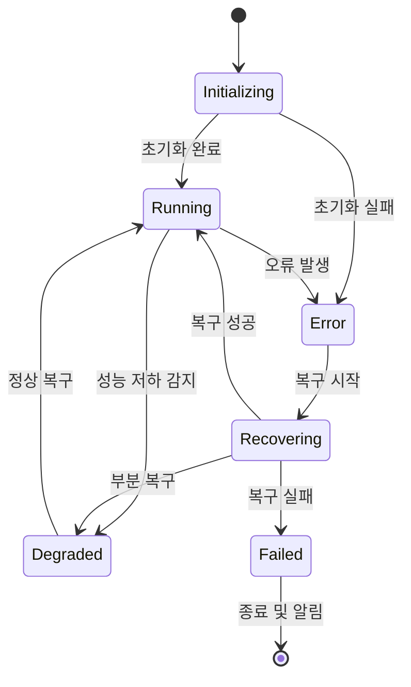
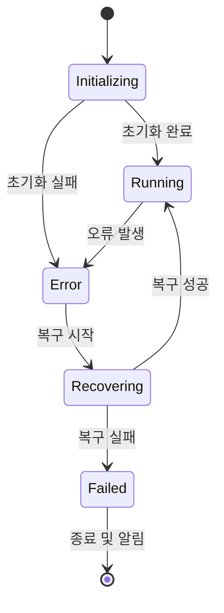
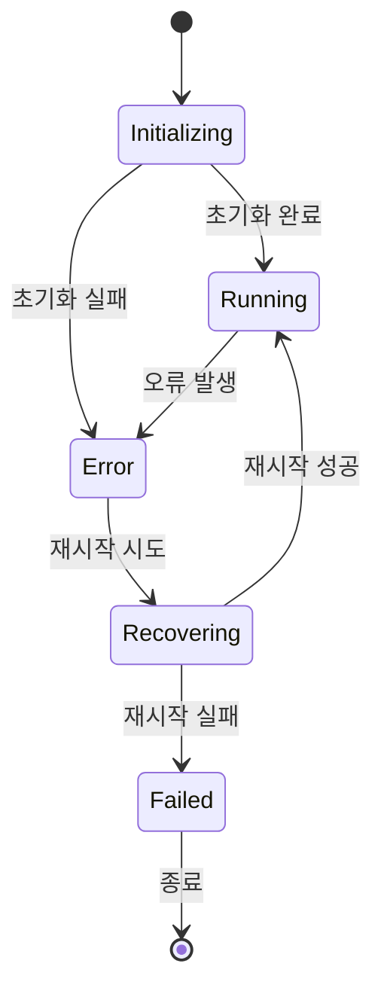

# PICCOLO ASIL 서비스 상태 관리 특화 가이드

**문서 번호**: PICCOLO-ASIL-STATE-2025-003  
**버전**: 1.0  
**날짜**: 2025-08-10  
**작성자**: joshua-jung_LGESDV  
**분류**: ASIL 서비스 상태 관리 가이드  

## 1. 개요

본 문서는 PICCOLO 프레임워크에서 ISO 26262 표준을 준수하는 ASIL(Automotive Safety Integrity Level) 서비스의 상태 관리에 대한 특화된 가이드를 제공합니다. 각 ASIL 등급(D, C, B, A, QM)에 따른 상세 구성 방법, 상태 머신 정의, 상태 전이 규칙, 복구 전략을 설명하며, 실제 사용 사례별 구현 예시를 제공합니다.

## 2. ASIL 등급별 상태 관리 요구사항

### 2.1 ASIL 등급 정의 및 일반 요구사항

ISO 26262에 따른 ASIL 등급은 차량 기능의 안전 무결성 수준을 나타내며, 다음과 같이 정의됩니다:

| ASIL 등급 | 위험도 | 상태 관리 요구사항 | 상태 전이 요건 | 모니터링 주기 | 복구 시간 |
|----------|------|------------------|-------------|------------|----------|
| ASIL D | 최고 | 완전 이중화, 확정적 실행, 완전 검증 | 모든 상태 전이 검증 | 5-10ms | 50ms 이내 |
| ASIL C | 높음 | 선택적 이중화, 엄격한 모니터링 | 주요 상태 전이 검증 | 50ms | 100ms 이내 |
| ASIL B | 중간 | 단일 장애 감내, 리소스 예약 | 핵심 상태 전이 검증 | 100ms | 500ms 이내 |
| ASIL A | 낮음 | 기본 안전성, 적절한 자원 할당 | 최소 검증 | 500ms | 1초 이내 |
| QM | 품질 관리 | 표준 품질 관리 절차 | 검증 없음 | 1초 | 5초 이내 |

### 2.2 ASIL 서비스의 기본 상태 모델

모든 ASIL 서비스는 다음의 기본 상태 모델을 따르되, ASIL 등급에 따라 상태 전이 규칙과 검증 요구사항이 달라집니다:



## 3. ASIL D 서비스 상태 관리

### 3.1 ASIL D 상태 전이 확장 모델

ASIL D 서비스는 기본 상태 모델을 확장하여 다음과 같은 상세 상태 모델을 구현해야 합니다:



### 3.2 ASIL D 서비스 구성 예시: 긴급 제동 시스템

#### 3.2.1 Package 구성

```yaml
apiVersion: piccolo.io/v1
kind: Package
metadata:
  name: emergency-brake-system
  annotations:
    version: "3.0"
    description: "ASIL D 긴급 제동 시스템"
    safetyIntegrityLevel: "ASIL-D"
  labels:
    types: ["time-critical", "redundant", "secure"]
    function: "emergency-braking"
    criticality: "safety-critical"
spec:
  pattern:
    type: distributed
    nodeSelectorPolicy: "safety-dedicated"
  models:
    - name: primary-brake-controller
      image: vehicle/emergency-brake:3.0
      node: SafetyECU-1
      resources:
        requests:
          cpu: 2
          memory: 1Gi
        limits:
          cpu: 2
          memory: 1Gi
      scheduling:
        timeCritical: true
        priority: 99
        period: "5ms"
        deadline: "4ms"
        executionTime: "1ms"
        cpuAffinity: [0, 1]
        isolationLevel: "exclusive"
      volumes:
        - name: brake-data
          mountPath: /data
          volume: brake-data-volume
      networks:
        - name: control-network
          qos:
            priority: "critical"
            latency: "ultra-low"
      stateValidation:
        startup:
          timeoutMs: 50
          requiredChecks:
            - type: "resourceAvailability"
            - type: "componentIntegrity"
            - type: "dependencyStatus"
        runtime:
          intervalMs: 5
          checks:
            - type: "responseTime"
              threshold: "3ms"
              action: "failover"
            - type: "memoryUsage"
              threshold: "80%"
              action: "notify"
            - type: "healthEndpoint"
              endpoint: "/health"
              timeoutMs: 2
              action: "restart"
    
    - name: secondary-brake-controller
      image: vehicle/emergency-brake:3.0
      node: SafetyECU-2
      resources:
        requests:
          cpu: 2
          memory: 1Gi
        limits:
          cpu: 2
          memory: 1Gi
      scheduling:
        timeCritical: true
        priority: 99
        period: "5ms"
        deadline: "4ms"
        executionTime: "1ms"
        cpuAffinity: [0, 1]
        isolationLevel: "exclusive"
      volumes:
        - name: brake-data-backup
          mountPath: /data
          volume: brake-data-backup-volume
      networks:
        - name: control-network
          qos:
            priority: "critical"
            latency: "ultra-low"
      stateValidation:
        startup:
          timeoutMs: 50
          requiredChecks:
            - type: "resourceAvailability"
            - type: "componentIntegrity" 
        runtime:
          intervalMs: 5
          checks:
            - type: "responseTime"
              threshold: "3ms"
              action: "activate"
    
    - name: brake-data-synchronizer
      image: vehicle/data-sync:2.0
      node: SafetyECU-3
      resources:
        requests:
          cpu: 1
          memory: 512Mi
        limits:
          cpu: 1
          memory: 512Mi
      scheduling:
        priority: 90
        period: "10ms"
      networks:
        - name: control-network
          qos:
            priority: "high"
      stateValidation:
        runtime:
          intervalMs: 10
          checks:
            - type: "syncStatus"
              threshold: "latency > 5ms"
              action: "alert"

    - name: safety-watchdog
      image: vehicle/safety-watchdog:2.0
      node: SafetyECU-3
      resources:
        requests:
          cpu: 0.5
          memory: 256Mi
        limits:
          cpu: 0.5
          memory: 256Mi
      scheduling:
        priority: 98
        period: "5ms"
      networks:
        - name: control-network
          qos:
            priority: "critical"
        - name: monitoring-network
          qos:
            priority: "high"
      stateValidation:
        startup:
          timeoutMs: 20
          requiredChecks:
            - type: "selfTest"
        runtime:
          intervalMs: 5
          checks:
            - type: "controllerHeartbeat"
              threshold: "missed > 1"
              action: "triggerFailover"

  failoverConfig:
    mode: "active-active"
    heartbeatInterval: "5ms"
    maxFailureDetectionTime: "15ms"
    automaticFailover: true
    validationCheck: true
    stateSynchronization:
      enabled: true
      syncInterval: "10ms"
      consistencyCheck: true
    
  securityConfig:
    encryptedCommunication: true
    signedExecutables: true
    resourceIsolation: true
    secureBootRequired: true
    tamperDetection: true
    
  stateTransitionValidation:
    enabled: true
    validationTimeout: "5ms"
    transitions:
      - from: "Initializing"
        to: "Running"
        validators:
          - "resourceCheck"
          - "dependencyCheck"
          - "integrityCheck"
      - from: "Error"
        to: "Recovering"
        validators:
          - "errorSeverityCheck"
          - "recoveryResourceCheck"
      - from: "Recovering"
        to: "Running"
        validators:
          - "fullFunctionalityCheck"
          - "dataConsistencyCheck"
```

#### 3.2.2 Scenario 구성

```yaml
apiVersion: piccolo.io/v1
kind: Scenario
metadata:
  name: emergency-brake-startup
  annotations:
    description: "긴급 제동 시스템 시작 시나리오"
    priority: "critical"
    safetyLevel: "ASIL-D"
  labels:
    function: "safety-critical"
    category: "emergency-braking"
spec:
  condition:
    ignitionState: "ON"
    vehicleSafetySystems: "INITIALIZING"
  action: launch
  target:
    packages:
      - emergency-brake-system
  executionConstraints:
    maxStartupTime: "100ms"
    resourceGuarantee: true
    preemptLowerPriority: true
    startupValidation: true
  orderConstraints:
    - first: "safety-watchdog"
      then: ["primary-brake-controller", "secondary-brake-controller"]
      finally: "brake-data-synchronizer"
  stateValidation:
    requiredStates:
      - target: "safety-watchdog"
        state: "Running"
        timeout: "50ms"
      - target: "primary-brake-controller"
        state: "Running"
        timeout: "80ms"
    transitionVerification:
      enabled: true
      verifiers:
        - type: "resourceAvailability"
        - type: "componentIntegrity"
        - type: "securityCheck"
```

```yaml
apiVersion: piccolo.io/v1
kind: Scenario
metadata:
  name: emergency-brake-failover
  annotations:
    description: "긴급 제동 시스템 장애 복구 시나리오"
    priority: "critical"
    safetyLevel: "ASIL-D"
  labels:
    function: "safety-critical"
    category: "emergency-braking"
spec:
  condition:
    primaryControllerState: "ERROR OR DEGRADED"
    vehicleMoving: "true"
  action: modify
  target:
    packages:
      - emergency-brake-system
    specificModels:
      - secondary-brake-controller
  modifications:
    secondaryControllerRole: "PRIMARY"
    resourcePriority: "MAXIMUM"
  executionConstraints:
    maxTransitionTime: "20ms"
    notificationLevel: "CRITICAL"
  stateValidation:
    preTransitionCheck:
      enabled: true
      timeout: "5ms"
      checks:
        - type: "secondaryControllerHealth"
        - type: "dataConsistency"
    postTransitionCheck:
      enabled: true
      timeout: "10ms"
      checks:
        - type: "functionalityVerification"
        - type: "performanceMetrics"
```

#### 3.2.3 Recovery Policy 구성

```yaml
apiVersion: piccolo.io/v1
kind: RecoveryPolicy
metadata:
  name: emergency-brake-recovery
  annotations:
    description: "ASIL D 긴급 제동 시스템 복구 정책"
    asilLevel: "D"
spec:
  target:
    package: emergency-brake-system
  stateAssessment:
    interval: "5ms"
    healthEndpoints:
      - model: "primary-brake-controller"
        endpoint: "/health"
        timeout: "2ms"
      - model: "secondary-brake-controller"
        endpoint: "/health"
        timeout: "2ms"
    watchdogConfig:
      enabled: true
      interval: "5ms"
      missedThreshold: 1
  recoveryStrategies:
    - type: failover
      timeout: 20ms
      maxRetries: 0
      backupInstance: true
      validationRequired: true
      stateSync: true
      dataSyncRequired: true
    - type: restart
      timeout: 50ms
      maxRetries: 1
      gracePeriod: 10ms
      coldRestart: false
      statePreservation: true
    - type: degradedMode
      activationCondition: "failover-failed AND restart-failed"
      notificationLevel: "critical"
      functionalityReduction:
        maintain: ["emergency-braking", "abs"]
        reduce: ["comfort-features"]
      timeLimit: "1m"
      continuousReassessment: true
  isolationStrategy:
    enabled: true
    scope: "container"
    faultContainment: true
    resourceIsolation: true
  resourceGuarantee:
    preemptive: true
    reservedResources:
      cpu: "2"
      memory: "1Gi"
  stateTransitionValidation:
    required: true
    timeout: "5ms"
    validationSteps:
      - step: "pre-transition"
        checks: ["resource", "dependencies", "security"]
      - step: "during-transition"
        checks: ["atomicity", "consistency"]
      - step: "post-transition"
        checks: ["functionality", "performance", "data-integrity"]
  loggingConfig:
    detailedStateTransitions: true
    persistenceLevel: "blackbox"
    storeDuration: "30d"
    criticalEvents:
      - "failover-trigger"
      - "recovery-failed"
      - "degraded-mode-activated"
  safetyMeasures:
    fallbackMode: "limp-home"
    emergencyStop:
      enabled: true
      conditions: "all-recovery-failed AND vehicle-moving"
    driverNotification:
      level: "critical"
      visualAlert: true
      audioAlert: true
```

### 3.3 ASIL D 상태 전이 예시

다음은 ASIL D 서비스의 주요 상태 전이 시나리오와 상태 검증 방법입니다:

#### 3.3.1 시스템 시작 상태 전이

1. **PreInitializing → ResourceValidation**
   - 시스템 시작 시 필요한 모든 리소스가 가용한지 검증
   - 검증 항목: CPU, 메모리, 네트워크, 저장소 등
   - 검증 실패 시: 즉시 Error 상태로 전환 및 로깅

2. **ResourceValidation → Initializing**
   - 리소스 검증 성공 후 초기화 시작
   - 안전 관련 하드웨어 자가 진단 수행
   - 독립적인 초기화 검증 모듈에 의한 모니터링

3. **Initializing → InitValidation**
   - 초기화 완료 후 시스템 무결성 검증
   - 초기화 결과 확인 및 데이터 일관성 검사
   - 백업 컨트롤러와의 상태 동기화 확인

4. **InitValidation → Running**
   - 모든 검증 통과 후 정상 실행 상태로 전환
   - 워치독 타이머 활성화 및 모니터링 시작
   - 상태 전이 정보 블랙박스 로깅

#### 3.3.2 오류 감지 및 복구 상태 전이

1. **Running → Error (오류 감지)**
   - 워치독 타임아웃 또는 내부 오류 감지
   - 실행 중 상태 검증 실패
   - 오류 정보 수집 및 로깅

2. **Error → ErrorClassification**
   - 오류 유형 및 심각도 분류
   - 복구 가능성 평가
   - 복구 전략 선택

3. **ErrorClassification → Recovering**
   - 복구 전략 실행 (페일오버, 재시작 등)
   - 복구 과정 모니터링
   - 블랙박스 로깅

4. **Recovering → ValidationCheck**
   - 복구 후 시스템 상태 검증
   - 기능 테스트 및 성능 검증
   - 데이터 일관성 확인

5. **ValidationCheck → Running/SafeState**
   - 검증 성공 시: Running 상태로 복귀
   - 검증 실패 시: SafeState로 전환 및 알림

## 4. ASIL C 서비스 상태 관리

### 4.1 ASIL C 상태 모델

ASIL C 서비스는 ASIL D보다 단순화된 상태 모델을 사용하지만, 여전히 엄격한 상태 검증이 필요합니다:



### 4.2 ASIL C 서비스 구성 예시: 차선 유지 보조 시스템

#### 4.2.1 Package 구성

```yaml
apiVersion: piccolo.io/v1
kind: Package
metadata:
  name: lane-keeping-assist
  annotations:
    version: "3.5"
    description: "ASIL C 차선 유지 보조 시스템"
    safetyIntegrityLevel: "ASIL-C"
  labels:
    types: ["time-critical", "resource-bounded"]
    function: "driver-assistance"
    criticality: "safety-related"
spec:
  pattern:
    type: selector
    nodeSelector:
      function: "vision-processing"
  models:
    - name: lane-detection
      image: vehicle/lane-detection:3.5
      resources:
        requests:
          cpu: 2
          memory: 2Gi
          gpu: 0.5
        limits:
          cpu: 4
          memory: 3Gi
          gpu: 1
      scheduling:
        timeCritical: true
        priority: 85
        period: "50ms"
        deadline: "40ms"
      volumes:
        - name: camera-data
          mountPath: /data/camera
          volume: camera-data-volume
      networks:
        - name: sensor-network
          qos:
            priority: "high"
      stateValidation:
        startup:
          timeoutMs: 200
          requiredChecks:
            - type: "resourceAvailability"
            - type: "sensorConnection"
        runtime:
          intervalMs: 50
          checks:
            - type: "detectionQuality"
              threshold: "confidence < 75%"
              action: "degradeMode"
    
    - name: lane-control
      image: vehicle/lane-control:3.0
      resources:
        requests:
          cpu: 1
          memory: 1Gi
        limits:
          cpu: 2
          memory: 2Gi
      scheduling:
        timeCritical: true
        priority: 80
        period: "50ms"
        deadline: "45ms"
      networks:
        - name: control-network
          qos:
            priority: "high"
      stateValidation:
        runtime:
          intervalMs: 50
          checks:
            - type: "responseTime"
              threshold: "40ms"
              action: "restart"
            - type: "controlQuality"
              threshold: "error > 10%"
              action: "degradeMode"
    
    - name: lane-monitor
      image: vehicle/lane-monitor:2.0
      resources:
        requests:
          cpu: 0.5
          memory: 512Mi
        limits:
          cpu: 1
          memory: 1Gi
      scheduling:
        priority: 75
      networks:
        - name: monitoring-network
          qos:
            priority: "medium"
      stateValidation:
        runtime:
          intervalMs: 100
          checks:
            - type: "componentStatus"
              action: "notify"

  degradedModeConfig:
    enabled: true
    levels:
      - name: "full-functionality"
        conditions: "all-resources-available AND detection-quality-high"
        stateMapping: "Running"
      - name: "reduced-precision"
        conditions: "gpu-limited OR detection-quality-medium"
        features:
          disabled: []
          reduced: ["detection-precision", "control-frequency"]
        stateMapping: "Degraded"
      - name: "warning-only"
        conditions: "severe-resource-limitation OR detection-quality-low"
        features:
          disabled: ["automatic-steering"]
          reduced: ["detection-frequency", "warning-distance"]
        stateMapping: "ReducedFunctionality"
  
  stateTransitionValidation:
    enabled: true
    validationTimeout: "20ms"
    transitions:
      - from: "Initializing"
        to: "Validating"
        validators:
          - "resourceCheck"
          - "sensorCheck"
      - from: "Validating"
        to: "Running"
        validators:
          - "detectionQualityCheck"
          - "controlSystemCheck"
      - from: "Running"
        to: "Degraded"
        validators:
          - "degradationLevelCheck"
          - "userNotificationCheck"
```

#### 4.2.2 Scenario 구성

```yaml
apiVersion: piccolo.io/v1
kind: Scenario
metadata:
  name: lane-assist-activation
  annotations:
    description: "차선 유지 보조 시스템 활성화"
    priority: "high"
    safetyLevel: "ASIL-C"
  labels:
    function: "driver-assistance"
    category: "lane-keeping"
spec:
  condition:
    vehicleSpeed: ">30"
    driverAssistEnabled: "true"
    cameraStatus: "OPERATIONAL"
  action: launch
  target:
    packages:
      - lane-keeping-assist
  executionConstraints:
    maxStartupTime: "200ms"
    resourceGuarantee: true
  stateValidation:
    requiredStates:
      - target: "lane-detection"
        state: "Running"
        timeout: "150ms"
      - target: "lane-control"
        state: "Running"
        timeout: "180ms"
    transitionVerification:
      enabled: true
      verifiers:
        - type: "sensorQuality"
        - type: "systemReadiness"
```

```yaml
apiVersion: piccolo.io/v1
kind: Scenario
metadata:
  name: lane-assist-degraded-mode
  annotations:
    description: "차선 유지 보조 성능 저하 모드 전환"
    priority: "high"
    safetyLevel: "ASIL-C"
  labels:
    function: "driver-assistance"
    category: "lane-keeping"
spec:
  condition:
    vehicleSpeed: ">30"
    driverAssistEnabled: "true"
    AND:
      - OR:
          - cameraStatus: "DEGRADED"
          - detectionQuality: "<75%"
      - systemStatus: "RUNNING OR DEGRADED"
  action: modify
  target:
    packages:
      - lane-keeping-assist
  modifications:
    operationMode: "REDUCED_PRECISION"
    notifyDriver: true
  executionConstraints:
    maxTransitionTime: "100ms"
  stateValidation:
    preTransitionCheck:
      enabled: true
      timeout: "20ms"
      checks:
        - type: "degradationLevelAssessment"
    postTransitionCheck:
      enabled: true
      timeout: "30ms"
      checks:
        - type: "userNotification"
        - type: "minimalFunctionalityVerification"
```

#### 4.2.3 Recovery Policy 구성

```yaml
apiVersion: piccolo.io/v1
kind: RecoveryPolicy
metadata:
  name: lane-keeping-recovery
  annotations:
    description: "ASIL C 차선 유지 보조 시스템 복구 정책"
    asilLevel: "C"
spec:
  target:
    package: lane-keeping-assist
  stateAssessment:
    interval: "50ms"
    healthEndpoints:
      - model: "lane-detection"
        endpoint: "/health"
        timeout: "20ms"
      - model: "lane-control"
        endpoint: "/health"
        timeout: "20ms"
    metricThresholds:
      - name: "detectionQuality"
        threshold: "75%"
        action: "degradeMode"
      - name: "processingLatency"
        threshold: "40ms"
        action: "restart"
  recoveryStrategies:
    - type: degradedMode
      timeout: 100ms
      levels:
        - name: "reduced-precision"
          conditions: "detectionQuality < 75% AND detectionQuality >= 50%"
          features:
            reduced: ["detection-precision"]
          stateMapping: "Degraded"
        - name: "warning-only"
          conditions: "detectionQuality < 50%"
          features:
            disabled: ["automatic-steering"]
            reduced: ["detection-frequency"]
          stateMapping: "ReducedFunctionality"
      notificationRequired: true
    - type: restart
      timeout: 100ms
      maxRetries: 2
      gracePeriod: 50ms
      statePreservation: true
    - type: resourceAdjustment
      timeout: 80ms
      adjustments:
        - resource: "gpu"
          action: "increase"
          limit: "available"
  stateTransitionValidation:
    required: true
    timeout: "20ms"
    validationSteps:
      - step: "pre-transition"
        checks: ["resource", "dependencies"]
      - step: "post-transition"
        checks: ["functionality", "user-notification"]
  loggingConfig:
    detailedStateTransitions: true
    persistenceLevel: "system"
    storeDuration: "15d"
  safetyMeasures:
    driverNotification:
      level: "warning"
      visualAlert: true
      audioAlert: true
    handoverStrategy:
      enabled: true
      warningTime: "3s"
```

## 5. ASIL B 서비스 상태 관리

### 5.1 ASIL B 상태 모델

ASIL B 서비스는 더 단순화된 상태 모델을 사용하지만, 여전히 핵심 안전 기능을 보장해야 합니다:



### 5.2 ASIL B 서비스 구성 예시: 후방 충돌 경고 시스템

#### 5.2.1 Package 구성

```yaml
apiVersion: piccolo.io/v1
kind: Package
metadata:
  name: rear-collision-warning
  annotations:
    version: "2.8"
    description: "ASIL B 후방 충돌 경고 시스템"
    safetyIntegrityLevel: "ASIL-B"
  labels:
    types: ["time-critical"]
    function: "warning-system"
    criticality: "safety-related"
spec:
  pattern:
    type: plain
  models:
    - name: radar-processing
      image: vehicle/radar-processing:2.8
      resources:
        requests:
          cpu: 1
          memory: 1Gi
        limits:
          cpu: 2
          memory: 2Gi
      scheduling:
        timeCritical: true
        priority: 70
        period: "100ms"
      volumes:
        - name: radar-data
          mountPath: /data/radar
          volume: radar-data-volume
      networks:
        - name: sensor-network
          qos:
            priority: "medium"
      stateValidation:
        startup:
          timeoutMs: 500
          requiredChecks:
            - type: "sensorConnection"
        runtime:
          intervalMs: 100
          checks:
            - type: "detectionQuality"
              threshold: "confidence < 70%"
              action: "notify"
    
    - name: warning-controller
      image: vehicle/warning-controller:2.2
      resources:
        requests:
          cpu: 0.5
          memory: 512Mi
        limits:
          cpu: 1
          memory: 1Gi
      scheduling:
        priority: 65
      networks:
        - name: control-network
          qos:
            priority: "medium"
      stateValidation:
        runtime:
          intervalMs: 100
          checks:
            - type: "responseTime"
              threshold: "80ms"
              action: "restart"
  
  restartPolicy:
    maxRestarts: 3
    backoffSeconds: 5
    notifyOnFailure: true
  
  stateTransitionValidation:
    enabled: true
    validationTimeout: "50ms"
    transitions:
      - from: "Initializing"
        to: "Running"
        validators:
          - "sensorCheck"
      - from: "Error"
        to: "Recovering"
        validators:
          - "recoveryResourceCheck"
```

#### 5.2.2 Scenario 구성

```yaml
apiVersion: piccolo.io/v1
kind: Scenario
metadata:
  name: rear-collision-warning-activation
  annotations:
    description: "후방 충돌 경고 시스템 활성화"
    priority: "medium"
    safetyLevel: "ASIL-B"
  labels:
    function: "warning-system"
    category: "collision-warning"
spec:
  condition:
    ignitionState: "ON"
    vehicleStatus: "PARKED OR MOVING_REVERSE"
  action: launch
  target:
    packages:
      - rear-collision-warning
  executionConstraints:
    maxStartupTime: "500ms"
  stateValidation:
    requiredStates:
      - target: "radar-processing"
        state: "Running"
        timeout: "400ms"
      - target: "warning-controller"
        state: "Running"
        timeout: "450ms"
```

```yaml
apiVersion: piccolo.io/v1
kind: Scenario
metadata:
  name: rear-collision-warning-recovery
  annotations:
    description: "후방 충돌 경고 시스템 복구 시나리오"
    priority: "medium"
    safetyLevel: "ASIL-B"
  labels:
    function: "warning-system"
    category: "collision-warning"
spec:
  condition:
    packageStatus: "rear-collision-warning:ERROR"
    vehicleStatus: "PARKED OR MOVING_REVERSE"
  action: restart
  target:
    packages:
      - rear-collision-warning
  executionConstraints:
    maxExecutionTime: "300ms"
    notifyUser: true
  stateValidation:
    postActionCheck:
      timeout: "200ms"
      requiredState: "Running OR Degraded"
```

#### 5.2.3 Recovery Policy 구성

```yaml
apiVersion: piccolo.io/v1
kind: RecoveryPolicy
metadata:
  name: rear-collision-warning-recovery
  annotations:
    description: "ASIL B 후방 충돌 경고 시스템 복구 정책"
    asilLevel: "B"
spec:
  target:
    package: rear-collision-warning
  stateAssessment:
    interval: "100ms"
    healthEndpoints:
      - model: "radar-processing"
        endpoint: "/health"
        timeout: "50ms"
      - model: "warning-controller"
        endpoint: "/health"
        timeout: "50ms"
  recoveryStrategies:
    - type: restart
      timeout: 500ms
      maxRetries: 3
      gracePeriod: 100ms
    - type: degradedMode
      activationCondition: "restart-failed OR detection-quality-low"
      notificationLevel: "warning"
      functionalityReduction:
        reduce: ["detection-distance", "warning-frequency"]
  stateTransitionValidation:
    required: true
    timeout: "50ms"
    validationSteps:
      - step: "post-transition"
        checks: ["basic-functionality", "user-notification"]
  loggingConfig:
    detailedStateTransitions: true
    persistenceLevel: "system"
    storeDuration: "7d"
  safetyMeasures:
    driverNotification:
      level: "warning"
      visualAlert: true
```

## 6. ASIL A 서비스 상태 관리

### 6.1 ASIL A 상태 모델

ASIL A 서비스는 기본적인 안전 요구사항을 충족하면서 상대적으로 단순한 상태 모델을 사용합니다:



### 6.2 ASIL A 서비스 구성 예시: 운전자 주의 경고 시스템

#### 6.2.1 Package 구성

```yaml
apiVersion: piccolo.io/v1
kind: Package
metadata:
  name: driver-attention-warning
  annotations:
    version: "2.0"
    description: "ASIL A 운전자 주의 경고 시스템"
    safetyIntegrityLevel: "ASIL-A"
  labels:
    types: ["resource-bounded"]
    function: "warning-system"
    criticality: "safety-related"
spec:
  pattern:
    type: plain
  models:
    - name: driver-monitoring
      image: vehicle/driver-monitoring:2.0
      resources:
        requests:
          cpu: 0.5
          memory: 512Mi
        limits:
          cpu: 1
          memory: 1Gi
      scheduling:
        priority: 60
      volumes:
        - name: camera-data
          mountPath: /data/camera
          volume: interior-camera-volume
      networks:
        - name: interior-network
          qos:
            priority: "medium"
      stateValidation:
        startup:
          timeoutMs: 1000
          requiredChecks:
            - type: "basicResourceCheck"
        runtime:
          intervalMs: 500
          checks:
            - type: "basicHealthCheck"
              action: "restart"
    
    - name: attention-analyzer
      image: vehicle/attention-analyzer:1.5
      resources:
        requests:
          cpu: 0.5
          memory: 256Mi
        limits:
          cpu: 1
          memory: 512Mi
      scheduling:
        priority: 55
      networks:
        - name: interior-network
          qos:
            priority: "low"
  
  restartPolicy:
    maxRestarts: 3
    backoffSeconds: 10
    notifyOnFailure: true
```

#### 6.2.2 Scenario 구성

```yaml
apiVersion: piccolo.io/v1
kind: Scenario
metadata:
  name: driver-attention-activation
  annotations:
    description: "운전자 주의 경고 시스템 활성화"
    priority: "low"
    safetyLevel: "ASIL-A"
  labels:
    function: "warning-system"
    category: "driver-monitoring"
spec:
  condition:
    ignitionState: "ON"
    vehicleSpeed: ">20"
    driverMonitoringEnabled: "true"
  action: launch
  target:
    packages:
      - driver-attention-warning
  executionConstraints:
    maxStartupTime: "1000ms"
```

#### 6.2.3 Recovery Policy 구성

```yaml
apiVersion: piccolo.io/v1
kind: RecoveryPolicy
metadata:
  name: driver-attention-recovery
  annotations:
    description: "ASIL A 운전자 주의 경고 시스템 복구 정책"
    asilLevel: "A"
spec:
  target:
    package: driver-attention-warning
  stateAssessment:
    interval: "500ms"
    healthEndpoints:
      - model: "driver-monitoring"
        endpoint: "/health"
        timeout: "200ms"
  recoveryStrategies:
    - type: restart
      timeout: 1000ms
      maxRetries: 3
      gracePeriod: 500ms
  loggingConfig:
    detailedStateTransitions: false
    persistenceLevel: "basic"
    storeDuration: "3d"
  safetyMeasures:
    driverNotification:
      level: "info"
      visualAlert: true
```

### 6.3 ASIL A 상태 전이 핵심 요구사항

1. **기본 상태 모니터링**:
   - 최소 500ms 주기로 상태 모니터링
   - 단순 헬스 체크 기반 오류 감지
   - 기본적인 재시작 정책 적용

2. **사용자 알림 중심**:
   - 상태 변화 시 사용자 알림
   - 시각적 표시를 통한 상태 전달
   - 안전 관련 메시지 제공

3. **단순 복구 전략**:
   - 재시작 기반 단순 복구
   - 최대 3회 재시도 허용
   - 복구 시간 1초 이내 목표

## 7. QM(Quality Management) 서비스 상태 관리

### 7.1 QM 상태 모델

QM 수준 서비스는 기본적인 품질 관리 수준의 상태 모델을 사용합니다:



### 7.2 QM 서비스 구성 예시: 차량 정보 표시 시스템

#### 7.2.1 Package 구성

```yaml
apiVersion: piccolo.io/v1
kind: Package
metadata:
  name: vehicle-info-display
  annotations:
    version: "1.5"
    description: "차량 정보 표시 시스템"
    safetyIntegrityLevel: "QM"
  labels:
    types: ["plain"]
    function: "information"
    criticality: "non-critical"
spec:
  pattern:
    type: plain
  models:
    - name: info-collector
      image: vehicle/info-collector:1.5
      resources:
        requests:
          cpu: 0.2
          memory: 128Mi
        limits:
          cpu: 0.5
          memory: 256Mi
      scheduling:
        priority: 30
      networks:
        - name: info-network
          qos:
            priority: "low"
    
    - name: display-manager
      image: vehicle/display-manager:1.2
      resources:
        requests:
          cpu: 0.3
          memory: 256Mi
        limits:
          cpu: 0.5
          memory: 512Mi
      scheduling:
        priority: 25
  
  restartPolicy:
    maxRestarts: 5
    backoffSeconds: 30
```

#### 7.2.2 Scenario 구성

```yaml
apiVersion: piccolo.io/v1
kind: Scenario
metadata:
  name: vehicle-info-display-activation
  annotations:
    description: "차량 정보 표시 시스템 활성화"
    priority: "low"
  labels:
    function: "information"
    category: "display"
spec:
  condition:
    ignitionState: "ON"
    displayAvailable: "true"
  action: launch
  target:
    packages:
      - vehicle-info-display
  executionConstraints:
    maxStartupTime: "5000ms"
```

### 7.3 QM 서비스 상태 관리 요구사항

1. **기본 상태 모니터링**:
   - 최소 1초 주기로 상태 모니터링
   - 기본적인 활성 여부 체크
   - 오류 발생 시 로그 기록

2. **단순 재시작 정책**:
   - 문제 발생 시 단순 재시작
   - 백오프 적용하여 연속 재시작 방지
   - 최대 5회 재시도 후 포기

3. **낮은 우선순위 처리**:
   - 중요 서비스에 리소스 양보
   - 비즈니스 로직 중심 설계
   - 성능보다 안정성 중시

## 8. 크리티컬 안전 시나리오의 상태 전이 예시

### 8.1 비상 제동 시스템 장애 대응 시나리오 (ASIL D)

다음은 주행 중 비상 제동 시스템의 주 컨트롤러에 장애가 발생했을 때의 상태 전이 시퀀스입니다:

1. **장애 감지 (Running → Error)**
   - 워치독 타임아웃 또는 내부 오류 감지 (10ms 이내)
   - 오류 상태로 즉시 전환 및 블랙박스 로깅
   - 오류 분류 프로세스 시작

2. **오류 분류 및 복구 전략 결정 (Error → ErrorClassification)**
   - 오류 유형 및 심각도 확인 (5ms 이내)
   - 페일오버 가능성 평가
   - 백업 컨트롤러 상태 검증

3. **페일오버 실행 (ErrorClassification → Recovering)**
   - 백업 컨트롤러로 제어 전환 (15ms 이내)
   - 백업 컨트롤러의 제어 권한 상승
   - 주 컨트롤러 격리

4. **복구 검증 (Recovering → ValidationCheck)**
   - 백업 컨트롤러 정상 작동 확인 (10ms 이내)
   - 기능 테스트 수행
   - 성능 지표 검증

5. **정상 운영 복귀 (ValidationCheck → Running)**
   - 백업 컨트롤러를 주 컨트롤러로 승격 (5ms 이내)
   - 새로운 상태 기록 및 모니터링 재설정
   - 드라이버에게 상태 알림

**총 상태 전이 시간**: 45ms (ASIL D 요구사항 50ms 이내 충족)

### 8.2 자율주행 차선 변경 실패 시나리오 (ASIL C)

자율주행 모드에서 차선 변경 기능 실패 시 상태 전이 시퀀스:

1. **성능 저하 감지 (Running → Degraded)**
   - 차선 인식 품질 저하 감지 (50ms 이내)
   - Degraded 상태로 전환
   - 성능 저하 수준 평가 시작

2. **저하 수준 평가 (Degraded → ImpactAssessment)**
   - 안전 영향 평가 수행 (20ms 이내)
   - 기능 제한 범위 결정
   - 사용자 알림 준비

3. **저하 모드 적용 (ImpactAssessment → DegradedRunning)**
   - 자동 차선 변경 기능 비활성화 (15ms 이내)
   - 경고 표시 활성화
   - 수동 모드로 전환 요청

4. **사용자 알림 및 제어 이양 (DegradedRunning → Stabilized)**
   - 운전자에게 제어권 이양 알림 (10ms 이내)
   - 시각 및 청각 경고 제공
   - 안전한 운행 상태 확인

**총 상태 전이 시간**: 95ms (ASIL C 요구사항 100ms 이내 충족)

### 8.3 후방 충돌 경고 센서 오류 시나리오 (ASIL B)

후방 충돌 경고 시스템의 센서 오류 발생 시 상태 전이 시퀀스:

1. **센서 오류 감지 (Running → Error)**
   - 레이더 센서 응답 없음 감지 (100ms 이내)
   - Error 상태로 전환
   - 오류 로깅 및 복구 시작

2. **복구 시도 (Error → Recovering)**
   - 센서 재초기화 시도 (150ms 이내)
   - 센서 연결 재설정
   - 진단 데이터 수집

3. **복구 결과 확인 (Recovering → Degraded/Failed)**
   - 복구 결과 평가 (100ms 이내)
   - 부분 복구 시 Degraded 상태로 전환
   - 복구 실패 시 Failed 상태로 전환 및 알림

4. **사용자 알림 (Degraded/Failed → Notified)**
   - 운전자에게 상태 알림 (50ms 이내)
   - 시각적 경고 표시
   - 시스템 제한사항 안내

**총 상태 전이 시간**: 400ms (ASIL B 요구사항 500ms 이내 충족)

## 9. ASIL 등급별 설계 패턴 추가 가이드

### 9.1 ASIL 등급 간 호환성 및 통합 패턴

여러 ASIL 등급의 서비스가 통합되어 작동하는 시스템을 위한 설계 패턴:

1. **격리 및 방화벽 패턴**:
   - 서로 다른 ASIL 등급 서비스 간 명확한 경계 설정
   - 낮은 ASIL 등급에서 높은 ASIL 등급으로의 영향 차단
   - 데이터 교환 시 검증 레이어 추가

2. **ASIL 분해 패턴**:
   - 높은 ASIL 요구사항을 충족하기 위해 여러 하위 기능으로 분해
   - 각 하위 기능에 적절한 ASIL 등급 할당
   - 전체 안전 목표 달성을 위한 조합 방식 정의

3. **ASIL 상속 패턴**:
   - 의존성이 있는 서비스 간 ASIL 등급 상속 규칙 정의
   - 높은 ASIL 서비스에 의존하는 서비스는 동등 수준 처리
   - 상속 범위 및 예외 조건 명확화

### 9.2 ASIL 서비스 상태 전환 패턴

1. **점진적 성능 저하 패턴**:
   - Running → Degraded Level 1 → Degraded Level 2 → ... → SafeState
   - 각 단계별 기능 제한 명확화
   - 단계 전환 조건 및 검증 방법 정의

2. **3단계 복구 패턴**:
   - 1단계: 빠른 복구 (재시도, 페일오버)
   - 2단계: 중간 복구 (재시작, 재구성)
   - 3단계: 심층 복구 (완전 재초기화, 안전 상태 전환)

3. **상태 롤백 패턴**:
   - 상태 변경 전 스냅샷 생성
   - 상태 전이 실패 시 이전 상태로 롤백
   - 롤백 과정의 원자성 보장

## 10. 결론

ASIL 서비스의 효과적인 상태 관리는 차량 안전 시스템의 신뢰성과 가용성을 보장하는 핵심 요소입니다. 본 문서에서 제시한 ASIL 등급별 상태 관리 방법론, 구성 예시, 설계 패턴을 적용함으로써 ISO 26262 표준을 준수하는 안전한 차량 시스템 개발이 가능합니다.

특히 크리티컬 안전 시나리오에서의 상태 전이 예시를 통해 실제 상황에서 ASIL 등급별 요구사항을 충족하는 상태 전이 구현 방법을 제시하였습니다. ASIL D부터 QM까지 모든 등급의 서비스에 대한 구체적인 구성 예시와 설계 패턴을 참고하여 차량 안전 시스템의 상태 관리 아키텍처를 설계하고 구현할 수 있습니다.
