# PICCOLO 리소스 상태 관리 명세서

**문서 번호**: PICCOLO-STATE-RESOURCES-2025-002  
**버전**: 1.0  
**날짜**: 2025-08-04  
**작성자**: joshua-jung_LGESDV  
**분류**: 상태 관리 명세서  

## 1. 개요

본 문서는 PICCOLO 프레임워크의 리소스 상태 관리에 대한 상세 명세를 기술합니다. StateManager를 통해 Scenario, Package, Model, Volume, Network, Node 리소스의 상태를 관리하는 방식과 상태 머신 정의, 상태 전이 규칙, 모니터링 방법, 조정(reconciliation) 프로세스, 그리고 오류 복구(recovery) 방법을 설명합니다.

## 2. 리소스 상태 머신 정의

각 리소스 타입은 고유한 상태 머신을 가지며, 이를 통해 리소스의 생명주기를 관리합니다.

### 2.1 Scenario 상태 머신

#### 2.1.1 상태 정의

| 상태 | 설명 |
|------|------|
| idle | 시나리오 준비 상태 (활성화되지 않음) |
| waiting | 조건이 충족되기를 기다리는 상태 |
| playing | 시나리오 액션이 실행 중인 상태 |
| error | 시나리오 실행 중 오류 발생 상태 |
| allowed | 정책에 의해 실행이 허용된 상태 |
| denied | 정책에 의해 실행이 거부된 상태 |

#### 2.1.2 상태 전이 다이어그램

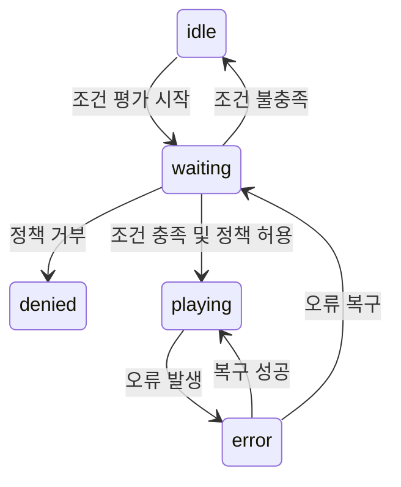

#### 2.1.3 상태 전이 규칙

| 현재 상태 | 이벤트 | 다음 상태 | 조건 | 액션 |
|---------|-------|---------|------|------|
| idle | 시나리오 활성화 | waiting | - | 조건 평가 시작 |
| waiting | 조건 충족 | allowed | - | 정책 검증 시작 |
| allowed | 정책 검증 성공 | playing | - | 타겟 패키지에 액션 실행 |
| allowed | 정책 검증 실패 | denied | - | 거부 로그 기록, 알림 생성 |
| waiting | 시간 초과 | error | 타임아웃 설정 존재 | 오류 로그 기록, 알림 생성 |
| playing | 액션 완료 | idle | 일회성 액션 | 완료 로그 기록 |
| playing | 조건 변경 | waiting | 지속적 평가 설정 | 재평가 시작 |
| playing | 실행 오류 | error | - | 오류 로그 기록, 알림 생성 |
| error | 복구 시도 | waiting | 자동 복구 설정 | 상태 초기화, 재시도 |
| error | 수동 리셋 | idle | - | 상태 초기화 |
| denied | 정책 변경 | waiting | - | 재평가 시작 |

### 2.2 Package 상태 머신

#### 2.2.1 상태 정의

| 상태 | 설명 |
|------|------|
| initializing | 패키지 초기화 중인 상태 |
| running | 패키지가 정상 작동 중인 상태 |
| degraded | 패키지가 일부 기능 저하된 상태로 작동 중 |
| error | 패키지 오류 발생 상태 |
| paused | 패키지가 일시 중지된 상태 |
| updating | 패키지가 업데이트 중인 상태 |

#### 2.2.2 상태 전이 다이어그램

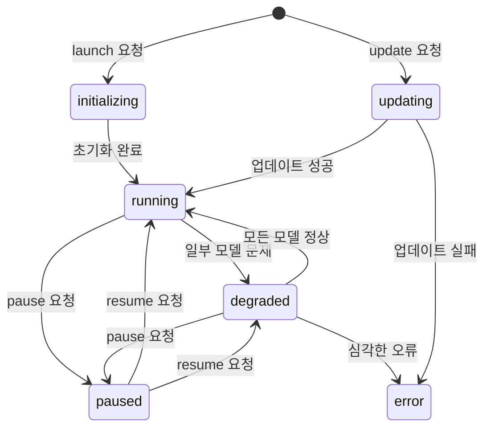

#### 2.2.3 상태 전이 규칙

| 현재 상태 | 이벤트 | 다음 상태 | 조건 | 액션 |
|---------|-------|---------|------|------|
| - | launch 요청 | initializing | - | 모델 생성 시작, 리소스 할당 |
| initializing | 초기화 완료 | running | 모든 모델 정상 | 상태 업데이트, 가용성 알림 |
| initializing | 일부 초기화 실패 | degraded | 필수 모델 정상 | 경고 로그, 부분 기능 활성화 |
| initializing | 필수 초기화 실패 | error | 필수 모델 실패 | 오류 로그, 복구 시도 |
| running | 모델 문제 감지 | degraded | 비필수 모델 문제 | 경고 로그, 부분 기능 유지 |
| running | 심각한 문제 감지 | error | 필수 모델 문제 | 오류 로그, 복구 시도 |
| running | pause 요청 | paused | - | 모델 일시 중지, 상태 보존 |
| degraded | 모델 복구 | running | 모든 모델 복구 | 상태 업데이트, 완전 기능 복구 |
| degraded | 추가 모델 문제 | error | 필수 모델 영향 | 오류 로그, 복구 시도 |
| degraded | pause 요청 | paused | - | 모델 일시 중지, 상태 보존 |
| error | 복구 성공 | running/degraded | 복구 수준에 따라 | 상태 업데이트, 기능 복구 알림 |
| paused | resume 요청 | running/degraded | 이전 상태에 따라 | 모델 재개, 상태 복원 |
| - | update 요청 | updating | - | 업데이트 프로세스 시작 |
| updating | 업데이트 성공 | running | - | 새 버전 활성화, 상태 업데이트 |
| updating | 업데이트 실패 | error/이전 상태 | 롤백 설정에 따라 | 롤백 또는 오류 처리 |

### 2.3 Model 상태 머신

#### 2.3.1 상태 정의

| 상태 | 설명 |
|------|------|
| Pending | 모델이 노드에 할당되기를 기다리는 상태 |
| Running | 모델이 정상적으로 실행 중인 상태 |
| Succeeded | 모델의 모든 컨테이너가 성공적으로 종료된 상태 |
| Failed | 하나 이상의 컨테이너가 실패한 상태 |
| Unknown | 모델의 상태를 확인할 수 없는 상태 |
| ContainerCreating | 컨테이너 생성 중인 상태 |
| CrashLoopBackOff | 반복적인 충돌로 백오프 적용 중인 상태 |

#### 2.3.2 상태 전이 다이어그램

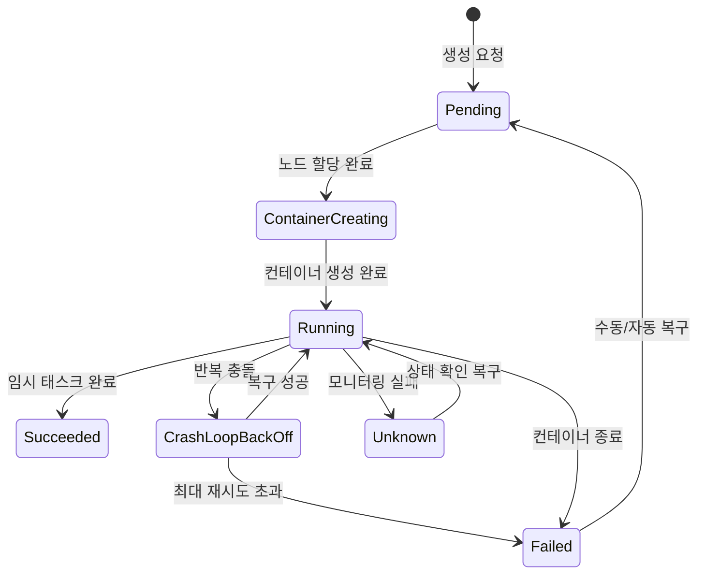

#### 2.3.3 상태 전이 규칙

| 현재 상태 | 이벤트 | 다음 상태 | 조건 | 액션 |
|---------|-------|---------|------|------|
| - | 생성 요청 | Pending | - | 노드 선택 및 할당 시작 |
| Pending | 노드 할당 완료 | ContainerCreating | 리소스 충분 | 컨테이너 이미지 풀링, 볼륨 마운트 |
| Pending | 노드 할당 실패 | Failed | 타임아웃 또는 오류 | 오류 로그, 재시도 또는 재스케줄링 |
| ContainerCreating | 컨테이너 생성 완료 | Running | 모든 컨테이너 시작 | 상태 업데이트, 준비 상태 체크 시작 |
| ContainerCreating | 컨테이너 생성 실패 | Failed | - | 오류 로그, 재시도 또는 재스케줄링 |
| Running | 임시 태스크 완료 | Succeeded | 일회성 태스크 | 완료 로그, 리소스 정리 |
| Running | 컨테이너 종료 | Failed | 예상치 못한 종료 | 오류 로그, 자동 재시작 평가 |
| Running | 반복 충돌 감지 | CrashLoopBackOff | 연속 재시작 실패 | 백오프 타이머 설정, 로그 수집 |
| Running | 모니터링 실패 | Unknown | 노드 통신 문제 | 진단 시도, 통신 복구 |
| CrashLoopBackOff | 백오프 시간 경과 | Running | 재시작 성공 | 모니터링 재개, 카운터 리셋 |
| CrashLoopBackOff | 최대 재시도 초과 | Failed | 재시도 한계 도달 | 오류 로그, 수동 개입 필요 알림 |
| Unknown | 상태 확인 복구 | Running/Failed | 실제 상태에 따라 | 상태 동기화, 필요시 복구 |
| Failed | 수동/자동 복구 | Pending | 재시작 정책에 따라 | 모델 재생성 시작 |

### 2.4 Volume 상태 머신

#### 2.4.1 상태 정의

| 상태 | 설명 |
|------|------|
| Pending | 볼륨이 생성 중인 상태 |
| Bound | 볼륨이 모델에 바인딩된 상태 |
| Released | 볼륨이 모델에서 해제된 상태 |
| Failed | 볼륨 생성 또는 사용 중 오류 발생 상태 |
| Terminating | 볼륨이 삭제 중인 상태 |

#### 2.4.2 상태 전이 다이어그램

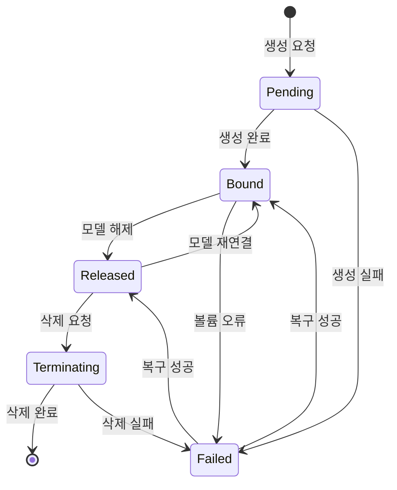

#### 2.4.3 상태 전이 규칙

| 현재 상태 | 이벤트 | 다음 상태 | 조건 | 액션 |
|---------|-------|---------|------|------|
| - | 생성 요청 | Pending | - | 스토리지 프로비저닝 시작 |
| Pending | 생성 완료 | Bound | 모델에 바인딩 | 마운트 정보 설정, 사용 가능 상태로 표시 |
| Pending | 생성 실패 | Failed | - | 오류 로그, 재시도 또는 대체 스토리지 |
| Bound | 모델 해제 | Released | reclaimPolicy 설정에 따라 | 마운트 해제, 데이터 보존 |
| Released | 모델 재연결 | Bound | 모델 클레임 매칭 | 재마운트, 액세스 권한 설정 |
| Released | 삭제 요청 | Terminating | reclaimPolicy=Delete | 데이터 삭제 프로세스 시작 |
| Bound | 볼륨 오류 | Failed | I/O 오류, 마운트 문제 등 | 오류 로그, 자동 복구 시도 |
| Failed | 복구 성공 | Bound/Released | 복구 방법에 따라 | 볼륨 재활성화, 상태 업데이트 |
| Terminating | 삭제 완료 | (삭제됨) | - | 리소스 정리, 상태 저장소에서 제거 |
| Terminating | 삭제 실패 | Failed | - | 오류 로그, 수동 개입 필요 알림 |

### 2.5 Network 상태 머신

#### 2.5.1 상태 정의

| 상태 | 설명 |
|------|------|
| Pending | 네트워크가 생성 중인 상태 |
| Active | 네트워크가 활성화되어 사용 가능한 상태 |
| Degraded | 네트워크가 일부 기능 저하된 상태로 작동 중 |
| Error | 네트워크 오류 발생 상태 |
| Terminating | 네트워크가 삭제 중인 상태 |

#### 2.5.2 상태 전이 다이어그램

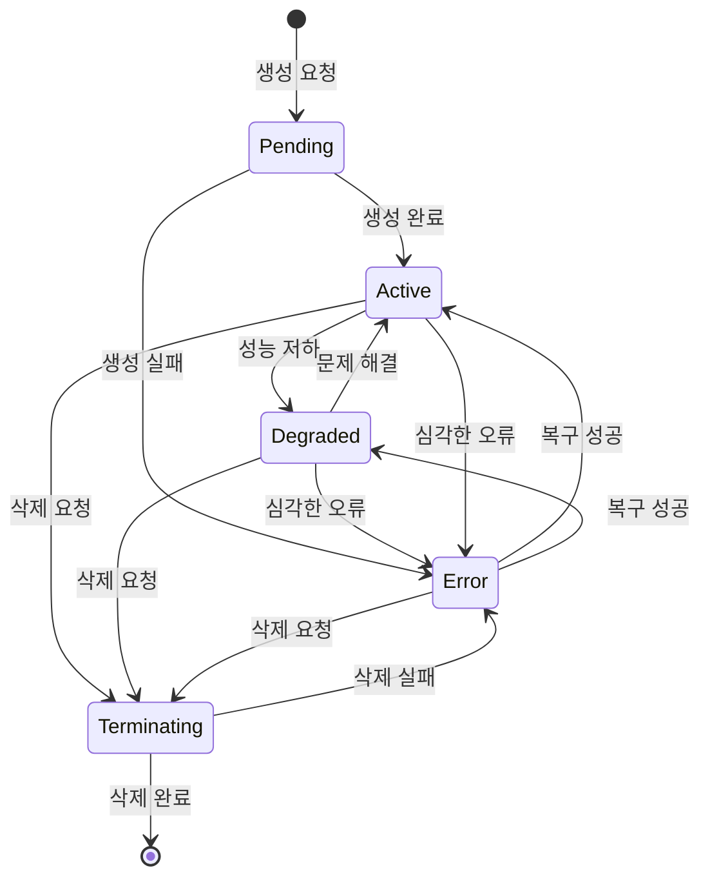

#### 2.5.3 상태 전이 규칙

| 현재 상태 | 이벤트 | 다음 상태 | 조건 | 액션 |
|---------|-------|---------|------|------|
| - | 생성 요청 | Pending | - | 네트워크 리소스 프로비저닝 시작 |
| Pending | 생성 완료 | Active | - | 네트워크 활성화, 연결 정보 설정 |
| Pending | 생성 실패 | Error | - | 오류 로그, 재시도 또는 대체 구성 |
| Active | 성능 저하 감지 | Degraded | 패킷 손실, 지연 시간 증가 등 | 경고 로그, QoS 조정 |
| Active | 심각한 오류 | Error | 연결 끊김, 구성 오류 등 | 오류 로그, 자동 복구 시도 |
| Degraded | 문제 해결 | Active | 성능 지표 정상화 | 상태 업데이트, 정상 운영 재개 |
| Degraded | 추가 성능 저하 | Error | 임계치 초과 | 오류 로그, 심각한 문제 알림 |
| Error | 복구 성공 | Active/Degraded | 복구 수준에 따라 | 네트워크 재구성, 상태 업데이트 |
| Active/Degraded/Error | 삭제 요청 | Terminating | - | 연결 해제, 리소스 해제 시작 |
| Terminating | 삭제 완료 | (삭제됨) | - | 리소스 정리, 상태 저장소에서 제거 |
| Terminating | 삭제 실패 | Error | - | 오류 로그, 수동 개입 필요 알림 |

### 2.6 Node 상태 머신

#### 2.6.1 상태 정의

| 상태 | 설명 |
|------|------|
| NotReady | 노드가 준비되지 않은 상태 |
| Ready | 노드가 정상 작동 중인 상태 |
| CordonedReady | 노드가 정상이지만 새 워크로드 할당이 차단된 상태 |
| CordonedNotReady | 노드가 문제 있고 새 워크로드 할당도 차단된 상태 |
| Maintenance | 노드가 유지보수 중인 상태 |
| Decommissioned | 노드가 서비스에서 제외된 상태 |

#### 2.6.2 상태 전이 다이어그램

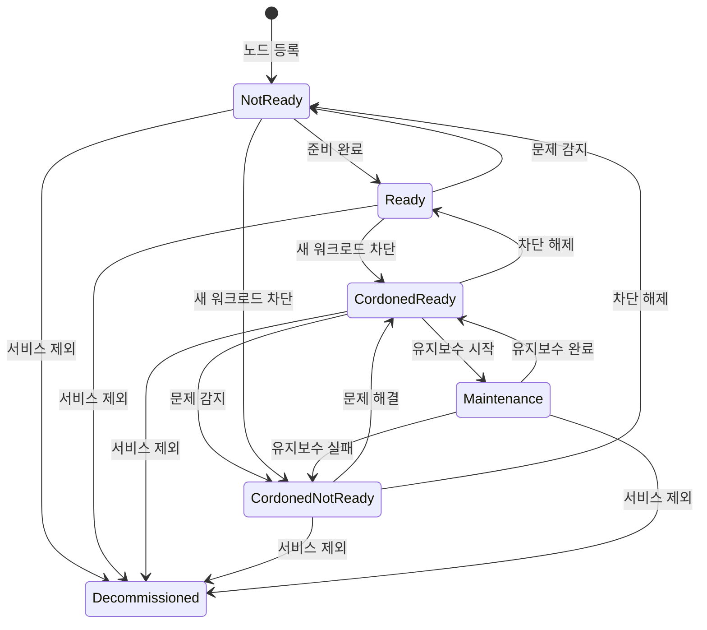

#### 2.6.3 상태 전이 규칙

| 현재 상태 | 이벤트 | 다음 상태 | 조건 | 액션 |
|---------|-------|---------|------|------|
| - | 노드 등록 | NotReady | - | 노드 초기화, 상태 체크 시작 |
| NotReady | 준비 완료 | Ready | 모든 서비스 정상 | 워크로드 할당 가능 표시 |
| Ready | 문제 감지 | NotReady | 심각한 문제 | 워크로드 재배치 시작, 문제 진단 |
| Ready | 새 워크로드 차단 | CordonedReady | 관리자 요청 | 새 할당 차단, 기존 워크로드 유지 |
| CordonedReady | 유지보수 시작 | Maintenance | 관리자 요청 | 워크로드 드레이닝, 서비스 일시 중단 |
| CordonedReady | 문제 감지 | CordonedNotReady | - | 워크로드 재배치, 문제 진단 |
| NotReady | 새 워크로드 차단 | CordonedNotReady | 관리자 요청 | 워크로드 재배치, 새 할당 차단 |
| Maintenance | 유지보수 완료 | CordonedReady | 모든 서비스 정상 | 서비스 재개 준비, 차단 유지 |
| Maintenance | 유지보수 실패 | CordonedNotReady | - | 오류 로그, 추가 진단 필요 |
| CordonedNotReady | 문제 해결 | CordonedReady | 모든 서비스 정상 | 워크로드 재배치 가능, 차단 유지 |
| CordonedReady | 차단 해제 | Ready | 관리자 요청 | 새 워크로드 할당 허용 |
| CordonedNotReady | 차단 해제 | NotReady | 관리자 요청 | 문제 진단 계속 |
| 모든 상태 | 서비스 제외 | Decommissioned | 관리자 요청 | 모든 워크로드 제거, 리소스 해제 |

## 3. 리소스 모니터링 방법

각 리소스 타입별 모니터링 방식은 다음과 같습니다:

### 3.1 Scenario 모니터링

| 모니터링 항목 | 방법 | 주기 | 중요도 |
|------------|------|------|-------|
| 조건 충족 여부 | 차량 데이터 스트림 구독 및 조건 평가 | 100ms | 높음 |
| 액션 실행 상태 | 액션 수행 결과 추적 | 이벤트 기반 | 높음 |
| 정책 준수 여부 | 정책 엔진 검증 | 액션 실행 전 | 필수 |
| 타임아웃 모니터링 | 시간 기반 체크 | 액션별 설정 | 중간 |

### 3.2 Package 모니터링

| 모니터링 항목 | 방법 | 주기 | 중요도 |
|------------|------|------|-------|
| 전체 상태 | 포함된 모든 Model의 상태 집계 | 1초 | 필수 |
| 리소스 사용량 | CPU, 메모리, 디스크 사용량 집계 | 1초 | 높음 |
| 패키지 타입별 특수 지표 | 패키지 타입에 따른 특화 지표 | 패키지 타입별 상이 | 높음 |
| 의존성 상태 | 의존 관계에 있는 패키지 상태 | 3초 | 중간 |

### 3.3 Model 모니터링

| 모니터링 항목 | 방법 | 주기 | 중요도 |
|------------|------|------|-------|
| 컨테이너 상태 | Podman/containerd API 호출 | 1초 | 필수 |
| 프로세스 상태 | cgroup 파일시스템 감시 | 1초 | 필수 |
| 리소스 사용량 | cgroup 메트릭 수집 | 1초 | 높음 |
| 로그 및 이벤트 | 로그 스트림 모니터링 | 실시간 | 중간 |
| 실행 시간 | 시작 시각 추적 | 이벤트 기반 | 중간 |
| 재시작 횟수 | 재시작 이벤트 카운팅 | 이벤트 기반 | 높음 |

### 3.4 Volume 모니터링

| 모니터링 항목 | 방법 | 주기 | 중요도 |
|------------|------|------|-------|
| 사용 가능 공간 | 파일시스템 상태 확인 | 10초 | 높음 |
| I/O 성능 | 읽기/쓰기 지연 시간 측정 | 30초 | 중간 |
| 마운트 상태 | 마운트 포인트 확인 | 5초 | 필수 |
| 무결성 검사 | 체크섬 검증 (해당 시) | 1시간 | 중간 |
| 백업 상태 | 백업 프로세스 모니터링 | 백업 주기 기반 | 중간 |

### 3.5 Network 모니터링

| 모니터링 항목 | 방법 | 주기 | 중요도 |
|------------|------|------|-------|
| 연결 상태 | 네트워크 인터페이스 상태 검사 | 1초 | 필수 |
| 대역폭 사용량 | 트래픽 측정 | 1초 | 높음 |
| 패킷 손실률 | 패킷 통계 수집 | 1초 | 높음 |
| 지연 시간 | 왕복 시간 측정 | 1초 | 높음 |
| QoS 준수 여부 | 트래픽 우선순위 확인 | 1초 | 높음 |
| 보안 정책 준수 | 트래픽 필터링 로그 분석 | 5초 | 높음 |

### 3.6 Node 모니터링

| 모니터링 항목 | 방법 | 주기 | 중요도 |
|------------|------|------|-------|
| 시스템 리소스 | OS 수준 메트릭 수집 | 1초 | 필수 |
| 하드웨어 상태 | 하드웨어 진단 인터페이스 | 10초 | 높음 |
| 온도 | 온도 센서 데이터 수집 | 5초 | 높음 |
| 프로세스 부하 | 시스템 부하 평균 측정 | 1초 | 높음 |
| 네트워크 연결성 | 연결 상태 확인 | 5초 | 높음 |
| 스토리지 상태 | 디스크 건전성 검사 | 1분 | 중간 |

## 4. 상태 조정(Reconciliation) 프로세스

상태 조정은 리소스의 '원하는 상태'와 '현재 상태'의 차이를 감지하고 해소하는 과정입니다. PICCOLO의 StateManager는 다음과 같은 상태 조정 단계를 수행합니다:

### 4.1 상태 조정 단계

1. **상태 수집**: NodeAgent로부터 현재 리소스 상태 수집
2. **차이 분석**: 원하는 상태(spec)와 현재 상태(status) 비교
3. **조정 계획 수립**: 차이를 해소하기 위한 액션 계획 수립
4. **조정 액션 실행**: 필요한 액션을 우선순위에 따라 실행
5. **검증**: 조정 액션 후 상태 재확인
6. **결과 업데이트**: 조정 결과를 상태 저장소에 업데이트

### 4.2 리소스 타입별 조정 전략

| 리소스 타입 | 조정 전략 | 우선순위 규칙 | 조정 주기 |
|-----------|----------|------------|---------|
| Scenario | 조건이 충족되면 액션 실행, 정책 검증 | 안전 관련 > 시간 중요 > 일반 | 이벤트 기반 |
| Package | 종속성 우선 조정, 모델 라이프사이클 관리 | ASIL 등급 > 사용자 체감 > 백그라운드 | 상태 변경 시 |
| Model | 컨테이너 생성/시작/중지, 리소스 할당 조정 | 안전 필수 > 기능 필수 > 편의 기능 | 상태 변경 시 |
| Volume | 볼륨 생성, 마운트 상태 조정, 공간 관리 | 데이터 보존 > 성능 최적화 | 사용 전 및 주기적 |
| Network | 네트워크 구성, QoS 설정, 연결 관리 | 안전 통신 > 사용자 체감 > 백그라운드 | 연결 변경 시 |
| Node | 워크로드 재배치, 리소스 할당 조정 | 노드 건전성 > 워크로드 분산 | 상태 변경 시 |

### 4.3 조정 충돌 해결

다중 시나리오 또는 요청 간 충돌이 발생할 경우의 해결 방법:

1. **안전 우선 원칙**: ASIL 등급이 높은 요청이 우선함
2. **선점 정책**: 높은 우선순위의 요청이 낮은 우선순위 요청을 선점
3. **자원 할당 정책**: 차량 상태에 따라 리소스 할당 정책 적용
4. **시간 기반 중재**: 타임아웃 및 기한에 따른 우선순위 조정
5. **정책 기반 거부**: 안전 정책에 위배되는 요청은 즉시 거부

## 5. 오류 복구(Recovery) 방법

각 리소스 타입별 오류 감지 및 복구 방법은 다음과 같습니다:

### 5.1 Scenario 복구 방법

| 오류 유형 | 감지 방법 | 복구 전략 | 복구 시간 목표 |
|----------|----------|----------|--------------|
| 조건 평가 오류 | 평가 결과 로그 분석 | 평가 로직 재시도, 대체 조건 사용 | 500ms |
| 액션 실행 실패 | 실행 결과 모니터링 | 재시도(최대 3회), 대체 액션 수행 | 1초 |
| 정책 검증 실패 | 정책 엔진 응답 | 관리자에게 알림, 로그 기록 | 즉시 |
| 시나리오 충돌 | 충돌 감지 로직 | 우선순위 규칙 적용, 충돌 해결 | 2초 |

### 5.2 Package 복구 방법

| 오류 유형 | 감지 방법 | 복구 전략 | 복구 시간 목표 |
|----------|----------|----------|--------------|
| 초기화 실패 | 상태 전이 타임아웃 | 재시도, 의존성 확인, 초기화 단계 분리 | 5초 |
| 모델 실패 | 모델 상태 모니터링 | 개별 모델 재시작, 필수 모델 우선 복구 | 2초 |
| 리소스 부족 | 리소스 사용량 모니터링 | 리소스 재할당, 비필수 모델 종료 | 3초 |
| 의존성 문제 | 의존성 체크 실패 | 의존 패키지 복구 시도, 대체 경로 탐색 | 5초 |

### 5.3 Model 복구 방법

| 오류 유형 | 감지 방법 | 복구 전략 | 복구 시간 목표 |
|----------|----------|----------|--------------|
| 크래시 | 프로세스 종료 감지 | 자동 재시작(백오프 적용), 로그 분석 | 1초 |
| OOM 킬 | OOM 이벤트 감지 | 메모리 한도 조정 후 재시작 | 2초 |
| 데드락 | 응답성 모니터링 | 강제 종료 후 재시작 | 3초 |
| 리소스 초과 | 리소스 사용량 모니터링 | 리소스 제한 조정, 최적화 모드 활성화 | 2초 |
| 시작 실패 | 시작 타임아웃 | 의존성 확인, 구성 검증 후 재시도 | 5초 |

### 5.4 Volume 복구 방법

| 오류 유형 | 감지 방법 | 복구 전략 | 복구 시간 목표 |
|----------|----------|----------|--------------|
| 마운트 실패 | 마운트 상태 확인 | 마운트 재시도, 파일시스템 점검 | 3초 |
| 공간 부족 | 사용량 모니터링 | 자동 정리, 불필요 데이터 제거 | 10초 |
| 파일시스템 오류 | I/O 오류 감지 | fsck 실행, 읽기 전용 모드로 전환 | 30초 |
| 손상된 데이터 | 무결성 검사 | 백업에서 복원, 데이터 복구 | 상황에 따라 다름 |
| 볼륨 분리 | 디바이스 상태 확인 | 자동 재연결 시도, 대체 경로 사용 | 5초 |

### 5.5 Network 복구 방법

| 오류 유형 | 감지 방법 | 복구 전략 | 복구 시간 목표 |
|----------|----------|----------|--------------|
| 연결 끊김 | 연결 상태 모니터링 | 자동 재연결, 대체 경로 탐색 | 1초 |
| 과도한 패킷 손실 | 패킷 통계 분석 | QoS 조정, 대역폭 최적화 | 2초 |
| 높은 지연 시간 | 지연 시간 측정 | 트래픽 우선순위 조정, 경로 최적화 | 2초 |
| 보안 정책 위반 | 보안 로그 분석 | 연결 차단, 정책 강화, 알림 발생 | 즉시 |
| 네트워크 인터페이스 오류 | 하드웨어 진단 | 인터페이스 재설정, 대체 인터페이스 사용 | 3초 |

### 5.6 Node 복구 방법

| 오류 유형 | 감지 방법 | 복구 전략 | 복구 시간 목표 |
|----------|----------|----------|--------------|
| 리소스 고갈 | 시스템 메트릭 모니터링 | 비필수 워크로드 종료, 리소스 재할당 | 5초 |
| 과열 | 온도 모니터링 | 쿨링 모드 활성화, 워크로드 감소 | 10초 |
| 노드 응답 없음 | 하트비트 체크 | 워크로드 재배치, 노드 재부팅 | 30초 |
| 부분적 하드웨어 실패 | 하드웨어 진단 | 영향받는 기능 격리, 대체 리소스 사용 | 15초 |
| 소프트웨어 오류 | 시스템 로그 분석 | 서비스 재시작, 업데이트 적용 | 10초 |

## 6. ASIL 서비스의 상태 관리 특화 기능

안전 중요(ASIL) 서비스의 효과적인 관리를 위해 PICCOLO 프레임워크는 ISO 26262 표준에 따른 ASIL 등급별 특화된 구성과 기능을 제공합니다. 각 ASIL 등급에 적합한 Scenario와 Package 구성 방법을 통해 차량 안전 서비스의 신뢰성과 가용성을 보장합니다.

> **참고**: ASIL 서비스 상태 관리에 대한 상세 내용은 [PICCOLO ASIL 서비스 상태 관리 특화 가이드](/home/edo/2025/projects/docs/workspace/specs/KR/PICCOLO_ASIL_Service_StateManagement.md) 문서를 참조하십시오. 이 문서에는 각 ASIL 등급별 상세 상태 머신, 구성 예시, 설계 패턴, 상태 전이 규칙 및 성능 평가 방법이 상세히 기술되어 있습니다.

### 6.1 크리티컬 안전 시나리오의 상태 전이 예시

다음은 안전 중요 시스템의 주요 상태 전이 시나리오에 대한 예시입니다:

#### 6.1.1 ASIL D: 제동 시스템 이중화 컨트롤러 전환

제동 제어 시스템의 주 컨트롤러에 장애가 발생하고 백업 컨트롤러로 전환되는 상태 전이 시퀀스:

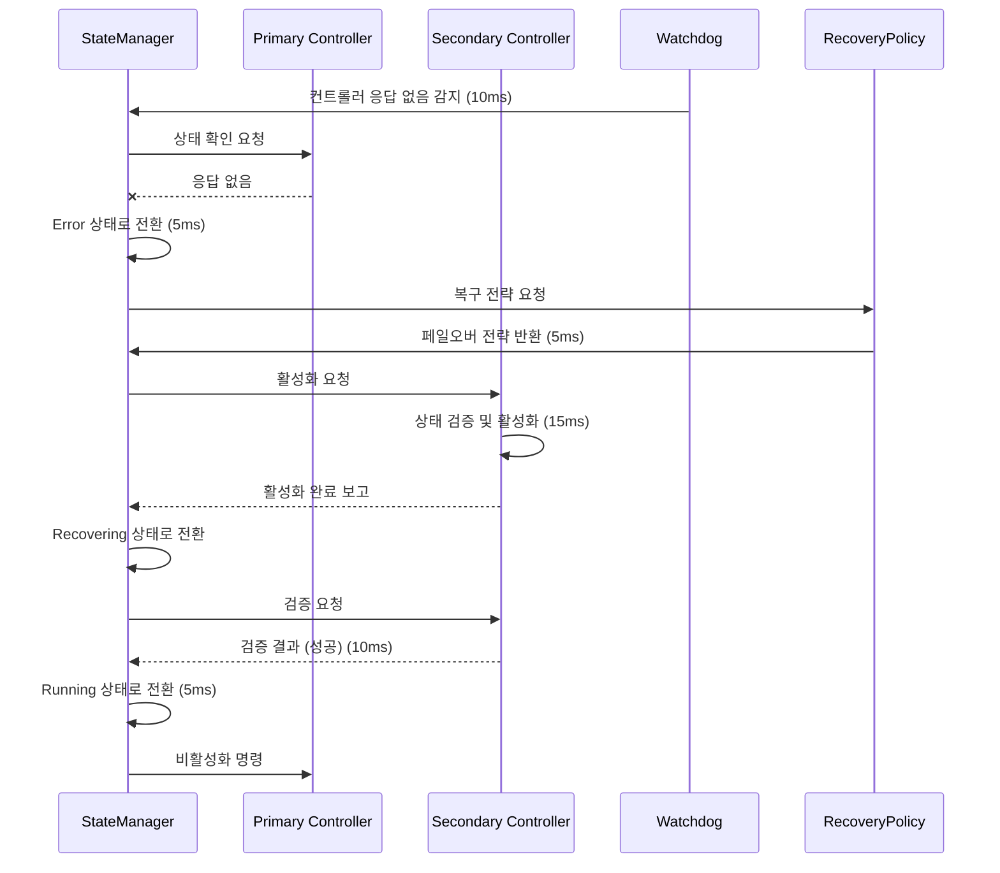

총 상태 전이 시간: 45ms (ASIL D 요구사항 50ms 이내)

#### 6.1.2 ASIL C: 차선 유지 보조 성능 저하 관리

차선 인식 품질이 저하되어 성능 저하 모드로 전환되는 상태 전이 시퀀스:

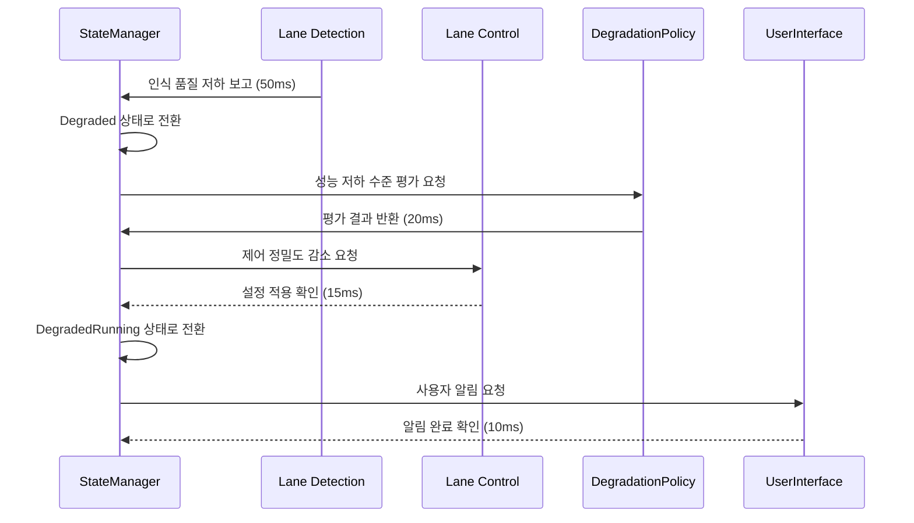

총 상태 전이 시간: 95ms (ASIL C 요구사항 100ms 이내)

#### 6.1.3 ASIL B: 후방 충돌 경고 센서 오류 복구

후방 충돌 경고 시스템의 레이더 센서 오류와 복구 과정의 상태 전이 시퀀스:

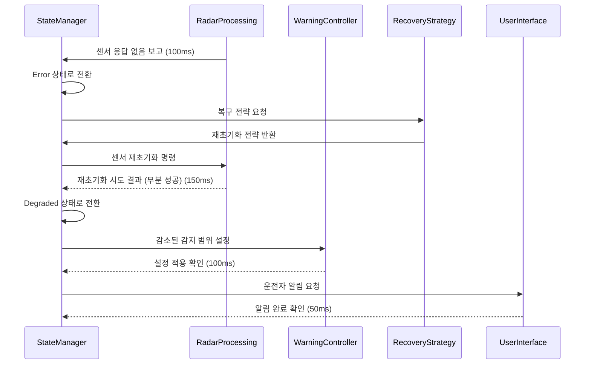

총 상태 전이 시간: 400ms (ASIL B 요구사항 500ms 이내)

### 6.2 ASIL 등급별 리소스 구성 원칙

각 ASIL 등급에 따른 Scenario와 Package 구성의 기본 원칙은 다음과 같습니다:

| ASIL 등급 | 기본 설계 원칙 | Package 구성 | Scenario 구성 | 상태 관리 요구사항 |
|----------|--------------|-------------|--------------|-----------------|
| ASIL D | 다중 중복 설계, 결정적 실행, 자원 격리 | time-critical + redundant + secure | 다중 안전 장치, 자동 복구 시나리오 필수 | 완전한 검증과 모니터링, 50ms 이내 복구 |
| ASIL C | 중복 설계, 고신뢰성, 자원 보장 | time-critical + redundant 또는 둘 중 하나 | 선택적 복구 시나리오, 성능 저하 허용 | 엄격한 모니터링, 100ms 이내 복구 |
| ASIL B | 단일 장애 감내, 자원 예약 | time-critical 또는 resource-bounded | 알림 및 간단한 복구 시나리오 | 상태 감시, 500ms 이내 복구 |
| ASIL A | 기본 안전성, 적절한 자원 할당 | resource-bounded 또는 secure | 알림 위주 시나리오 | 기본 모니터링, 1초 이내 복구 |
| QM | 표준 품질 관리 | plain 또는 update | 일반 시나리오 | 표준 상태 관리, 5초 이내 복구 |

### 6.2 ASIL D 서비스 구성 예시: 제동 제어 시스템

ASIL D 등급의 제동 제어 시스템은 가장 엄격한 안전 요구사항을 충족해야 합니다.

#### 6.2.1 Package 구성

```yaml
apiVersion: piccolo.io/v1
kind: Package
metadata:
  name: brake-control-system
  annotations:
    version: "2.1"
    description: "ASIL-D 제동 제어 시스템"
    safetyIntegrityLevel: "ASIL-D"
  labels:
    types: ["time-critical", "redundant", "secure"]
    function: "braking"
    criticality: "safety-critical"
spec:
  pattern:
    type: distributed
    nodeSelectorPolicy: "safety-dedicated"
  models:
    - name: primary-brake-controller
      image: vehicle/brake-controller:2.1
      node: BrakeECU-1
      resources:
        requests:
          cpu: 2
          memory: 1Gi
        limits:
          cpu: 2
          memory: 1Gi
      scheduling:
        timeCritical: true
        priority: 99
        period: "5ms"
        deadline: "4ms"
        executionTime: "1ms"
        cpuAffinity: [0, 1]
        isolationLevel: "exclusive"
      volumes:
        - name: brake-data
          mountPath: /data
          volume: brake-data-volume
      networks:
        - name: control-network
          qos:
            priority: "critical"
            latency: "ultra-low"
    
    - name: secondary-brake-controller
      image: vehicle/brake-controller:2.1
      node: BrakeECU-2
      resources:
        requests:
          cpu: 2
          memory: 1Gi
        limits:
          cpu: 2
          memory: 1Gi
      scheduling:
        timeCritical: true
        priority: 99
        period: "5ms"
        deadline: "4ms"
        executionTime: "1ms"
        cpuAffinity: [0, 1]
        isolationLevel: "exclusive"
      volumes:
        - name: brake-data-backup
          mountPath: /data
          volume: brake-data-backup-volume
      networks:
        - name: control-network
          qos:
            priority: "critical"
            latency: "ultra-low"
    
    - name: brake-monitoring
      image: vehicle/brake-monitor:1.8
      node: BrakeECU-1
      resources:
        requests:
          cpu: 1
          memory: 512Mi
        limits:
          cpu: 1
          memory: 512Mi
      scheduling:
        timeCritical: true
        priority: 95
        period: "10ms"
        deadline: "8ms"
      networks:
        - name: monitoring-network
          qos:
            priority: "high"

    - name: safety-watchdog
      image: vehicle/safety-watchdog:1.5
      node: BrakeECU-3
      resources:
        requests:
          cpu: 0.5
          memory: 256Mi
        limits:
          cpu: 0.5
          memory: 256Mi
      scheduling:
        priority: 98
        period: "10ms"
      networks:
        - name: control-network
          qos:
            priority: "critical"
        - name: monitoring-network
          qos:
            priority: "high"

  failoverConfig:
    mode: "active-active"
    heartbeatInterval: "5ms"
    maxFailureDetectionTime: "15ms"
    automaticFailover: true
    validationCheck: true
    
  securityConfig:
    encryptedCommunication: true
    signedExecutables: true
    resourceIsolation: true
    secureBootRequired: true
```

#### 6.2.2 Scenario 구성

ASIL D 서비스는 여러 시나리오를 통해 다양한 상황에 대응합니다:

```yaml
apiVersion: piccolo.io/v1
kind: Scenario
metadata:
  name: brake-system-startup
  annotations:
    description: "제동 시스템 시작 시나리오"
    priority: "critical"
    safetyLevel: "ASIL-D"
  labels:
    function: "safety-critical"
    category: "braking"
spec:
  condition:
    ignitionState: "ON"
  action: launch
  target:
    packages:
      - brake-control-system
  executionConstraints:
    maxStartupTime: "100ms"
    resourceGuarantee: true
    preemptLowerPriority: true
    startupValidation: true
  orderConstraints:
    - first: "safety-watchdog"
      then: ["primary-brake-controller", "secondary-brake-controller"]
```

```yaml
apiVersion: piccolo.io/v1
kind: Scenario
metadata:
  name: brake-system-failover
  annotations:
    description: "제동 시스템 장애 복구 시나리오"
    priority: "critical"
    safetyLevel: "ASIL-D"
  labels:
    function: "safety-critical"
    category: "braking"
spec:
  condition:
    primaryControllerState: "FAILED OR DEGRADED"
    vehicleMoving: "true"
  action: modify
  target:
    packages:
      - brake-control-system
    specificModels:
      - secondary-brake-controller
  modifications:
    secondaryControllerRole: "PRIMARY"
    resourcePriority: "MAXIMUM"
  executionConstraints:
    maxTransitionTime: "20ms"
    notificationLevel: "CRITICAL"
```

```yaml
apiVersion: piccolo.io/v1
kind: Scenario
metadata:
  name: brake-system-monitoring
  annotations:
    description: "제동 시스템 지속 모니터링"
    priority: "high"
    safetyLevel: "ASIL-D"
  labels:
    function: "safety-critical"
    category: "monitoring"
spec:
  condition:
    ignitionState: "ON"
  action: launch
  target:
    packages:
      - brake-control-system
    specificModels:
      - brake-monitoring
      - safety-watchdog
  continuousValidation:
    enabled: true
    interval: "10ms"
    metricThresholds:
      responseTime: "5ms"
      cpuUsage: "80%"
      memoryUsage: "80%"
    actions:
      - threshold: "responseTime > 5ms"
        action: "notify"
        level: "warning"
      - threshold: "responseTime > 10ms"
        action: "triggerScenario"
        scenarioName: "brake-system-failover"
```

#### 6.2.3 RecoveryPolicy 구성

```yaml
apiVersion: piccolo.io/v1
kind: RecoveryPolicy
metadata:
  name: brake-controller-recovery
  annotations:
    description: "Emergency brake system recovery policy"
    asilLevel: "D"
spec:
  target:
    package: brake-control-system
  recoveryStrategies:
    - type: failover
      timeout: 20ms
      maxRetries: 0  # 즉시 대체 인스턴스로 전환
      backupInstance: true
      validationRequired: true
    - type: restart
      timeout: 50ms
      maxRetries: 1
      gracePeriod: 10ms
      coldRestart: false  # 상태 유지 재시작
    - type: degradedMode
      activationCondition: "failover-failed AND restart-failed"
      notificationLevel: "critical"
      functionalityReduction:
        maintain: ["emergency-braking", "abs"]
        reduce: ["comfort-features"]
  isolationStrategy:
    enabled: true
    scope: "container"
    faultContainment: true
  resourceGuarantee:
    preemptive: true
    reservedResources:
      cpu: "2"
      memory: "1Gi"
  monitoringConfig:
    interval: 5ms
    healthCheck:
      type: "custom"
      endpoint: "/health"
      timeout: 2ms
    heartbeat:
      enabled: true
      interval: 5ms
      missedThreshold: 2
  loggingConfig:
    detailedStateTransitions: true
    persistenceLevel: "blackbox"
    storeDuration: "30d"
  safetyMeasures:
    fallbackMode: "limp-home"
    emergencyStop:
      enabled: true
      conditions: "all-recovery-failed AND vehicle-moving"
```

### 6.3 ASIL C 서비스 구성 예시: 차선 유지 보조

ASIL C 등급의 차선 유지 보조 시스템은 높은 안전 요구사항을 충족하면서도 ASIL D보다는 유연한 구성이 가능합니다.

#### 6.3.1 Package 구성

```yaml
apiVersion: piccolo.io/v1
kind: Package
metadata:
  name: lane-keeping-assist
  annotations:
    version: "3.2"
    description: "ASIL-C 차선 유지 보조 시스템"
    safetyIntegrityLevel: "ASIL-C"
  labels:
    types: ["time-critical", "resource-bounded"]
    function: "driver-assistance"
    criticality: "safety-related"
spec:
  pattern:
    type: selector
    nodeSelector:
      function: "vision-processing"
  models:
    - name: lane-detection
      image: vehicle/lane-detection:3.2
      resources:
        requests:
          cpu: 2
          memory: 2Gi
          gpu: 0.5
        limits:
          cpu: 4
          memory: 3Gi
          gpu: 1
      scheduling:
        timeCritical: true
        priority: 85
        period: "50ms"
        deadline: "40ms"
      volumes:
        - name: camera-data
          mountPath: /data/camera
          volume: camera-data-volume
      networks:
        - name: sensor-network
          qos:
            priority: "high"
    
    - name: lane-control
      image: vehicle/lane-control:2.8
      resources:
        requests:
          cpu: 1
          memory: 1Gi
        limits:
          cpu: 2
          memory: 2Gi
      scheduling:
        timeCritical: true
        priority: 80
        period: "50ms"
        deadline: "45ms"
      networks:
        - name: control-network
          qos:
            priority: "high"
    
    - name: lane-monitor
      image: vehicle/lane-monitor:1.4
      resources:
        requests:
          cpu: 0.5
          memory: 512Mi
        limits:
          cpu: 1
          memory: 1Gi
      scheduling:
        priority: 75
      networks:
        - name: monitoring-network
          qos:
            priority: "medium"

  degradedModeConfig:
    enabled: true
    levels:
      - name: "full-functionality"
        conditions: "all-resources-available"
      - name: "reduced-precision"
        conditions: "gpu-limited OR cpu-limited"
        features:
          disabled: []
          reduced: ["detection-precision"]
      - name: "warning-only"
        conditions: "severe-resource-limitation"
        features:
          disabled: ["automatic-steering"]
          reduced: ["detection-frequency"]
  
  securityConfig:
    encryptedCommunication: true
    resourceIsolation: true
```

#### 6.3.2 Scenario 구성

```yaml
apiVersion: piccolo.io/v1
kind: Scenario
metadata:
  name: lane-assist-activation
  annotations:
    description: "차선 유지 보조 시스템 활성화"
    priority: "high"
    safetyLevel: "ASIL-C"
  labels:
    function: "driver-assistance"
    category: "lane-keeping"
spec:
  condition:
    vehicleSpeed: ">30"
    driverAssistEnabled: "true"
    cameraStatus: "OPERATIONAL"
  action: launch
  target:
    packages:
      - lane-keeping-assist
  executionConstraints:
    maxStartupTime: "200ms"
    resourceGuarantee: true
```

```yaml
apiVersion: piccolo.io/v1
kind: Scenario
metadata:
  name: lane-assist-degraded
  annotations:
    description: "차선 유지 보조 성능 저하 모드"
    priority: "high"
    safetyLevel: "ASIL-C"
  labels:
    function: "driver-assistance"
    category: "lane-keeping"
spec:
  condition:
    vehicleSpeed: ">30"
    driverAssistEnabled: "true"
    cameraStatus: "DEGRADED OR resourceLimitation: true"
  action: modify
  target:
    packages:
      - lane-keeping-assist
  modifications:
    operationMode: "REDUCED_PRECISION"
    notifyDriver: true
  executionConstraints:
    maxTransitionTime: "100ms"
```

### 6.4 ASIL B 서비스 구성 예시: 후방 충돌 경고

ASIL B 등급의 후방 충돌 경고 시스템은 중간 수준의 안전 요구사항을 충족합니다.

#### 6.4.1 Package 구성

```yaml
apiVersion: piccolo.io/v1
kind: Package
metadata:
  name: rear-collision-warning
  annotations:
    version: "2.5"
    description: "ASIL-B 후방 충돌 경고 시스템"
    safetyIntegrityLevel: "ASIL-B"
  labels:
    types: ["time-critical"]
    function: "warning-system"
    criticality: "safety-related"
spec:
  pattern:
    type: plain
  models:
    - name: radar-processing
      image: vehicle/radar-processing:2.5
      resources:
        requests:
          cpu: 1
          memory: 1Gi
        limits:
          cpu: 2
          memory: 2Gi
      scheduling:
        timeCritical: true
        priority: 70
        period: "100ms"
      volumes:
        - name: radar-data
          mountPath: /data/radar
          volume: radar-data-volume
      networks:
        - name: sensor-network
          qos:
            priority: "medium"
    
    - name: warning-controller
      image: vehicle/warning-controller:1.9
      resources:
        requests:
          cpu: 0.5
          memory: 512Mi
        limits:
          cpu: 1
          memory: 1Gi
      scheduling:
        priority: 65
      networks:
        - name: control-network
          qos:
            priority: "medium"
  
  restartPolicy:
    maxRestarts: 3
    backoffSeconds: 5
    notifyOnFailure: true
```

#### 6.4.2 Scenario 구성

```yaml
apiVersion: piccolo.io/v1
kind: Scenario
metadata:
  name: rear-collision-warning-activation
  annotations:
    description: "후방 충돌 경고 시스템 활성화"
    priority: "medium"
    safetyLevel: "ASIL-B"
  labels:
    function: "warning-system"
    category: "collision-warning"
spec:
  condition:
    ignitionState: "ON"
    vehicleStatus: "PARKED OR MOVING_REVERSE"
  action: launch
  target:
    packages:
      - rear-collision-warning
  executionConstraints:
    maxStartupTime: "500ms"
```

## 10. 리소스 상태 전이 검증 및 검증 방법

리소스 상태 전이의 안전성과 신뢰성을 보장하기 위한 검증 및 검증 방법을 정의합니다.

### 10.1 상태 전이 검증 기법

#### 10.1.1 기본 검증 기법

| 검증 기법 | 설명 | 적용 대상 |
|----------|------|----------|
| 사전 조건 검증 | 상태 전이 전 필요한 모든 조건이 충족되는지 확인 | 모든 리소스 |
| 리소스 가용성 검증 | 상태 전이에 필요한 리소스가 가용한지 확인 | 모든 리소스 |
| 의존성 검증 | 의존하는 다른 리소스의 상태가 적절한지 확인 | 모든 리소스 |
| 상태 일관성 검증 | 분산 환경에서 상태 정보의 일관성 확인 | 분산 패턴 리소스 |
| 성능 요구사항 검증 | 시간 제약 등 성능 요구사항 충족 여부 확인 | time-critical 리소스 |
| 보안 검증 | 상태 전이의 권한 및 보안 요구사항 검증 | secure 리소스 |

#### 10.1.2 ASIL 등급별 검증 기법

| ASIL 등급 | 필수 검증 기법 | 검증 주체 | 검증 빈도 |
|----------|--------------|----------|----------|
| ASIL D | 모든 검증 + 중복 검증 + 형식 검증 | 독립 검증 모듈 + 메인 모듈 | 모든 상태 전이 |
| ASIL C | 모든 기본 검증 + 주요 지점 중복 검증 | 독립 검증 모듈 | 주요 상태 전이 |
| ASIL B | 기본 검증 + 핵심 지점 검증 | 메인 모듈 | 핵심 상태 전이 |
| ASIL A | 기본 검증 | 메인 모듈 | 주요 진입점 |
| QM | 최소 검증 | 메인 모듈 | 초기화 시점 |

### 10.2 상태 전이 검증 프로세스

#### 10.2.1 일반 검증 프로세스

1. **사전 검증 단계**
   - 상태 전이 요청 검증
   - 리소스 가용성 확인
   - 의존성 상태 확인
   - 보안 및 권한 확인

2. **전이 중 검증 단계**
   - 원자성 보장
   - 타임아웃 모니터링
   - 중간 상태 일관성 확인

3. **사후 검증 단계**
   - 전이 완료 확인
   - 새 상태 유효성 검증
   - 영향 리소스 상태 확인
   - 로그 및 감사 기록

#### 10.2.2 ASIL D 서비스 검증 프로세스

ASIL D 서비스는 가장 엄격한 상태 전이 검증 프로세스를 적용합니다:

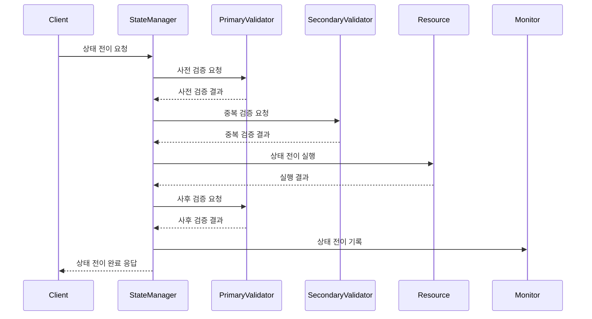

#### 10.2.3 시간 제약 검증

time-critical 리소스의 상태 전이 시간 제약 검증:

1. **전이 시작 시간 기록**
   - 나노초 정밀도의 타임스탬프 기록
   - 전이 ID 및 컨텍스트 기록

2. **중간 단계 시간 측정**
   - 주요 단계별 시간 측정
   - 임계값 초과 시 경고 또는 조치

3. **전이 완료 시간 기록 및 분석**
   - 총 소요 시간 계산 및 기록
   - 허용 범위 내 완료 여부 확인
   - 통계 데이터 축적 및 분석

4. **시간 제약 위반 시 대응**
   - ASIL 등급별 대응 전략 실행
   - 로깅 및 알림
   - 필요 시 복구 절차 시작

### 10.3 상태 전이 검증 지표 및 모니터링

#### 10.3.1 주요 검증 지표

| 지표 | 설명 | 측정 방법 |
|-----|------|----------|
| 상태 전이 성공률 | 성공적으로 완료된 상태 전이 비율 | (성공 건수 / 총 시도 건수) × 100% |
| 상태 전이 시간 | 상태 전이 완료까지 소요된 시간 | 시작 시간부터 완료 시간까지의 차이 |
| 검증 성공률 | 검증을 통과한 상태 전이 비율 | (검증 통과 건수 / 총 검증 시도 건수) × 100% |
| 검증 소요 시간 | 검증 완료까지 소요된 시간 | 검증 시작부터 완료까지의 시간 |
| 상태 일관성 오류율 | 일관성 오류가 발생한 비율 | (일관성 오류 건수 / 총 전이 건수) × 100% |

#### 10.3.2 모니터링 대시보드

상태 전이 검증 모니터링을 위한 대시보드 구성 요소:

1. **실시간 상태 전이 모니터**
   - 현재 진행 중인 상태 전이 표시
   - ASIL 등급별 색상 코딩
   - 경과 시간 및 제한 시간 표시

2. **검증 성공률 그래프**
   - 리소스 타입별 검증 성공률 트렌드
   - ASIL 등급별 비교 차트
   - 이상치 감지 및 알림

3. **성능 통계 패널**
   - 평균, 최대, 최소 전이 시간
   - 95th 백분위수 성능 지표
   - 시간 제약 충족률

4. **오류 및 경고 로그**
   - 최근 검증 실패 목록
   - 빈번한 오류 패턴 분석
   - 심각도별 분류 및 필터링

#### 10.3.3 ASIL 등급별 모니터링 요구사항

| ASIL 등급 | 모니터링 주기 | 지표 저장 기간 | 알림 임계값 | 대응 자동화 수준 |
|----------|------------|--------------|-----------|--------------|
| ASIL D | 실시간 (5ms) | 30일 + 블랙박스 | 즉시 (첫 발생) | 완전 자동화 |
| ASIL C | 준실시간 (50ms) | 15일 | 즉시 (패턴 발생) | 높은 자동화 |
| ASIL B | 주기적 (100ms) | 7일 | 임계값 초과 시 | 부분 자동화 |
| ASIL A | 주기적 (500ms) | 3일 | 반복 발생 시 | 알림 중심 |
| QM | 정기 (1s) | 1일 | 심각한 패턴 시 | 수동 대응 |

### 10.4 상태 전이 검증 오류 대응 전략

#### 10.4.1 오류 유형별 대응 전략

| 오류 유형 | 대응 전략 | 적용 우선순위 |
|----------|----------|-------------|
| 사전 조건 미충족 | 요청 거부 및 원인 기록 | 최우선 |
| 리소스 가용성 부족 | 대체 리소스 탐색 또는 지연 실행 | 높음 |
| 시간 제약 위반 | ASIL 등급별 타임아웃 처리 | 높음 |
| 의존성 상태 불일치 | 의존성 조정 시도 또는 요청 거부 | 중간 |
| 일관성 오류 | 일관성 복구 절차 시작 | 중간 |
| 검증 모듈 실패 | 대체 검증 절차 또는 보수적 대응 | 낮음 |

#### 10.4.2 ASIL D 서비스 오류 대응 예시

비상 제동 시스템의 상태 전이 검증 오류 발생 시 대응 흐름:

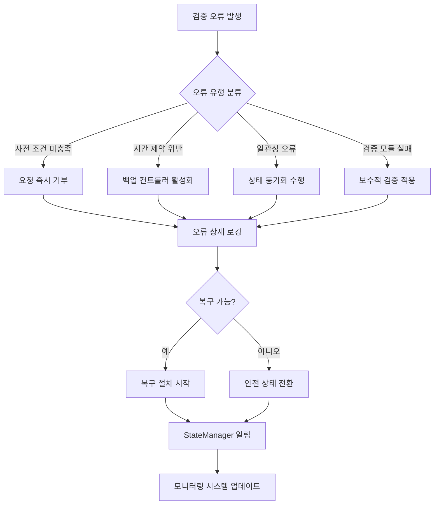

## 7. StateManager 구현 방식

### 7.1 StateManager 아키텍처

StateManager는 PICCOLO 프레임워크의 핵심 컴포넌트로, 모든 리소스의 상태를 관리하고 조정합니다. StateManager의 주요 구성 요소는 다음과 같습니다:

1. **상태 저장소 (State Store)**: ETCD 기반의 분산 상태 저장소로, 모든 리소스의 현재 상태와 원하는 상태를 저장
2. **상태 관찰자 (State Observer)**: 리소스 상태 변화를 감지하고 이벤트 발생
3. **조정 컨트롤러 (Reconciliation Controller)**: 각 리소스 타입별 상태 조정 로직 구현
4. **상태 전이 관리자 (State Transition Manager)**: 상태 머신에 따른 상태 전이 관리
5. **복구 관리자 (Recovery Manager)**: 오류 상황에서 복구 전략 실행
6. **이벤트 처리 엔진 (Event Processing Engine)**: 상태 관련 이벤트 처리 및 라우팅

### 7.2 StateManager 작동 방식

1. **초기화 및 등록**:
   - 시스템 시작 시 모든 리소스 상태 로드
   - 각 리소스 타입별 상태 머신 등록
   - 조정 컨트롤러 및 워치(watch) 메커니즘 초기화

2. **상태 감시 및 이벤트 처리**:
   - NodeAgent로부터 주기적으로 상태 업데이트 수신
   - 리소스 상태 변화 감지 시 이벤트 생성
   - 이벤트에 따라 조정 또는 복구 프로세스 트리거

3. **상태 조정 프로세스**:
   - 원하는 상태와 현재 상태 비교
   - 차이 발견 시 조정 계획 수립
   - 조정 액션 실행 및 결과 검증
   - 상태 업데이트 및 이력 관리

4. **오류 처리 및 복구**:
   - 오류 상황 감지 시 리소스 타입 및 ASIL 등급에 따른 복구 전략 선택
   - 복구 절차 실행 및 모니터링
   - 복구 실패 시 에스컬레이션 또는 대체 전략 적용
   - 복구 이력 기록 및 분석

5. **상태 보고 및 알림**:
   - 중요 상태 변화 시 알림 생성
   - 상태 이력 및 트렌드 분석
   - 대시보드 및 모니터링 시스템으로 상태 정보 제공

### 7.3 StateManager API

StateManager는 다음과 같은 주요 API를 제공합니다:

1. **상태 조회 API**:
   - `GetResourceState(resourceType, resourceName)`: 특정 리소스의 현재 상태 조회
   - `GetResourceStateHistory(resourceType, resourceName, timeRange)`: 상태 이력 조회
   - `ListResourcesByState(resourceType, state)`: 특정 상태에 있는 리소스 목록 조회

2. **상태 관리 API**:
   - `UpdateDesiredState(resourceType, resourceName, desiredState)`: 원하는 상태 업데이트
   - `TriggerStateTransition(resourceType, resourceName, targetState)`: 상태 전이 트리거
   - `ForceSynchronization(resourceType, resourceName)`: 강제 상태 동기화

3. **복구 관리 API**:
   - `TriggerRecovery(resourceType, resourceName, recoveryStrategy)`: 복구 프로세스 시작
   - `AbortRecovery(resourceType, resourceName)`: 진행 중인 복구 중단
   - `GetRecoveryStatus(resourceType, resourceName)`: 복구 상태 조회

4. **이벤트 및 알림 API**:
   - `SubscribeToStateChanges(resourceType, filter)`: 상태 변화 이벤트 구독
   - `AcknowledgeAlert(alertId)`: 알림 확인
   - `GetPendingAlerts(severity, resourceType)`: 대기 중인 알림 조회

## 8. 결론

PICCOLO 프레임워크의 리소스 상태 관리 시스템은 차량 환경에 특화된 안정적이고 예측 가능한 서비스 운영을 위한 핵심 기능입니다. 각 리소스 타입별로 정의된 상태 머신과 전이 규칙은 리소스의 생명주기를 명확하게 관리하며, 철저한 모니터링과 조정 프로세스를 통해 실제 상태와 원하는 상태 간의 일치를 보장합니다.

특히 ASIL 서비스에 대한 특화된 상태 관리 기능은 차량의 안전 중요 서비스에 대한 높은 신뢰성과 가용성을 제공합니다. 상태 전이 검증, 신속한 오류 감지 및 복구, 그리고 상세한 로깅을 통해 안전 요구사항을 충족시킵니다.

StateManager를 중심으로 한 통합된 상태 관리 아키텍처는 모든 리소스의 상태를 일관되게 관리하며, 상태 변화에 대한 신속한 대응과 조정을 가능하게 합니다. 이를 통해 PICCOLO 프레임워크는 차량 소프트웨어 플랫폼의 안정성, 가용성, 그리고 안전성을 보장합니다.
