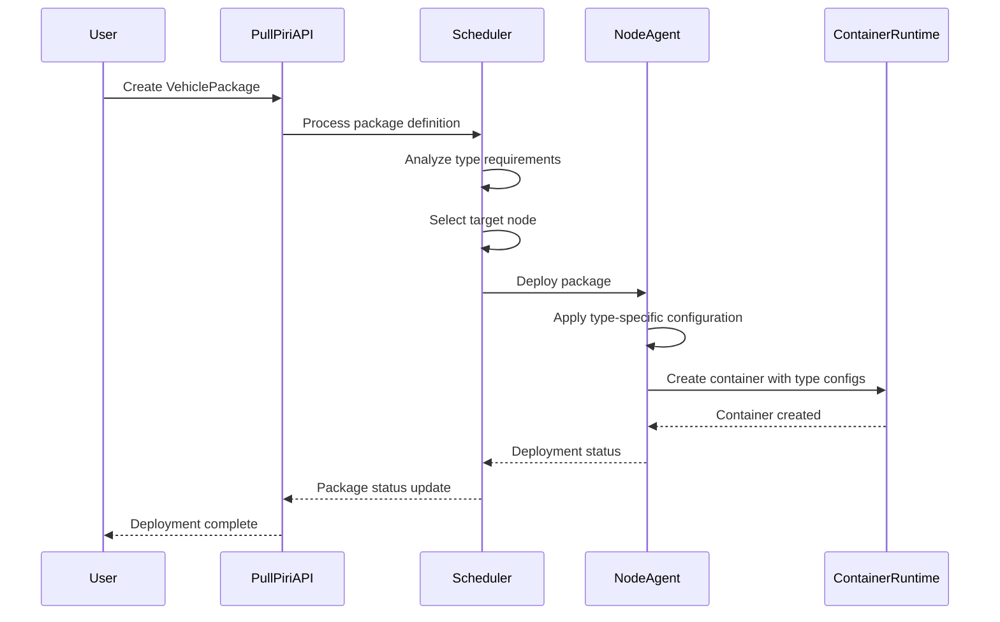
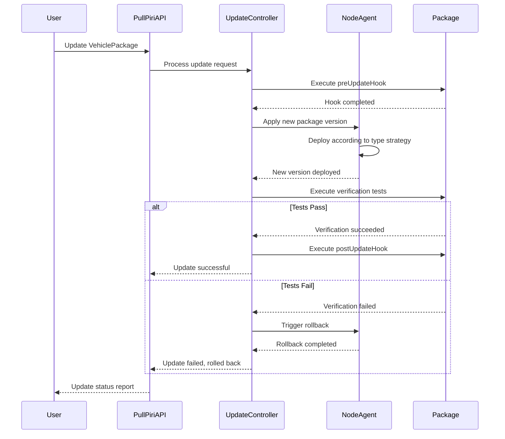
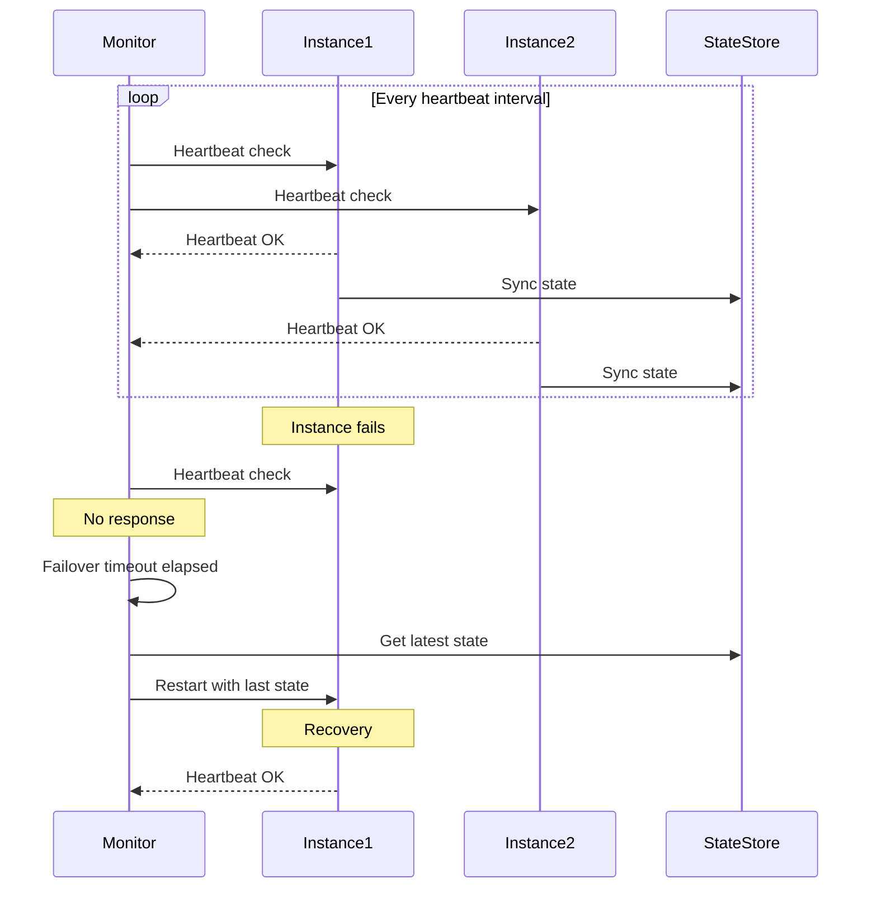
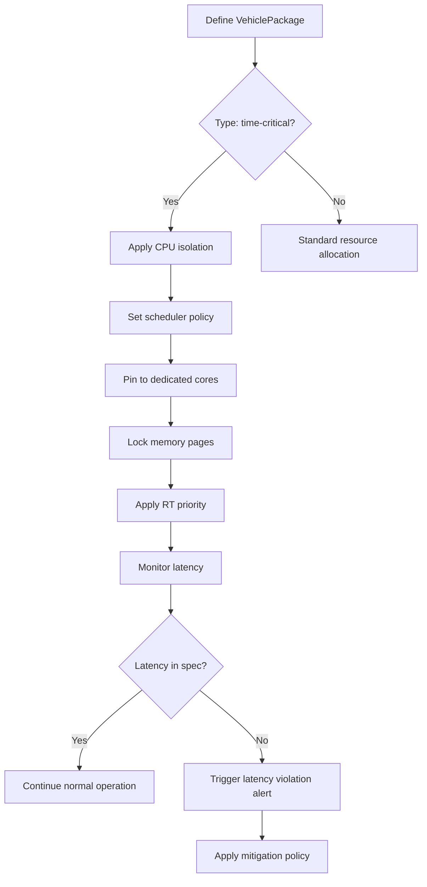
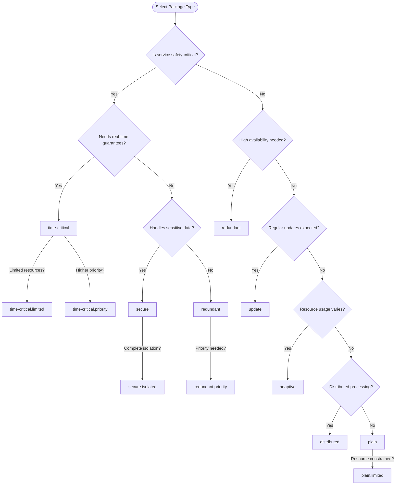

# Eclipse PullPiri Vehicle System Package Type Design Document

## 1. Vehicle System Package Type Definitions

````markdown name=vehicle-package-types.md
# PullPiri Vehicle System Package Type Definitions

## Basic Package Types

### plain
- **Purpose**: Basic container operation
- **Characteristics**: Basic type for simple deployment and execution
- **Vehicle Use Cases**: Non-critical services, diagnostic tools, logging systems, basic infotainment apps

### redundant
- **Purpose**: Ensure high availability
- **Characteristics**: 
  - Redundant operation through heartbeat mechanism
  - Failure detection and automatic recovery
  - Service continuity even during container crashes
- **Vehicle Use Cases**: Driving-essential services, safety-related monitoring systems, vehicle diagnostic systems

### update
- **Purpose**: Guarantee stable updates
- **Characteristics**:
  - Updates performed according to defined policies
  - Automatic rollback during update interruption/failure
  - Support for safe Over-The-Air (OTA) updates
- **Vehicle Use Cases**: ECU firmware, infotainment software, map data, ADAS algorithms

### time-critical
- **Purpose**: Meet real-time processing requirements
- **Characteristics**:
  - Reserved CPU resources
  - Minimized context switching
  - Deterministic latency guarantee
- **Vehicle Use Cases**: Vehicle control systems, ADAS, sensor fusion, real-time monitoring

## Advanced Package Types

### secure
- **Purpose**: Enhanced security for sensitive services
- **Characteristics**:
  - Isolated execution environment
  - Encrypted storage
  - Access control
  - Integrity verification
- **Vehicle Use Cases**: Key management, authentication services, payment systems

### distributed
- **Purpose**: Operation across multiple ECUs or domains
- **Characteristics**:
  - Coordinated execution across multiple computing nodes
  - Load balancing
  - Fault tolerance
  - Resource sharing
- **Vehicle Use Cases**: Distributed sensor processing, cross-domain applications, cluster computing tasks

### adaptive
- **Purpose**: Dynamic resource adjustment based on conditions
- **Characteristics**:
  - Dynamic resource allocation
  - Performance monitoring
  - Automatic scaling based on load
  - Context-aware operation
- **Vehicle Use Cases**: Machine learning applications, situation-aware systems, entertainment systems

## Package Type Extensions

### .limited
- **Purpose**: Restricted resource usage
- **Characteristics**:
  - Hard limits on CPU, memory, network
  - Throttling when approaching limits
  - Non-critical operation classification
- **Example**: `plain.limited` for background services with minimal resource allocation

### .isolated
- **Purpose**: Enhanced separation from other services
- **Characteristics**:
  - Separate network namespace
  - No shared resources
  - Independent lifecycle
- **Example**: `secure.isolated` for payment processing with complete isolation

### .priority
- **Purpose**: Guaranteed resource access
- **Characteristics**:
  - High scheduling priority
  - Pre-allocated resources
  - Non-preemptible execution
- **Example**: `time-critical.priority` for emergency response systems
````

## 2. Package Configuration Specifications

### 2.1 Core Configuration Fields

```yaml
apiVersion: pullpiri.sdv.eclipse.org/v1
kind: VehiclePackage
metadata:
  name: sensor-fusion-service
  namespace: adas
spec:
  type: time-critical.priority
  containers:
    - name: sensor-fusion
      image: registry.sdv.org/adas/sensor-fusion:v1.2.3
      resources:
        limits:
          cpu: 2
          memory: 2Gi
        requests:
          cpu: 1
          memory: 1Gi
  securityContext:
    runAsUser: 1000
    allowPrivilegeEscalation: false
  restartPolicy: Always
```

### 2.2 Type-Specific Configuration

#### 2.2.1 Redundant Package Configuration

```yaml
apiVersion: pullpiri.sdv.eclipse.org/v1
kind: VehiclePackage
metadata:
  name: vehicle-status-monitor
  namespace: diagnostics
spec:
  type: redundant
  redundancyConfig:
    instances: 2
    heartbeatIntervalMs: 500
    failoverTimeoutMs: 1000
    syncDataVolumes:
      - name: status-data
        path: /app/data
  containers:
    - name: monitor
      image: registry.sdv.org/diagnostics/status-monitor:v2.1.0
```

#### 2.2.2 Update Package Configuration

```yaml
apiVersion: pullpiri.sdv.eclipse.org/v1
kind: VehiclePackage
metadata:
  name: navigation-system
  namespace: infotainment
spec:
  type: update
  updateConfig:
    strategy: rolling
    maxUnavailable: 0
    rollbackTimeout: 30s
    verificationTests:
      - name: api-check
        command: ["/bin/sh", "-c", "curl -f http://localhost:8080/health"]
    preUpdateHook:
      command: ["/bin/sh", "-c", "/app/scripts/backup-data.sh"]
    postUpdateHook:
      command: ["/bin/sh", "-c", "/app/scripts/notify-update-complete.sh"]
  containers:
    - name: nav-app
      image: registry.sdv.org/infotainment/navigation:v3.4.2
```

#### 2.2.3 Time-Critical Package Configuration

```yaml
apiVersion: pullpiri.sdv.eclipse.org/v1
kind: VehiclePackage
metadata:
  name: emergency-brake-assistant
  namespace: safety
spec:
  type: time-critical.priority
  timeCriticalConfig:
    cpuSet: "0-1"  # Dedicated CPU cores
    schedulerPolicy: FIFO
    priority: 99
    memoryLock: true
    rtKernel: true
    latencyRequirement: 10ms
  containers:
    - name: brake-control
      image: registry.sdv.org/safety/emergency-brake:v1.1.0
```

## 3. Operational Workflows

### 3.1 Package Lifecycle Management

#### 3.1.1 Deployment Sequence



#### 3.1.2 Update Process



### 3.2 Type-Specific Operations

#### 3.2.1 Redundant Package Operations



#### 3.2.2 Time-Critical Package Resource Management



## 4. Integration with Vehicle Systems

### 4.1 Resource Integration

#### 4.1.1 CPU Resource Mapping

| Package Type | CPU Allocation Strategy | Priority | Scheduling Policy |
|--------------|-------------------------|----------|------------------|
| plain | Shared pool | Normal | CFS |
| redundant | Reserved quota | High | CFS |
| update | Dynamic allocation | Normal | CFS |
| time-critical | Dedicated cores | Highest | FIFO/RR |
| secure | Isolated cores | High | CFS |
| distributed | Cross-node reservation | High | CFS |
| adaptive | Dynamic scaling | Variable | CFS |

#### 4.1.2 Memory Resource Mapping

| Package Type | Memory Allocation | Swap Usage | OOM Behavior |
|--------------|-------------------|------------|-------------|
| plain | Standard | Allowed | Kill |
| redundant | Guaranteed minimum | Limited | Restart |
| update | Version-dependent | Limited | Rollback |
| time-critical | Locked pages | None | Critical alert |
| secure | Encrypted zones | None | Protected |
| distributed | Node-appropriate | Limited | Migrate |
| adaptive | Dynamic | Allowed | Throttle |

### 4.2 Network Integration

#### 4.2.1 Network Policies by Package Type

```yaml
# Example network policy for secure package type
apiVersion: pullpiri.sdv.eclipse.org/v1
kind: VehicleNetworkPolicy
metadata:
  name: secure-package-policy
spec:
  packageSelector:
    types: ["secure", "secure.isolated"]
  ingress:
    - from:
        packageSelector:
          types: ["secure"]
      ports:
        - protocol: TCP
          port: 8443
  egress:
    - to:
        cidrs:
          - 10.0.0.0/8
      ports:
        - protocol: TCP
          port: 443
    - to:
        domainNames:
          - "*.sdv-trusted-services.org"
```

#### 4.2.2 Quality of Service Configuration

| Package Type | Traffic Priority | Bandwidth | Latency Guarantee |
|--------------|------------------|-----------|-------------------|
| plain | Best effort | Throttled | None |
| redundant | Medium | Guaranteed minimum | Soft |
| update | Low (updates) | Limited | None |
| time-critical | Highest | Reserved | Hard |
| secure | High | Guaranteed | Medium |
| distributed | Medium | Load-balanced | Soft |
| adaptive | Variable | Dynamic | Contextual |

## 5. Security Considerations

### 5.1 Package Type Security Matrix

| Security Feature | plain | redundant | time-critical | update | secure | distributed | adaptive |
|------------------|-------|-----------|---------------|--------|--------|-------------|----------|
| Privilege Level | Low | Low | Medium | Low | Lowest | Medium | Variable |
| Isolation | Standard | Standard | Enhanced | Standard | Maximum | Standard | Standard |
| Code Signing | Optional | Required | Required | Required | Required | Required | Required |
| Encryption | None | Config only | Config only | Full | Full | Partial | Contextual |
| Runtime Protection | Basic | Medium | Medium | Basic | Advanced | Medium | Variable |
| Security Scanning | On update | Periodic | Periodic | Pre/Post update | Continuous | Periodic | Adaptive |

### 5.2 Package Type-Specific Security Controls

```yaml
# Secure package type security context example
apiVersion: pullpiri.sdv.eclipse.org/v1
kind: VehiclePackage
metadata:
  name: payment-processing-service
  namespace: financial
spec:
  type: secure.isolated
  securityContext:
    seccompProfile:
      type: Localhost
      localhostProfile: strict-profile.json
    capabilities:
      drop: ["ALL"]
    readOnlyRootFilesystem: true
    runAsNonRoot: true
    runAsUser: 10000
    seLinuxOptions:
      level: "s0:c123,c456"
  secureConfig:
    encryptedStorage:
      - path: /app/secrets
        keyringId: vehicle-payment-keyring
    integrityVerification:
      signatureVerification: true
      trustedPublisherCerts: ["payment-system-cert"]
    accessControl:
      apiTokenRequired: true
      adminSeparation: true
```

## 6. Implementation Guidelines

### 6.1 Package Type Selection Decision Tree



### 6.2 Package Migration Strategies

| From | To | Migration Strategy | Downtime | Data Preservation |
|------|-----|-------------------|----------|-------------------|
| plain | redundant | Deploy secondary instance, enable sync | Minimal | Full copy |
| plain | update | Add update configuration, version metadata | During transition | Manual backup |
| plain | time-critical | Requires resource reallocation, scheduling update | Scheduled | Manual backup |
| redundant | time-critical | Sequential update with failover | Minimal | Preserved |
| update | secure | Security enhancement, permission reduction | Required | Encrypted transfer |
| any | distributed | Phased deployment, service decomposition | Variable | Depends on service |

### 6.3 Best Practices by Package Type

#### 6.3.1 Time-Critical Packages
- Keep container images minimal and optimized
- Avoid garbage collection languages for critical paths
- Use static memory allocation where possible
- Implement watchdogs for deadline monitoring
- Partition data processing into critical and non-critical paths

#### 6.3.2 Secure Packages
- Use minimal base images (e.g., distroless)
- Implement runtime integrity validation
- Store secrets in dedicated secure storage
- Perform regular vulnerability scans
- Implement principle of least privilege

#### 6.3.3 Redundant Packages
- Design for statelessness or efficient state synchronization
- Implement intelligent health checks
- Use proper termination handling to prevent data corruption
- Test failover scenarios regularly
- Configure appropriate restart policies

## 7. Appendix

### 7.1 Package Type Decision Matrix

| Requirement | Recommended Package Types |
|-------------|---------------------------|
| Safety-critical functionality | time-critical, time-critical.priority |
| High reliability needs | redundant, redundant.priority |
| Sensitive data handling | secure, secure.isolated |
| Regular OTA updates | update |
| Resource-intensive processing | distributed, adaptive |
| Background/non-critical services | plain, plain.limited |
| Cross-domain functionality | distributed |
| Variable resource needs | adaptive |

### 7.2 Type Compatibility Reference

| Base Type | Compatible Extensions | Typical Combinations |
|-----------|----------------------|----------------------|
| plain | .limited, .isolated | plain.limited |
| redundant | .priority, .limited | redundant.priority |
| update | .priority | update.priority |
| time-critical | .priority, .isolated | time-critical.priority |
| secure | .isolated, .priority | secure.isolated |
| distributed | .limited, .priority | distributed.priority |
| adaptive | .limited | adaptive.limited |

### 7.3 Performance Benchmarks by Package Type

| Package Type | Startup Time | Resource Overhead | Failover Speed | Update Duration |
|--------------|--------------|-------------------|----------------|-----------------|
| plain | < 1s | Minimal | N/A | Variable |
| redundant | < 2s | Medium | < 2s | Increased |
| update | < 1s | Low | N/A | Optimized |
| time-critical | < 500ms | Medium | N/A | Extended |
| secure | < 3s | High | N/A | Extended |
| distributed | < 5s | High | < 3s | Complex |
| adaptive | Variable | Variable | Variable | Variable |
