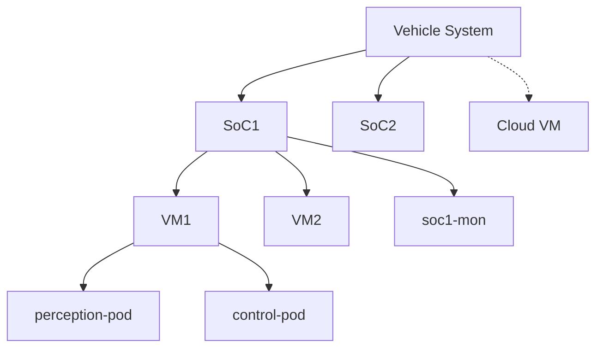
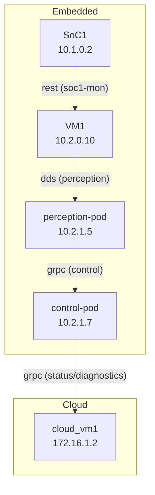
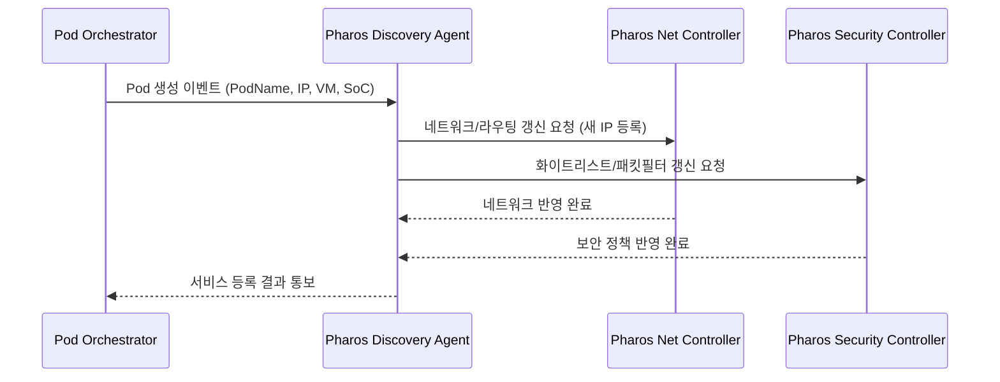
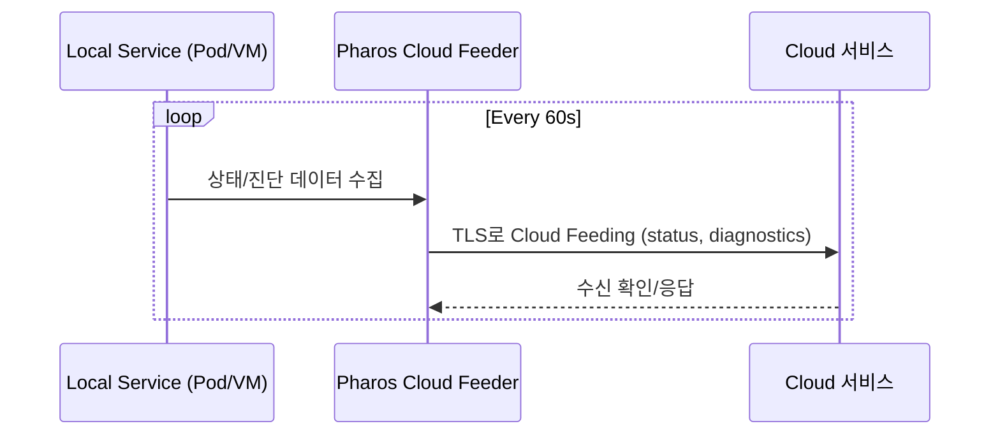

# Pharos 차량 네트워크 시스템 종합 명세서

| 문서 정보 | 상세 |
|--------|------|
| 문서 제목 | Pharos 차량 네트워크 시스템 종합 명세서 |
| 버전 | 1.0.0 |
| 날짜 | 2025-07-24 03:13:13 |
| 작성자 | joshua-jung_LGESDV |
| 상태 | 승인 대기 (Pending Approval) |

---

## 목차

1. [소개](#1-소개)
2. [시스템 아키텍처](#2-시스템-아키텍처)
3. [핵심 기능](#3-핵심-기능)
4. [네트워크 구성 및 관리](#4-네트워크-구성-및-관리)
5. [서비스 배포 및 운영](#5-서비스-배포-및-운영)
6. [동적 서비스 관리](#6-동적-서비스-관리)
7. [보안 및 접근 제어](#7-보안-및-접근-제어)
8. [클라우드 연동](#8-클라우드-연동)
9. [모니터링 및 로깅](#9-모니터링-및-로깅)
10. [구성 예시](#10-구성-예시)
11. [API 명세](#11-api-명세)
12. [사용 시나리오](#12-사용-시나리오)
13. [구현 고려사항](#13-구현-고려사항)
14. [부록: 다이어그램 및 시퀀스](#14-부록-다이어그램-및-시퀀스)
15. [부록: 전체 Proto 파일](#15-부록-전체-proto-파일)

---

## 1. 소개

Pharos는 차량 내부 및 클라우드 시스템 간의 완전한 네트워크 통합을 제공하는 차량 네트워크 오케스트레이션 시스템입니다. 이 시스템은 SoC, VM, Pod 단위의 컴퓨팅 리소스와 이들 간의 통신을 관리하며, 다양한 통신 프로토콜을 지원합니다.

### 1.1 목적

- 차량 내부 컴퓨팅 리소스의 효율적인 네트워크 구성 자동화
- 차량-클라우드 간 안전하고 효율적인 통신 지원
- 다양한 프로토콜 간 브릿지와 변환 제공
- 동적 서비스 배포 및 네트워크 정책 자동 적용
- 보안 및 접근 제어 통합 관리

### 1.2 범위

- 차량 내부 네트워크 구성 (SoC, VM, Pod)
- 차량-클라우드 연결 관리
- 서비스 검색 및 동적 네트워크 업데이트
- 트래픽 제어 및 QoS 관리
- 보안 정책 구현 및 모니터링

---

## 2. 시스템 아키텍처

### 2.1 계층 구조

Pharos는 다음과 같은 계층적 구조로 시스템을 관리합니다:

1. **차량 시스템 (Vehicle System)**
   - 여러 SoC(System on Chip)로 구성됨

2. **SoC (System on Chip)**
   - 차량 내 물리적인 컴퓨팅 하드웨어
   - 0개 이상의 VM 호스팅 가능
   - Native 서비스 직접 실행 가능

3. **VM (Virtual Machine)**
   - SoC 위에서 실행되는 가상 머신
   - 0개 이상의 Pod 호스팅 가능
   - 고정적 IP 주소 체계 사용

4. **Pod**
   - VM 위에서 실행되는 컨테이너 그룹
   - 동적으로 생성/종료/이동 가능
   - 실행 시마다 동적 IP 할당 필요

### 2.2 주요 컴포넌트

- **Pharos Controller**: 전체 네트워크 오케스트레이션 담당
- **Discovery Agent**: 동적 서비스/Pod 검색 및 등록
- **Network Manager**: 네트워크 구성, 라우팅, NAT 관리
- **Security Controller**: 패킷 필터, 접근 제어, 암호화 관리
- **Cloud Connector**: 차량-클라우드 간 통신 관리
- **Configuration Handler**: YAML 구성 파일 처리 및 적용

---

## 3. 핵심 기능

### 3.1 지원 프로토콜

- **DDS (Data Distribution Service)**
  - 차량 내부 실시간 데이터 공유에 최적화
  - QoS 정책 지원

- **gRPC**
  - 마이크로서비스 간 효율적인 통신
  - 양방향 스트리밍 지원

- **REST**
  - 클라우드 서비스 및 관리 인터페이스 용
  - HTTP/HTTPS 기반 통신

- **SOME/IP**
  - 자동차 산업 표준 통신 프로토콜
  - 서비스 검색 및 이벤트 관리 지원

### 3.2 성능 최적화 기능

- **Fasttrack**
  - XDP(eXpress Data Path) 기반 고성능 패킷 처리
  - SHM(Shared Memory) 기반 프로세스 간 통신 최적화
  - 지연 시간 민감 애플리케이션 우선 처리

- **TSN (Time Sensitive Networking)**
  - IEEE 802.1 TSN 표준 지원
  - 결정적 지연 시간 보장
  - 타임 슬롯 및 트래픽 쉐이핑

---

## 4. 네트워크 구성 및 관리

### 4.1 네트워크 토폴로지

- **다중 서브넷 관리**
  - SoC, VM, Pod별 독립 서브넷 구성
  - 서브넷 간 라우팅 자동화

- **브릿지 구성**
  - VM-브릿지: VM과 호스트 SoC 간 연결
  - Pod-브릿지: Pod 간 통신 지원
  - 클라우드-브릿지: 클라우드 서비스 연결

### 4.2 IP 관리

- **고정 IP 할당**
  - SoC, VM에 고정 IP 할당
  - 구성 파일 기반 설정

- **동적 IP 할당**
  - Pod 생성 시 IPAM을 통한 동적 IP 할당
  - host-local 또는 DHCP 방식 지원

### 4.3 라우팅 및 NAT

- **라우팅 테이블 관리**
  - 서브넷 간 라우팅 규칙 자동 생성
  - 정책 기반 라우팅 지원

- **NAT (Network Address Translation)**
  - 서로 다른 서브넷 간 통신 지원
  - IP Masquerading 및 포트 포워딩
  - SNAT, DNAT 구성 가능

### 4.4 QoS (Quality of Service)

- **트래픽 분류**
  - 프로토콜, 포트, 서비스 기반 분류
  - 우선순위 태깅

- **대역폭 관리**
  - 서비스별 대역폭 할당
  - 혼잡 제어 및 쉐이핑

---

## 5. 서비스 배포 및 운영

### 5.1 서비스 정의

- YAML 기반 서비스 명세
- 서비스 실행 위치 (SoC/VM/Pod) 지정
- 필요 리소스 및 네트워크 요구사항 정의

### 5.2 서비스 배치

- 선언적 배포 모델
- 서비스 간 의존성 관리
- 리소스 제약 조건 반영

### 5.3 서비스 연결성

- 서비스 간 통신 경로 자동 구성
- 프로토콜 브릿지 자동 설정
- 연결 정책 (허용/거부) 관리

---

## 6. 동적 서비스 관리

### 6.1 서비스 검색 (Discovery)

- **Discovery 프로세스**
  - Pod/서비스 생성 시 자동 검색
  - IP, 프로토콜, 포트 정보 등록
  - 서비스 메타데이터 관리

- **서비스 레지스트리**
  - 모든 활성 서비스 목록 유지
  - 상태 및 건강 정보 추적

### 6.2 동적 네트워크 구성

- Pod 생성/종료에 따른 네트워크 설정 자동 조정
- 라우팅 테이블 실시간 업데이트
- 방화벽 규칙 동적 적용

### 6.3 장애 복구

- 서비스 장애 감지
- 자동 재시작 및 재배치
- 네트워크 구성 복구

---

## 7. 보안 및 접근 제어

### 7.1 패킷 필터링

- **Layer 3/4 필터링**
  - IP 주소, 포트 기반 필터링
  - 프로토콜별 규칙 적용

- **Layer 7 필터링**
  - DDS 토픽 기반 필터링
  - gRPC 서비스/메소드 기반 필터링
  - REST 엔드포인트 기반 필터링

### 7.2 화이트리스트 기반 접근 제어

- 허용된 Pod/서비스만 네트워크 접근 허용
- 서비스별 화이트리스트 관리
- 기본 거부(Default Deny) 정책

### 7.3 암호화 및 인증

- TLS/SSL 기반 통신 암호화
- 상호 인증(Mutual Authentication)
- 인증서 관리 및 갱신

---

## 8. 클라우드 연동

### 8.1 클라우드 통신 채널

- 보안 터널링 (VPN, IPsec)
- 중복 연결 및 장애 조치
- 대역폭 최적화

### 8.2 클라우드 피딩 (Cloud Feeding)

- 주기적 데이터 업로드
- 상태, 진단, 텔레메트리 데이터 전송
- 배치 처리 및 압축 전송

### 8.3 원격 관리

- 클라우드에서 차량 시스템 원격 구성
- OTA(Over-The-Air) 업데이트 지원
- 원격 진단 및 문제 해결

---

## 9. 모니터링 및 로깅

### 9.1 네트워크 모니터링

- 대역폭 사용량 추적
- 연결 상태 모니터링
- 성능 메트릭 수집

### 9.2 서비스 모니터링

- 서비스 상태 및 건강 체크
- 리소스 사용량 모니터링
- 이벤트 추적

### 9.3 로깅

- 중앙 집중식 로깅
- 심각도 기반 로그 필터링
- 로그 로테이션 및 아카이빙

---

## 10. 구성 예시

### 10.1 VM Node 구성

```yaml
apiVersion: v1
kind: node
metadata:
  name: "vehicle-network-node"
spec:
    name: "{{VEHICLE_NAME}}"               # 차량 식별자 (예: "vehicle001")
    socs:
      - name: "{{SOC_NAME}}"               # SoC 이름 (예: "soc1")
        vms:
          - name: "{{VM_NAME}}"            # VM 이름 (예: "vm1")
            interfaces:
              - name: "{{INTERFACE_NAME}}"  # 인터페이스 이름 (예: "eth0")
                type: "{{INTERFACE_TYPE}}"  # 인터페이스 타입 (예: "static" 또는 "dhcp")
                address: "{{IP_ADDRESS}}"   # IP 주소/서브넷 (예: "192.168.1.10/24")
                gateway: "{{GATEWAY_IP}}"   # 게이트웨이 주소 (예: "192.168.1.1")
                dns:
                  nameservers:
                    - "{{PRIMARY_DNS}}"     # 기본 DNS (예: "8.8.8.8")
                    - "{{SECONDARY_DNS}}"   # 보조 DNS (예: "8.8.4.4")                    
```
### 10.2 POD 브릿지
```yaml
apiVersion: v1
kind: bridge
metadata:
  name: "vehicle-network-bridge"
spec:
  bridges:                      
    # Pod 브릿지
    - name: "{{BRIDGE_NAME}}"          # Pod 브릿지 이름 (예: "podBr0")
      type: "bridge"
      bridgeFor: "pod"                      # 브릿지 용도 (vm/pod)
      ipMasq: {{IP_MASQ}}                   # IP 마스커레이딩 (true/false)
      isGateway: {{IS_GATEWAY}}             # 게이트웨이 역할 (true/false)
      ipam:
        type: "{{IPAM_TYPE}}"               # IP 관리 방식 (예: "host-local")
        ranges:
          - subnet: "{{POD_SUBNET}}"        # Pod 서브넷 (예: "192.168.1.0/24")
        routes:
          - dst: "{{DEFAULT_ROUTE}}"        # 기본 라우트 (예: "0.0.0.0/0")
```
### 10.3 라우팅 규칙 구성

```yaml
apiVersion: v1
kind: routingConfig
metadata:
  name: "network-routing-rules"
spec:
  routingInfo:
    # Pod 브릿지 간 라우팅 규칙
    - srcIntfName: "{{SRC_BRIDGE_NAME}}"      # 출발지 인터페이스 (예: "podBr1")
      dstIntfName: "{{DST_BRIDGE_NAME}}"      # 목적지 인터페이스 (예: "podBr2")
      rules:
        - action: "{{ACTION}}"                # 액션 (예: "ACCEPT" 또는 "DROP")
          protocol: "{{PROTOCOL}}"            # 프로토콜 (예: "all", "tcp", "udp", "dds")
          # 선택적 필드 (프로토콜에 따라 필요한 경우)
          # srcPort: {{SRC_PORT}}             # 출발지 포트
          # dstPort: {{DST_PORT}}             # 목적지 포트
          
    # DDS 토픽 기반 라우팅 규칙
    - srcIntfName: "{{SRC_BRIDGE_NAME}}"      # 출발지 인터페이스 (예: "br2")
      dstIntfName: "{{DST_BRIDGE_NAME}}"      # 목적지 인터페이스 (예: "br1")
      rules:
        - action: "{{ACTION}}"                # 액션 (예: "ACCEPT" 또는 "DROP")
          protocol: "dds"                     # DDS 프로토콜
          TopicName: "{{TOPIC_NAME}}"         # DDS 토픽 이름 (예: "example_topic1")
          
    # 클라우드 연결 라우팅 규칙
    - srcIntfName: "{{SRC_VM_INTF}}"          # 출발지 VM 인터페이스 (예: "vm1Eth0")
      dstIntfName: "{{CLOUD_INTF}}"           # 클라우드 인터페이스 (예: "awsEth0")
      rules:
        - action: "{{ACTION}}"                # 액션 (예: "ACCEPT" 또는 "DROP")
          protocol: "{{PROTOCOL}}"            # 프로토콜 (예: "tcp", "udp")
          dstPort: {{PORT_NUMBER}}            # 목적지 포트 번호 (예: 50000)
```


### 10.5 보안 및 화이트리스트 구성 (추가 기능)

```yaml
apiVersion: v1
kind: securityConfig
metadata:
  name: "{{SERVICE_NAME}}-security"      # 보안 구성 이름 (예: "perception-security")
spec:
  security:
    packet_filter:
      enabled: {{FILTER_ENABLED}}        # 패킷 필터링 활성화 (true/false)
      rules:
        - src: "{{SOURCE_IP}}"           # 출발지 IP (예: "10.2.1.5" 또는 "10.2.0.0/24")
          dst: "{{DESTINATION_IP}}"      # 목적지 IP (예: "10.2.1.7")
          protocol: "{{PROTOCOL}}"       # 프로토콜 (예: "grpc", "tcp", "dds", "all")
          action: "{{ACTION}}"           # 액션 (예: "ACCEPT" 또는 "DROP")
        - src: "{{DEFAULT_SOURCE}}"      # 기본 정책의 출발지 (예: "0.0.0.0/0")
          dst: "{{DEFAULT_DST}}"         # 기본 정책의 목적지 (예: "10.2.1.7")
          protocol: "{{DEFAULT_PROTO}}"  # 기본 정책의 프로토콜 (일반적으로 "all")
          action: "{{DEFAULT_ACTION}}"   # 기본 정책의 액션 (일반적으로 "DROP")
    whitelist:
      enabled: {{WHITELIST_ENABLED}}     # 화이트리스트 활성화 (true/false)
      allowed_pods:
        - "{{ALLOWED_POD1}}"             # 허용된 Pod 이름 (예: "perception-pod")
        - "{{ALLOWED_POD2}}"             # 허용된 Pod 이름 (예: "control-pod")
    tls:
      enabled: {{TLS_ENABLED}}           # TLS 암호화 활성화 (true/false)
      cert_path: "{{CERT_PATH}}"         # 인증서 경로 (예: "/etc/pharos/cert.pem")
    cloud_feeding:
      enabled: {{CLOUD_FEEDING_ENABLED}} # 클라우드 피딩 활성화 (true/false)
      interval_sec: {{INTERVAL}}         # 피딩 주기 (초) (예: 60)
      targets:
        - "{{TARGET_VM}}"                # 대상 클라우드 VM (예: "cloud_vm1")
      data_fields:
        - "{{DATA_FIELD1}}"              # 피딩할 데이터 필드 (예: "status")
        - "{{DATA_FIELD2}}"              # 피딩할 데이터 필드 (예: "diagnostics")
```

### 10.6 서비스 배치 구성 (추가 기능)

```yaml
apiVersion: v1
kind: serviceDeployment
metadata:
  name: "{{DEPLOYMENT_NAME}}"        # 배치 구성 이름 (예: "vehicle-services")
spec:
  services:
    - name: "{{SERVICE_NAME1}}"      # 서비스 이름 (예: "perception")
      node: "{{NODE_NAME1}}"         # 실행 노드 (예: "soc1", "vm1")
      protocol: "{{PROTOCOL1}}"      # 통신 프로토콜 (예: "dds", "grpc", "rest")
      ports: [{{PORT_LIST1}}]        # 포트 목록 (예: 7400, 7500)

    - name: "{{SERVICE_NAME2}}"      # 서비스 이름 (예: "fusion")
      node: "{{NODE_NAME2}}"         # 실행 노드 (예: "vm1")
      protocol: "{{PROTOCOL2}}"      # 통신 프로토콜 (예: "grpc")
      ports: [{{PORT_LIST2}}]        # 포트 목록 (예: 50051)

    - name: "{{SERVICE_NAME3}}"      # 서비스 이름 (예: "control")
      node: "{{NODE_NAME3}}"         # 실행 노드 (예: "perception-pod")
      protocol: "{{PROTOCOL3}}"      # 통신 프로토콜 (예: "rest")
      ports: [{{PORT_LIST3}}]        # 포트 목록 (예: 8080)

    - name: "{{SERVICE_NAME4}}"      # 서비스 이름 (예: "remote_monitor")
      node: "{{NODE_NAME4}}"         # 실행 노드 (예: "cloud_vm1")
      protocol: "{{PROTOCOL4}}"      # 통신 프로토콜 (예: "grpc")
      ports: [{{PORT_LIST4}}]        # 포트 목록 (예: 60000)
```

---

## 11. API 명세

### 11.1 API 개요

Pharos는 외부 시스템(Piccolo)과의 통신을 위해 gRPC 기반 API를 제공합니다. API는 **호출 방향에 따라** 명확하게 분리되어 있습니다:

1. **Pharos 서비스 (PharosService)**
   - Piccolo → Pharos 방향 호출
   - 차량 네트워크 구성, 모니터링, 진단, 보안 관련 요청 처리

2. **Piccolo 콜백 서비스 (PiccoloCallbackService)**
   - Pharos → Piccolo 방향 호출
   - 비동기 작업 완료 알림, 상태 변경 이벤트, 보안 이벤트 등 통지

각 방향별 API는 다음과 같은 기능 그룹으로 구성됩니다:

#### Piccolo → Pharos 방향 API:
- 네트워크 구성 및 관리
- 서비스 등록 및 관리
- 구성 검증 및 적용
- 네트워크 상태 및 진단
- 보안 정책 관리

#### Pharos → Piccolo 방향 API:
- 작업 완료 알림
- 상태 변경 통지
- 보안 이벤트 알림

### 11.2 Piccolo → Pharos 방향 API (PharosService)

#### 11.2.1 네트워크 구성 및 관리

##### RequestNetworkPod

**기능**: Pod에 대한 네트워크 구성을 요청합니다. Piccolo가 Pod 네트워크 설정을 요청할 때 사용합니다.

**요청 메시지 (RequestNetworkPodRequest)**:
```
message RequestNetworkPodRequest {  
  string pod_name = 1;     // 구성할 Pod의 이름
  string network_yaml = 2; // 네트워크 구성 정보 (YAML 형식)
}
```

**응답 메시지 (RequestNetworkPodResponse)**:
```
message RequestNetworkPodResponse {
  string request_id = 1;   // 요청 추적용 고유 ID
  bool accepted = 2;       // 요청 수락 여부 (true/false)
  string message = 3;      // 추가 정보 또는 오류 메시지
}
```

**사용 예시**:
```java
// 클라이언트 코드 (Piccolo 측)
PharosServiceClient client = new PharosServiceClient(channel);
RequestNetworkPodRequest request = RequestNetworkPodRequest.newBuilder()    
    .setPodName("perception-pod")
    .setNetworkYaml(networkYaml)
    .build();
    
RequestNetworkPodResponse response = client.requestNetworkPod(request);
String requestId = response.getRequestId();
```

##### ConfigureVehicleNetwork

**기능**: 차량 전체 네트워크 구성을 초기화하거나 갱신합니다. 차량 부팅 시 또는 전체 네트워크 구성 변경 시 사용합니다.

**요청 메시지 (ConfigureVehicleNetworkRequest)**:
```
message ConfigureVehicleNetworkRequest {
  string vehicle_yaml = 1;   // 전체 차량 네트워크 구성 (YAML 형식)
  bool dry_run = 2;          // 검증만 수행하고 실제로 적용하지 않음
}
```

**응답 메시지 (ConfigureVehicleNetworkResponse)**:
```
message ConfigureVehicleNetworkResponse {
  bool success = 1;                         // 작업 성공 여부
  string message = 2;                       // 추가 정보 또는 오류 메시지
  repeated ValidationIssue validation_issues = 3; // 발견된 구성 문제 목록
}
```

**사용 예시**:
```java
// 클라이언트 코드 (Piccolo 측)
PharosServiceClient client = new PharosServiceClient(channel);
ConfigureVehicleNetworkRequest request = ConfigureVehicleNetworkRequest.newBuilder()
    .setVehicleYaml(vehicleConfigYaml)
    .setDryRun(false)  // 실제 적용
    .build();
    
ConfigureVehicleNetworkResponse response = client.configureVehicleNetwork(request);
if (response.getSuccess()) {
    logger.info("차량 네트워크 구성 성공");
} else {
    logger.error("차량 네트워크 구성 실패: " + response.getMessage());
    // 검증 문제 처리
    for (ValidationIssue issue : response.getValidationIssues()) {
        logger.error("검증 오류: " + issue.getDescription());
    }
}
```

##### UpdateNetworkConfiguration

**기능**: 기존 네트워크 구성의 일부를 업데이트합니다. 전체 구성을 변경하지 않고 특정 부분만 수정할 때 사용합니다.

**요청 메시지 (UpdateNetworkConfigurationRequest)**:
```
message UpdateNetworkConfigurationRequest {
  string update_yaml = 1;    // 업데이트할 구성 정보 (YAML 형식)
  bool incremental = 2;      // 부분 업데이트 여부 (true: 기존 구성에 병합, false: 전체 교체)
}
```

**응답 메시지 (UpdateNetworkConfigurationResponse)**:
```
message UpdateNetworkConfigurationResponse {
  bool success = 1;                         // 작업 성공 여부
  string message = 2;                       // 추가 정보 또는 오류 메시지
  repeated string affected_components = 3;  // 변경 영향을 받은 컴포넌트 목록
}
```

**사용 예시**:
```java
// 클라이언트 코드 (Piccolo 측)
PharosServiceClient client = new PharosServiceClient(channel);
UpdateNetworkConfigurationRequest request = UpdateNetworkConfigurationRequest.newBuilder()
    .setUpdateYaml(updateConfigYaml)
    .setIncremental(true)  // 기존 구성에 병합
    .build();
    
UpdateNetworkConfigurationResponse response = client.updateNetworkConfiguration(request);
if (response.getSuccess()) {
    logger.info("네트워크 구성 업데이트 성공");
    logger.info("영향 받은 컴포넌트: " + String.join(", ", response.getAffectedComponents()));
}
```

#### 11.2.2 서비스 등록 및 관리

##### RegisterService

**기능**: 새로운 서비스를 Pharos 네트워크에 등록합니다. 서비스 검색 및 라우팅을 위해 필요합니다.

**요청 메시지 (RegisterServiceRequest)**:
```
message RegisterServiceRequest {
  string service_name = 1;            // 서비스 이름
  string host = 2;                    // 호스트 (IP 또는 호스트명)
  int32 port = 3;                     // 포트 번호
  string protocol = 4;                // 프로토콜 (dds, grpc, rest, someip)
  map<string, string> metadata = 5;   // 추가 메타데이터
}
```

**응답 메시지 (RegisterServiceResponse)**:
```
message RegisterServiceResponse {
  bool success = 1;      // 성공 여부
  string service_id = 2; // 등록된 서비스의 고유 ID
}
```

**사용 예시**:
```java
// 클라이언트 코드 (Piccolo 측)
PharosServiceClient client = new PharosServiceClient(channel);
Map<String, String> metadata = new HashMap<>();
metadata.put("version", "1.2.0");
metadata.put("category", "perception");

RegisterServiceRequest request = RegisterServiceRequest.newBuilder()
    .setServiceName("object-detection")
    .setHost("10.2.1.5")
    .setPort(8080)
    .setProtocol("grpc")
    .putAllMetadata(metadata)
    .build();
    
RegisterServiceResponse response = client.registerService(request);
String serviceId = response.getServiceId();
```

##### DeregisterService

**기능**: 등록된 서비스를 Pharos 네트워크에서 제거합니다. 서비스가 종료되거나 제거될 때 사용합니다.

**요청 메시지 (DeregisterServiceRequest)**:
```
message DeregisterServiceRequest {
  string service_id = 1;  // 제거할 서비스의 ID
}
```

**응답 메시지 (DeregisterServiceResponse)**:
```
message DeregisterServiceResponse {
  bool success = 1;  // 성공 여부
}
```

##### UpdateServiceEndpoint

**기능**: 이미 등록된 서비스의 엔드포인트(호스트, 포트) 정보를 업데이트합니다.

**요청 메시지 (UpdateServiceEndpointRequest)**:
```
message UpdateServiceEndpointRequest {
  string service_id = 1;  // 업데이트할 서비스의 ID
  string host = 2;        // 새 호스트 정보
  int32 port = 3;         // 새 포트 번호
}
```

**응답 메시지 (UpdateServiceEndpointResponse)**:
```
message UpdateServiceEndpointResponse {
  bool success = 1;  // 성공 여부
}
```

#### 11.2.3 구성 검증 및 적용

##### ValidateConfiguration

**기능**: 네트워크 구성의 유효성을 검증합니다. 실제 적용하기 전에 구성의 문제점을 미리 확인할 때 사용합니다.

**요청 메시지 (ValidateConfigurationRequest)**:
```
message ValidateConfigurationRequest {
  string config_yaml = 1;  // 검증할 구성 YAML
}
```

**응답 메시지 (ValidateConfigurationResponse)**:
```
message ValidateConfigurationResponse {
  bool valid = 1;                  // 유효성 여부
  repeated ValidationIssue issues = 2;  // 발견된 문제 목록
}

message ValidationIssue {
  string path = 1;            // 문제 발생 위치 (YAML 경로)
  string description = 2;     // 문제 설명
  string severity = 3;        // 심각도 (ERROR, WARNING, INFO)
  string recommendation = 4;  // 해결 방안 제안 (선택적)
}
```

**사용 예시**:
```java
// 클라이언트 코드 (Piccolo 측)
PharosServiceClient client = new PharosServiceClient(channel);
ValidateConfigurationRequest request = ValidateConfigurationRequest.newBuilder()
    .setConfigYaml(configYaml)
    .build();
    
ValidateConfigurationResponse response = client.validateConfiguration(request);
if (response.getValid()) {
    logger.info("구성 유효성 검증 성공");
} else {
    logger.warn("구성에 문제가 있습니다:");
    for (ValidationIssue issue : response.getIssues()) {
        logger.warn(issue.getSeverity() + " - " + issue.getPath() + ": " + issue.getDescription());
    }
}
```

##### ApplyConfiguration

**기능**: 검증된 구성을 실제로 적용합니다. 구성이 유효하다고 확인된 후 실제 네트워크에 적용할 때 사용합니다.

**요청 메시지 (ApplyConfigurationRequest)**:
```
message ApplyConfigurationRequest {
  string config_yaml = 1;  // 적용할 구성 YAML
  bool validate_only = 2;  // 검증만 수행 (true인 경우 실제로 적용하지 않음)
}
```

**응답 메시지 (ApplyConfigurationResponse)**:
```
message ApplyConfigurationResponse {
  bool success = 1;          // 성공 여부
  string message = 2;        // 추가 정보 또는 오류 메시지
  string config_version = 3; // 적용된 구성 버전/ID
}
```

##### RollbackConfiguration

**기능**: 이전에 적용된 구성으로 롤백합니다. 새 구성 적용 후 문제가 발생했을 때 사용합니다.

**요청 메시지 (RollbackConfigurationRequest)**:
```
message RollbackConfigurationRequest {
  string target_version = 1;  // 롤백할 버전 (없으면 바로 이전 버전)
}
```

**응답 메시지 (RollbackConfigurationResponse)**:
```
message RollbackConfigurationResponse {
  bool success = 1;           // 성공 여부
  string message = 2;         // 추가 정보 또는 오류 메시지
  string current_version = 3; // 현재 적용된 구성 버전
}
```

#### 11.2.4 네트워크 상태 및 진단

##### GetNetworkStatus

**기능**: 네트워크 구성요소의 현재 상태를 조회합니다. SoC, VM, Pod, 브릿지 등의 상태 확인에 사용합니다.

**요청 메시지 (GetNetworkStatusRequest)**:
```
message GetNetworkStatusRequest {
  string component_filter = 1;  // 특정 컴포넌트 필터링 (선택적)
}
```

**응답 메시지 (GetNetworkStatusResponse)**:
```
message GetNetworkStatusResponse {
  message ComponentStatus {
    string name = 1;             // 컴포넌트 이름
    string type = 2;             // 유형 (soc, vm, pod, bridge 등)
    string status = 3;           // 상태 (up, down, degraded 등)
    string ip_address = 4;       // IP 주소
    repeated string connected_to = 5;  // 연결된 컴포넌트
  }
  repeated ComponentStatus components = 1;  // 컴포넌트 상태 목록
}
```

**사용 예시**:
```java
// 클라이언트 코드 (Piccolo 측)
PharosServiceClient client = new PharosServiceClient(channel);
GetNetworkStatusRequest request = GetNetworkStatusRequest.newBuilder()
    .setComponentFilter("pod")  // Pod 유형만 필터링
    .build();
    
GetNetworkStatusResponse response = client.getNetworkStatus(request);
for (ComponentStatus component : response.getComponents()) {
    logger.info(component.getType() + " " + component.getName() + ": " + 
                component.getStatus() + " (" + component.getIpAddress() + ")");
}
```

##### GetServiceConnectivity

**기능**: 서비스 간 연결성을 확인합니다. 두 서비스 간의 네트워크 연결 상태 확인에 사용합니다.

**요청 메시지 (GetServiceConnectivityRequest)**:
```
message GetServiceConnectivityRequest {
  string source_service = 1;  // 출발 서비스
  string target_service = 2;  // 목적 서비스
}
```

**응답 메시지 (GetServiceConnectivityResponse)**:
```
message GetServiceConnectivityResponse {
  bool connected = 1;               // 연결 가능 여부
  string route_description = 2;     // 경로 설명
  repeated string hops = 3;         // 중간 노드 경로
  int32 latency_ms = 4;            // 측정된 지연시간(ms)
}
```

##### GetNetworkMetrics

**기능**: 네트워크 성능 메트릭을 수집합니다. 특정 컴포넌트의 네트워크 성능 확인에 사용합니다.

**요청 메시지 (GetNetworkMetricsRequest)**:
```
message GetNetworkMetricsRequest {
  string component_id = 1;       // 대상 컴포넌트
  int32 duration_seconds = 2;    // 측정 기간(초)
}
```

**응답 메시지 (GetNetworkMetricsResponse)**:
```
message GetNetworkMetricsResponse {
  message ComponentMetrics {
    string component_id = 1;
    int64 bytes_in = 2;
    int64 bytes_out = 3;
    int32 packets_in = 4;
    int32 packets_out = 5;
    int32 errors_in = 6;
    int32 errors_out = 7;
    float bandwidth_usage_mbps = 8;
  }
  repeated ComponentMetrics metrics = 1;
}
```

##### TestConnectivity

**기능**: 연결 테스트를 수행합니다. 특정 서비스 또는 IP 간의 연결 테스트에 사용합니다.

**요청 메시지 (TestConnectivityRequest)**:
```
message TestConnectivityRequest {
  string source = 1;        // 소스 (IP 또는 서비스명)
  string destination = 2;   // 목적지 (IP 또는 서비스명)
  string protocol = 3;      // 프로토콜 (icmp, tcp, udp 등)
  int32 port = 4;           // 포트 (tcp/udp인 경우)
  int32 timeout_ms = 5;     // 타임아웃(ms)
}
```

**응답 메시지 (TestConnectivityResponse)**:
```
message TestConnectivityResponse {
  bool success = 1;             // 성공 여부
  int32 latency_ms = 2;         // 지연시간(ms)
  string detailed_result = 3;   // 상세 결과
}
```

##### GetRouteInfo

**기능**: 라우팅 정보를 조회합니다. 소스와 목적지 간의 네트워크 경로와 적용된 정책 확인에 사용합니다.

**요청 메시지 (GetRouteInfoRequest)**:
```
message GetRouteInfoRequest {
  string source = 1;       // 소스 (IP 또는 서비스명)
  string destination = 2;  // 목적지 (IP 또는 서비스명)
}
```

**응답 메시지 (GetRouteInfoResponse)**:
```
message GetRouteInfoResponse {
  bool routable = 1;                  // 라우팅 가능 여부
  repeated string route_hops = 2;     // 라우팅 경로
  repeated string policy_rules = 3;   // 적용된 정책 규칙
}
```

#### 11.2.5 보안 정책 관리

##### ConfigureSecurityPolicy

**기능**: 보안 정책을 구성합니다. 네트워크 접근 제어, 패킷 필터링 등의 보안 정책 설정에 사용합니다.

**요청 메시지 (ConfigureSecurityPolicyRequest)**:
```
message ConfigureSecurityPolicyRequest {
  string security_policy_yaml = 1;  // 보안 정책 YAML
}
```

**응답 메시지 (ConfigureSecurityPolicyResponse)**:
```
message ConfigureSecurityPolicyResponse {
  bool success = 1;      // 성공 여부
  string message = 2;    // 추가 정보 또는 오류 메시지
}
```

##### ConfigureCloudFeeding

**기능**: 클라우드 피딩 설정을 구성합니다. 클라우드 서비스로의 데이터 전송 설정에 사용합니다.

**요청 메시지 (ConfigureCloudFeedingRequest)**:
```
message ConfigureCloudFeedingRequest {
  bool enabled = 1;                   // 활성화 여부
  int32 interval_seconds = 2;         // 전송 주기(초)
  repeated string data_fields = 3;    // 전송할 데이터 필드
  string target_endpoint = 4;         // 클라우드 엔드포인트
}
```

**응답 메시지 (ConfigureCloudFeedingResponse)**:
```
message ConfigureCloudFeedingResponse {
  bool success = 1;  // 성공 여부
}
```

##### GetCloudFeedingStatus

**기능**: 클라우드 피딩 상태를 조회합니다. 현재 클라우드 피딩 설정 및 상태 확인에 사용합니다.

**요청 메시지 (GetCloudFeedingStatusRequest)**:
```
message GetCloudFeedingStatusRequest {}  // 매개변수 없음
```

**응답 메시지 (GetCloudFeedingStatusResponse)**:
```
message GetCloudFeedingStatusResponse {
  bool enabled = 1;                 // 활성화 여부
  int32 interval_seconds = 2;       // 전송 주기(초)
  string last_feeding_time = 3;     // 마지막 전송 시간 (ISO 8601)
  bool last_feeding_success = 4;    // 마지막 전송 성공 여부
  string last_error_message = 5;    // 마지막 오류 메시지
}
```

##### EmergencyNetworkMode

**기능**: 긴급 네트워크 모드를 변경합니다. 비상 상황이나 진단 모드 활성화에 사용합니다.

**요청 메시지 (EmergencyNetworkModeRequest)**:
```
message EmergencyNetworkModeRequest {
  bool activate = 1;    // 활성화 여부
  string mode = 2;      // 모드 ("minimal", "failsafe", "diagnostic" 등)
}
```

**응답 메시지 (EmergencyNetworkModeResponse)**:
```
message EmergencyNetworkModeResponse {
  bool success = 1;       // 성공 여부
  string message = 2;     // 추가 정보 또는 오류 메시지
  string active_mode = 3; // 현재 활성화된 모드
}
```

### 11.3 Pharos → Piccolo 방향 API (PiccoloCallbackService)

#### 11.3.1 작업 완료 알림

##### CompleteNetworkSetting

**기능**: 네트워크 설정 완료 상태를 통지합니다. Pharos가 Pod 네트워크 설정을 완료한 후 결과를 알릴 때 사용합니다.

**요청 메시지 (CompleteNetworkSettingRequest)**:
```
message CompleteNetworkSettingRequest {
  string request_id = 1;   // 요청 ID
  enum Status {
    OK = 0;
    ERROR = 1;
    TIMEOUT = 2;
  }
  Status status = 2;       // 완료 상태
  string details = 3;      // 추가 상세 정보
}
```

**응답 메시지 (CompleteNetworkSettingResponse)**:
```
message CompleteNetworkSettingResponse {
  bool acknowledged = 1;   // 응답 수신 확인
}
```

**사용 예시**:
```java
// 서버 구현 (Piccolo 측)
@Override
public void completeNetworkSetting(CompleteNetworkSettingRequest request,
                                  StreamObserver<CompleteNetworkSettingResponse> responseObserver) {
    String requestId = request.getRequestId();
    Status status = request.getStatus();
    
    // 요청 ID로 관련 작업 찾기
    PendingNetworkTask task = pendingTasks.get(requestId);
    if (task != null) {
        if (status == Status.OK) {
            logger.info("네트워크 설정 완료: " + requestId);
            task.complete(true);
        } else {
            logger.error("네트워크 설정 실패: " + requestId + ", 상세: " + request.getDetails());
            task.complete(false, request.getDetails());
        }
    } else {
        logger.warn("알 수 없는 요청 ID: " + requestId);
    }
    
    // 응답 반환
    CompleteNetworkSettingResponse response = CompleteNetworkSettingResponse.newBuilder()
        .setAcknowledged(true)
        .build();
    responseObserver.onNext(response);
    responseObserver.onCompleted();
}
```

#### 11.3.2 상태 변경 통지

##### NotifyNetworkStatusChange

**기능**: 네트워크 컴포넌트의 상태 변화를 알립니다. 브릿지, 인터페이스, 라우팅 등의 상태가 변경되었을 때 사용합니다.

**요청 메시지 (NetworkStatusChangeNotification)**:
```
message NetworkStatusChangeNotification {
  string component_id = 1;      // 컴포넌트 ID
  string previous_status = 2;   // 이전 상태
  string current_status = 3;    // 현재 상태
  string timestamp = 4;         // 변경 시간 (ISO 8601 형식)
  string details = 5;           // 상세 정보
}
```

**응답 메시지 (NetworkStatusChangeAcknowledgement)**:
```
message NetworkStatusChangeAcknowledgement {
  bool acknowledged = 1;        // 응답 수신 확인
}
```

**사용 예시**:
```java
// 클라이언트 코드 (Pharos 측)
PiccoloCallbackServiceClient client = new PiccoloCallbackServiceClient(channel);
NetworkStatusChangeNotification notification = NetworkStatusChangeNotification.newBuilder()
    .setComponentId("vm1-bridge")
    .setPreviousStatus("UP")
    .setCurrentStatus("DOWN")
    .setTimestamp(ZonedDateTime.now(ZoneOffset.UTC).format(DateTimeFormatter.ISO_INSTANT))
    .setDetails("Link failure detected")
    .build();
    
NetworkStatusChangeAcknowledgement response = client.notifyNetworkStatusChange(notification);
```

##### NotifyServiceStatusChange

**기능**: 서비스의 상태 변화를 알립니다. 서비스가 시작, 중지, 실패 등의 상태 변화가 있을 때 사용합니다.

**요청 메시지 (ServiceStatusChangeNotification)**:
```
message ServiceStatusChangeNotification {
  string service_id = 1;        // 서비스 ID
  string previous_status = 2;   // 이전 상태
  string current_status = 3;    // 현재 상태
  string timestamp = 4;         // 변경 시간 (ISO 8601 형식)
  string details = 5;           // 상세 정보
}
```

**응답 메시지 (ServiceStatusChangeAcknowledgement)**:
```
message ServiceStatusChangeAcknowledgement {
  bool acknowledged = 1;        // 응답 수신 확인
}
```

#### 11.3.3 보안 이벤트 알림

##### NotifySecurityEvent

**기능**: 보안 관련 이벤트를 알립니다. 의심스러운 연결 시도, 패킷 필터링, 정책 위반 등의 이벤트가 발생했을 때 사용합니다.

**요청 메시지 (SecurityEventNotification)**:
```
message SecurityEventNotification {
  enum Severity {
    INFO = 0;
    WARNING = 1;
    CRITICAL = 2;
  }
  Severity severity = 1;       // 심각도
  string event_type = 2;       // 이벤트 유형
  string source = 3;           // 출발지 정보
  string destination = 4;      // 목적지 정보
  string timestamp = 5;        // 이벤트 발생 시간 (ISO 8601 형식)
  string details = 6;          // 상세 정보
}
```

**응답 메시지 (SecurityEventAcknowledgement)**:
```
message SecurityEventAcknowledgement {
  bool acknowledged = 1;       // 응답 수신 확인
  string action_taken = 2;     // 취한 조치 (선택적)
}
```

**사용 예시**:
```java
// 클라이언트 코드 (Pharos 측)
PiccoloCallbackServiceClient client = new PiccoloCallbackServiceClient(channel);
SecurityEventNotification notification = SecurityEventNotification.newBuilder()
    .setSeverity(Severity.CRITICAL)
    .setEventType("unauthorized_access")
    .setSource("10.5.2.15")
    .setDestination("10.2.0.10:22")
    .setTimestamp(ZonedDateTime.now(ZoneOffset.UTC).format(DateTimeFormatter.ISO_INSTANT))
    .setDetails("SSH 무단 접근 시도 감지, 5회 실패")
    .build();
    
SecurityEventAcknowledgement response = client.notifySecurityEvent(notification);
```

### 11.4 구현 고려사항

#### 11.4.1 양방향 통신 설정

양방향 통신을 위해서는 Piccolo와 Pharos 모두 gRPC 서버와 클라이언트 역할을 수행해야 합니다:

1. **서버 설정**:
   - Piccolo는 PiccoloCallbackService 구현을 위한 gRPC 서버 실행
   - Pharos는 PharosService 구현을 위한 gRPC 서버 실행

2. **엔드포인트 교환**:
   - 초기 연결 설정 시 서로의 gRPC 엔드포인트 정보(IP:포트) 교환
   - 구성 파일에 미리 정의하거나 시작 시 등록 프로세스 통해 교환

3. **연결 유지**:
   - 주기적인 연결 상태 확인 (keepalive)
   - 연결 끊김 발생 시 재연결 메커니즘 구현

4. **구현 예시**:
```java
// Piccolo측 PiccoloCallbackService 서버 초기화
Server piccoloCallbackServer = ServerBuilder.forPort(9090)
    .addService(new PiccoloCallbackServiceImpl())
    .build()
    .start();

// Pharos측 PharosService 서버 초기화
Server pharosServer = ServerBuilder.forPort(9091)
    .addService(new PharosServiceImpl())
    .build()
    .start();
```

#### 11.4.2 오류 처리 및 복구 전략

1. **gRPC 오류 처리**:
   - 표준 gRPC 상태 코드 사용 (NOT_FOUND, PERMISSION_DENIED, INTERNAL 등)
   - 상세 오류 정보를 메시지와 함께 반환

2. **재시도 메커니즘**:
   - 일시적인 네트워크 문제에 대한 지수 백오프 재시도
   - 최대 재시도 횟수 및 타임아웃 설정

3. **비동기 작업 관리**:
   - 작업 상태 추적을 위한 고유 요청 ID 사용
   - 장시간 실행 작업의 상태 조회 API 제공
   - 비동기 알림을 위한 콜백 메서드 활용

4. **구현 예시**:
```java
// 재시도 정책이 있는 채널 설정
ManagedChannel channel = ManagedChannelBuilder.forAddress(host, port)
    .usePlaintext()
    .enableRetry()
    .maxRetryAttempts(3)
    .initialRetryDelay(Duration.ofSeconds(1))
    .maxRetryDelay(Duration.ofSeconds(10))
    .retryBufferSize(16 * 1024 * 1024)
    .build();
```

---

## 12. 사용 시나리오

### 12.1 차량 부팅 시 네트워크 초기화

1. Piccolo는 `ConfigureVehicleNetwork`를 호출하여 전체 차량 네트워크 구성을 Pharos에 전달
2. Pharos는 구성을 검증하고 적용한 후 결과를 응답
3. 필요한 경우 Piccolo는 `GetNetworkStatus`를 호출하여 초기 네트워크 상태 확인

```
Piccolo -> Pharos: ConfigureVehicleNetwork(vehicle_yaml)
Pharos -> Piccolo: ConfigureVehicleNetworkResponse(success=true)
Piccolo -> Pharos: GetNetworkStatus()
Pharos -> Piccolo: GetNetworkStatusResponse(components=[...])
```

### 12.2 새로운 Pod 생성 및 네트워크 구성

1. Piccolo는 `RequestNetworkPod`를 호출하여 새 Pod 네트워크 구성 요청
2. Pharos는 요청을 처리하고 작업 ID 반환
3. 네트워크 구성 완료 후 Pharos는 `CompleteNetworkSetting`으로 결과 통지

```
Piccolo -> Pharos: RequestNetworkPod(node_yaml, pod_name, network_yaml)
Pharos -> Piccolo: RequestNetworkPodResponse(request_id="abc123", accepted=true)
... 네트워크 구성 작업 수행 ...
Pharos -> Piccolo: CompleteNetworkSetting(request_id="abc123", status=OK)
Piccolo -> Pharos: CompleteNetworkSettingResponse(acknowledged=true)
```

### 12.3 보안 정책 업데이트

1. Piccolo는 `ConfigureSecurityPolicy`를 호출하여 새로운 보안 정책 적용 요청
2. Pharos는 정책을 적용하고 결과 반환

```
Piccolo -> Pharos: ConfigureSecurityPolicy(security_policy_yaml)
Pharos -> Piccolo: ConfigureSecurityPolicyResponse(success=true)
```

### 12.4 클라우드 피딩 구성 및 상태 확인

1. Piccolo는 `ConfigureCloudFeeding`을 호출하여 클라우드 피딩 설정
2. 이후 주기적으로 `GetCloudFeedingStatus`를 호출하여 피딩 상태 확인

```
Piccolo -> Pharos: ConfigureCloudFeeding(enabled=true, interval_seconds=60)
Pharos -> Piccolo: ConfigureCloudFeedingResponse(success=true)
... 시간 경과 ...
Piccolo -> Pharos: GetCloudFeedingStatus()
Pharos -> Piccolo: GetCloudFeedingStatusResponse(enabled=true, last_feeding_time="2025-07-24T03:13:13Z")
```

### 12.5 네트워크 문제 진단

1. Piccolo는 `TestConnectivity`를 호출하여 특정 서비스 간 연결 테스트
2. 문제 발생 시 `GetRouteInfo`를 호출하여 라우팅 정보 확인

```
Piccolo -> Pharos: TestConnectivity(source="service-a", destination="service-b", protocol="tcp", port=8080)
Pharos -> Piccolo: TestConnectivityResponse(success=false, detailed_result="Connection timeout")
Piccolo -> Pharos: GetRouteInfo(source="service-a", destination="service-b")
Pharos -> Piccolo: GetRouteInfoResponse(routable=true, policy_rules=["DENY in firewall"])
```

---

## 13. 구현 고려사항

### 13.1 오류 처리

- 모든 API는 표준화된 오류 코드와 상세 메시지를 반환해야 함
- 네트워크 오류, 타임아웃, 구성 오류 등 다양한 실패 시나리오 처리
- 중요 오류는 로깅하고 필요시 알림 발생

### 13.2 성능 최적화

- 대용량 YAML 처리를 위한 스트리밍 고려
- 장시간 실행 작업은 비동기 처리 후 상태 확인 API 제공
- 빈번한 API 호출에 대한 캐싱 고려

### 13.3 보안

- API 호출 인증 및 권한 부여 메커니즘 필요
- 민감한 구성 정보 암호화 고려
- API 접근 감사 로깅 구현

### 13.4 확장성

- 새로운 네트워크 기능 및 프로토콜 지원을 위한 확장 방안 마련
- 향후 다중 차량 관리를 위한 스케일링 고려
- 버전 관리를 통한 API 호환성 유지

---

## 14. 부록: 다이어그램 및 시퀀스

### 14.1 시스템 계층 구조 다이어그램



### 14.2 네트워크 통신 다이어그램



### 14.3 Pod 동적 생성 및 Discovery 시퀀스



### 14.4 Cloud Feeding 시퀀스



---

## 15. 부록: 전체 Proto 파일

### 15.1 pharos_service.proto (Piccolo → Pharos)

```protobuf
syntax = "proto3";

package pharos.api.v1;

import "pharos_common.proto";
import "pharos_management_messages.proto";
import "pharos_configuration_messages.proto";
import "pharos_monitoring_messages.proto";
import "pharos_security_messages.proto";

// Piccolo → Pharos 방향 API (Pharos가 서비스 제공)
service PharosService {
  // Pod 네트워크 구성 요청
  rpc RequestNetworkPod(RequestNetworkPodRequest) returns (RequestNetworkPodResponse);
  
  // 차량 전체 네트워크 구성
  rpc ConfigureVehicleNetwork(ConfigureVehicleNetworkRequest) returns (ConfigureVehicleNetworkResponse);
  
  // 네트워크 구성 부분 업데이트
  rpc UpdateNetworkConfiguration(UpdateNetworkConfigurationRequest) returns (UpdateNetworkConfigurationResponse);
  
  // 서비스 등록
  rpc RegisterService(RegisterServiceRequest) returns (RegisterServiceResponse);
  
  // 서비스 등록 해제
  rpc DeregisterService(DeregisterServiceRequest) returns (DeregisterServiceResponse);
  
  // 서비스 엔드포인트 업데이트
  rpc UpdateServiceEndpoint(UpdateServiceEndpointRequest) returns (UpdateServiceEndpointResponse);
  
  // 구성 유효성 검증
  rpc ValidateConfiguration(ValidateConfigurationRequest) returns (ValidateConfigurationResponse);
  
  // 구성 적용
  rpc ApplyConfiguration(ApplyConfigurationRequest) returns (ApplyConfigurationResponse);
  
  // 이전 구성으로 롤백
  rpc RollbackConfiguration(RollbackConfigurationRequest) returns (RollbackConfigurationResponse);
  
  // 네트워크 상태 조회
  rpc GetNetworkStatus(GetNetworkStatusRequest) returns (GetNetworkStatusResponse);
  
  // 서비스 간 연결성 확인
  rpc GetServiceConnectivity(GetServiceConnectivityRequest) returns (GetServiceConnectivityResponse);
  
  // 네트워크 메트릭 수집
  rpc GetNetworkMetrics(GetNetworkMetricsRequest) returns (GetNetworkMetricsResponse);
  
  // 연결성 테스트
  rpc TestConnectivity(TestConnectivityRequest) returns (TestConnectivityResponse);
  
  // 라우팅 정보 조회
  rpc GetRouteInfo(GetRouteInfoRequest) returns (GetRouteInfoResponse);
  
  // 보안 정책 구성
  rpc ConfigureSecurityPolicy(ConfigureSecurityPolicyRequest) returns (ConfigureSecurityPolicyResponse);
  
  // 클라우드 피딩 구성
  rpc ConfigureCloudFeeding(ConfigureCloudFeedingRequest) returns (ConfigureCloudFeedingResponse);
  
  // 클라우드 피딩 상태 조회
  rpc GetCloudFeedingStatus(GetCloudFeedingStatusRequest) returns (GetCloudFeedingStatusResponse);
  
  // 긴급 네트워크 모드 변경
  rpc EmergencyNetworkMode(EmergencyNetworkModeRequest) returns (EmergencyNetworkModeResponse);
}

// Pod 네트워크 메시지
message RequestNetworkPodRequest {
  string node_yaml = 1;  // 노드 구성 YAML
  string pod_name = 2;   // Pod 이름
  string network_yaml = 3; // 네트워크 구성 YAML
}

message RequestNetworkPodResponse {
  string request_id = 1;   // 요청 추적용 ID
  bool accepted = 2;       // 요청 수락 여부
  string message = 3;      // 추가 정보/오류 메시지
}
```

### 15.2 piccolo_callback_service.proto (Pharos → Piccolo)

```protobuf
syntax = "proto3";

package pharos.api.v1;

// Pharos → Piccolo 방향 API (Piccolo가 서비스 제공)
service PiccoloCallbackService {
  // 네트워크 설정 완료 통지
  rpc CompleteNetworkSetting(CompleteNetworkSettingRequest) returns (CompleteNetworkSettingResponse);
  
  // 네트워크 상태 변경 알림
  rpc NotifyNetworkStatusChange(NetworkStatusChangeNotification) returns (NetworkStatusChangeAcknowledgement);
  
  // 서비스 상태 변경 알림
  rpc NotifyServiceStatusChange(ServiceStatusChangeNotification) returns (ServiceStatusChangeAcknowledgement);
  
  // 보안 이벤트 알림
  rpc NotifySecurityEvent(SecurityEventNotification) returns (SecurityEventAcknowledgement);
}

message CompleteNetworkSettingRequest {
  string request_id = 1;   // 요청 ID
  enum Status {
    OK = 0;
    ERROR = 1;
    TIMEOUT = 2;
  }
  Status status = 2;       // 완료 상태
  string details = 3;      // 추가 상세 정보
}

message CompleteNetworkSettingResponse {
  bool acknowledged = 1;   // 응답 수신 확인
}

message NetworkStatusChangeNotification {
  string component_id = 1;
  string previous_status = 2;
  string current_status = 3;
  string timestamp = 4;    // ISO 8601 형식 (UTC)
  string details = 5;
}

message NetworkStatusChangeAcknowledgement {
  bool acknowledged = 1;
}

message ServiceStatusChangeNotification {
  string service_id = 1;
  string previous_status = 2;
  string current_status = 3;
  string timestamp = 4;    // ISO 8601 형식 (UTC)
  string details = 5;
}

message ServiceStatusChangeAcknowledgement {
  bool acknowledged = 1;
}

message SecurityEventNotification {
  enum Severity {
    INFO = 0;
    WARNING = 1;
    CRITICAL = 2;
  }
  Severity severity = 1;
  string event_type = 2;   // "connection_attempt", "packet_filtered", 등
  string source = 3;
  string destination = 4;
  string timestamp = 5;    // ISO 8601 형식 (UTC)
  string details = 6;
}

message SecurityEventAcknowledgement {
  bool acknowledged = 1;
  string action_taken = 2; // 선택적 필드, 취한 조치가 있는 경우
}
```


### 15.3 pharos_management_messages.proto

```protobuf
syntax = "proto3";

package pharos.api.v1;

import "pharos_common.proto";

// 차량 네트워크 구성 메시지
message ConfigureVehicleNetworkRequest {
  string vehicle_yaml = 1;   // 전체 차량 구성 YAML
  bool dry_run = 2;          // 검증만 하고 적용하지 않음
}

message ConfigureVehicleNetworkResponse {
  bool success = 1;
  string message = 2;
  repeated ValidationIssue validation_issues = 3;
}

// 네트워크 업데이트 메시지
message UpdateNetworkConfigurationRequest {
  string update_yaml = 1;    // 업데이트할 구성 YAML
  bool incremental = 2;      // 부분 업데이트 여부
}

message UpdateNetworkConfigurationResponse {
  bool success = 1;
  string message = 2;
  repeated string affected_components = 3;  // 영향 받은 컴포넌트
}

// 서비스 관리 메시지
message RegisterServiceRequest {
  string service_name = 1;
  string host = 2;
  int32 port = 3;
  string protocol = 4;  // dds, grpc, rest, someip
  map<string, string> metadata = 5;  // 추가 메타데이터
}

message RegisterServiceResponse {
  bool success = 1;
  string service_id = 2;
}

message DeregisterServiceRequest {
  string service_id = 1;
}

message DeregisterServiceResponse {
  bool success = 1;
}

message UpdateServiceEndpointRequest {
  string service_id = 1;
  string host = 2;
  int32 port = 3;
}

message UpdateServiceEndpointResponse {
  bool success = 1;
}
```

### 15.4 pharos_configuration_messages.proto

```protobuf
syntax = "proto3";

package pharos.api.v1;

import "pharos_common.proto";

// 구성 검증 메시지
message ValidateConfigurationRequest {
  string config_yaml = 1;  // 검증할 구성 YAML
}

message ValidateConfigurationResponse {
  bool valid = 1;
  repeated ValidationIssue issues = 2;
}

// 구성 적용 메시지
message ApplyConfigurationRequest {
  string config_yaml = 1;  // 적용할 구성 YAML
  bool validate_only = 2;  // 검증만 수행
}

message ApplyConfigurationResponse {
  bool success = 1;
  string message = 2;
  string config_version = 3;  // 적용된 구성 버전/ID
}

// 구성 롤백 메시지
message RollbackConfigurationRequest {
  string target_version = 1;  // 롤백할 버전
}

message RollbackConfigurationResponse {
  bool success = 1;
  string message = 2;
  string current_version = 3;
}
```

### 15.5 pharos_monitoring_messages.proto

```protobuf
syntax = "proto3";

package pharos.api.v1;

// 네트워크 상태 메시지
message GetNetworkStatusRequest {
  string component_filter = 1;  // 특정 컴포넌트만 필터링
}

message GetNetworkStatusResponse {
  message ComponentStatus {
    string name = 1;
    string type = 2;  // soc, vm, pod, bridge 등
    string status = 3;  // up, down, degraded 등
    string ip_address = 4;
    repeated string connected_to = 5;
  }
  repeated ComponentStatus components = 1;
}

// 서비스 연결성 메시지
message GetServiceConnectivityRequest {
  string source_service = 1;
  string target_service = 2;
}

message GetServiceConnectivityResponse {
  bool connected = 1;
  string route_description = 2;
  repeated string hops = 3;  // 경로 상의 중간 노드들
  int32 latency_ms = 4;      // 측정된 지연시간 (밀리초)
}

// 네트워크 메트릭 메시지
message GetNetworkMetricsRequest {
  string component_id = 1;  // 대상 컴포넌트
  int32 duration_seconds = 2;  // 측정 기간
}

message GetNetworkMetricsResponse {
  message ComponentMetrics {
    string component_id = 1;
    int64 bytes_in = 2;
    int64 bytes_out = 3;
    int32 packets_in = 4;
    int32 packets_out = 5;
    int32 errors_in = 6;
    int32 errors_out = 7;
    float bandwidth_usage_mbps = 8;
  }
  repeated ComponentMetrics metrics = 1;
}

// 연결성 테스트 메시지
message TestConnectivityRequest {
  string source = 1;
  string destination = 2;
  string protocol = 3;  // icmp, tcp, udp 등
  int32 port = 4;  // 프로토콜이 tcp/udp인 경우
  int32 timeout_ms = 5;
}

message TestConnectivityResponse {
  bool success = 1;
  int32 latency_ms = 2;
  string detailed_result = 3;
}

// 라우팅 정보 메시지
message GetRouteInfoRequest {
  string source = 1;  // 소스 IP 또는 서비스 이름
  string destination = 2;  // 대상 IP 또는 서비스 이름
}

message GetRouteInfoResponse {
  bool routable = 1;
  repeated string route_hops = 2;  // 라우팅 경로
  repeated string policy_rules = 3;  // 적용된 정책 규칙
}
```

### 15.6 pharos_security_messages.proto

```protobuf
syntax = "proto3";

package pharos.api.v1;

// 보안 정책 메시지
message ConfigureSecurityPolicyRequest {
  string security_policy_yaml = 1;  // 보안 정책 YAML
}

message ConfigureSecurityPolicyResponse {
  bool success = 1;
  string message = 2;
}

// 클라우드 피딩 메시지
message ConfigureCloudFeedingRequest {
  bool enabled = 1;
  int32 interval_seconds = 2;
  repeated string data_fields = 3;  // 전송할 데이터 필드
  string target_endpoint = 4;       // 클라우드 엔드포인트
}

message ConfigureCloudFeedingResponse {
  bool success = 1;
}

message GetCloudFeedingStatusRequest {}

message GetCloudFeedingStatusResponse {
  bool enabled = 1;
  int32 interval_seconds = 2;
  string last_feeding_time = 3;    // ISO 8601 형식 시간
  bool last_feeding_success = 4;
  string last_error_message = 5;
}

// 긴급 모드 메시지
message EmergencyNetworkModeRequest {
  bool activate = 1;  // true: 활성화, false: 비활성화
  string mode = 2;    // "minimal", "failsafe", "diagnostic" 등
}

message EmergencyNetworkModeResponse {
  bool success = 1;
  string message = 2;
  string active_mode = 3;
}
```
---

## 16. 결론

Pharos 차량 네트워크 시스템은 복잡한 차량 내부 컴퓨팅 리소스와 클라우드 서비스 간의 통합 네트워크 환경을 제공합니다. 계층적 구조의 효율적인 관리, 동적 서비스 검색 및 네트워크 적용, 강력한 보안 및 접근 제어 기능을 통해 현대적인 커넥티드 카 서비스의 기반을 마련합니다.

본 명세서에서 정의된 기능과 구성 요소는 계속 발전할 것이며, 향후 릴리스에서는 멀티 차량 관리, 고급 진단 기능, 향상된 보안 기능 등이 추가될 예정입니다.

---

